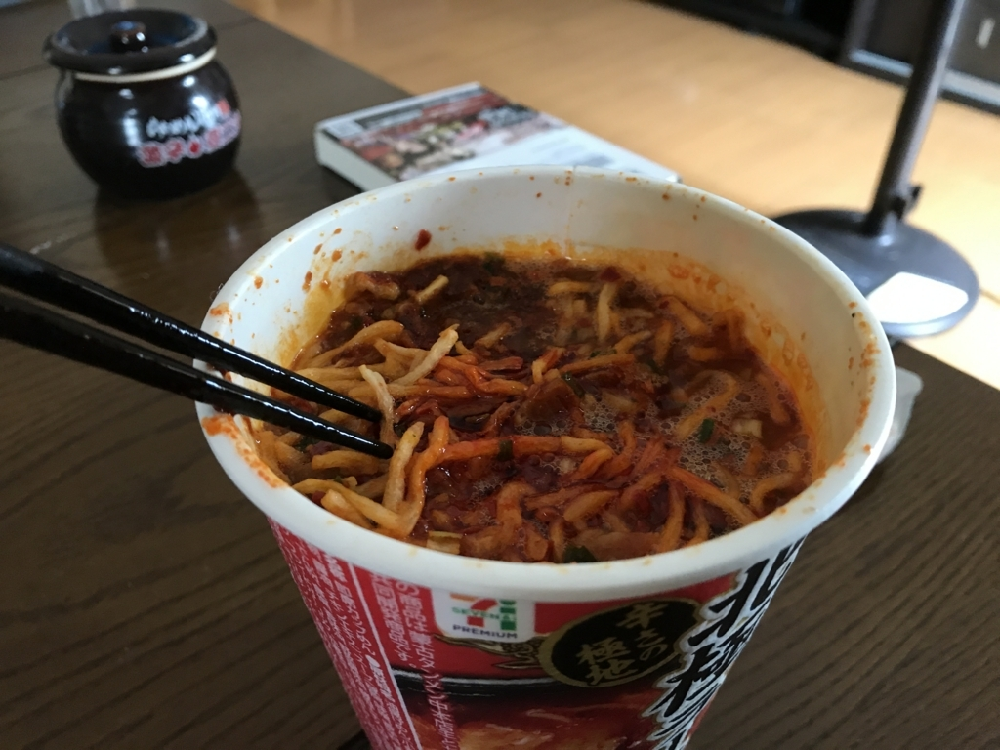

毎度要らんことしかせえへん某氏から、また変なのが送られてきた。

<blockquote class="twitter-tweet" data-lang="ja">
<a href="https://twitter.com/daruyanagi">@daruyanagi</a> 荷物届いたやろ、レビュー頼むで
&mdash; しばやん (@shibayan) <a href="https://twitter.com/shibayan/status/886839855157624832">2017年7月17日</a></blockquote>

もうケツの穴が破れそうやけど、頑張って食べた。

カップの上についてる“激辛オイル”ってのが、まずヤバい。開けてみたら、ラー油の赤いところだけを抽出したかのような、邪悪な液体だった。

お湯を注いで、5.5分待機。最近のカップ麺って待機時間長くない？　フタを開けると、噴き出した湯気が鼻孔を突き、猛烈に咳き込んだ。湯気が辛い。こんなに辛くして頭がおかしいんじゃないかと思うんだけど、よだれが沸いてくる俺もたいがい頭おかしい。

食べてみると……“辛辛魚”の袋麺ほどのパンチはなくて、まぁまぁ、美味しいって感じ。袋タイプと比べるのは酷かもしれないけど、麺も“ぬーどる”って感じやね。でも、全然、フツーに美味しくて、ちゃんとスープまで完食しました。――翌日恒例の下痢も……大したことがない。“辛辛魚”はマジで尻の穴が焼けるかと思ったんだけど……辛さが弱いのか、それとも俺の尻の穴が鍛えられてきたのか。

<blockquote class="twitter-tweet" data-lang="ja">
全部食べたら、今度東京でなんかご馳走したるわ
&mdash; しばやん (@shibayan) <a href="https://twitter.com/shibayan/status/886846864321945600">2017年7月17日</a></blockquote>

ともあれ、次に東京行くのが楽しみです。

<a href="http://www.amazon.co.jp/exec/obidos/ASIN/B073TK1NRX/bestylesnet-22/">日清食品 蒙古タンメン中本 北極 111g×6個</a>
<ul><li>出版社/メーカー: 日清食品</li><li>メディア: その他</li><li><a href="http://d.hatena.ne.jp/asin/B073TK1NRX/bestylesnet-22" target="_blank">この商品を含むブログを見る</a></li></ul>

