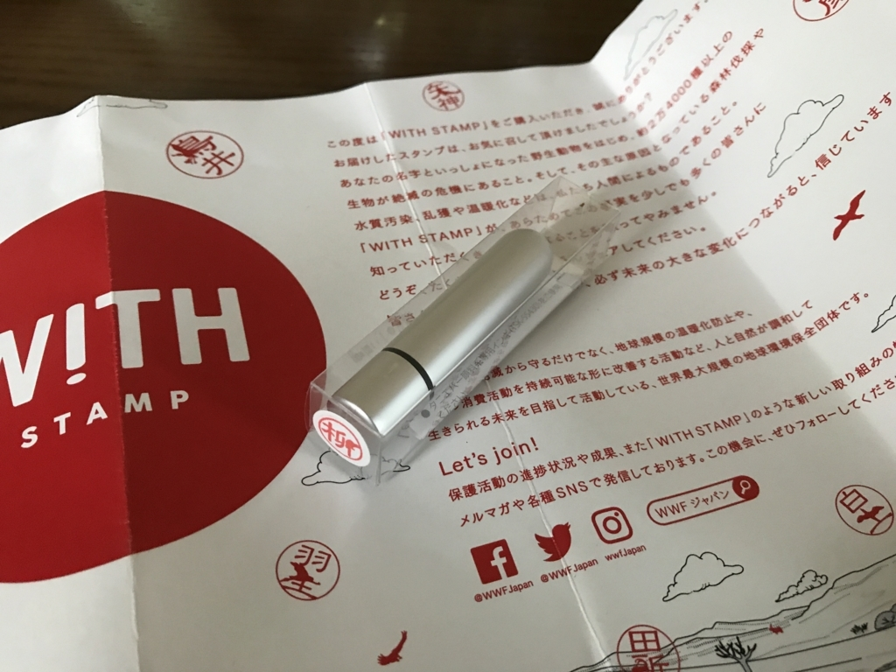
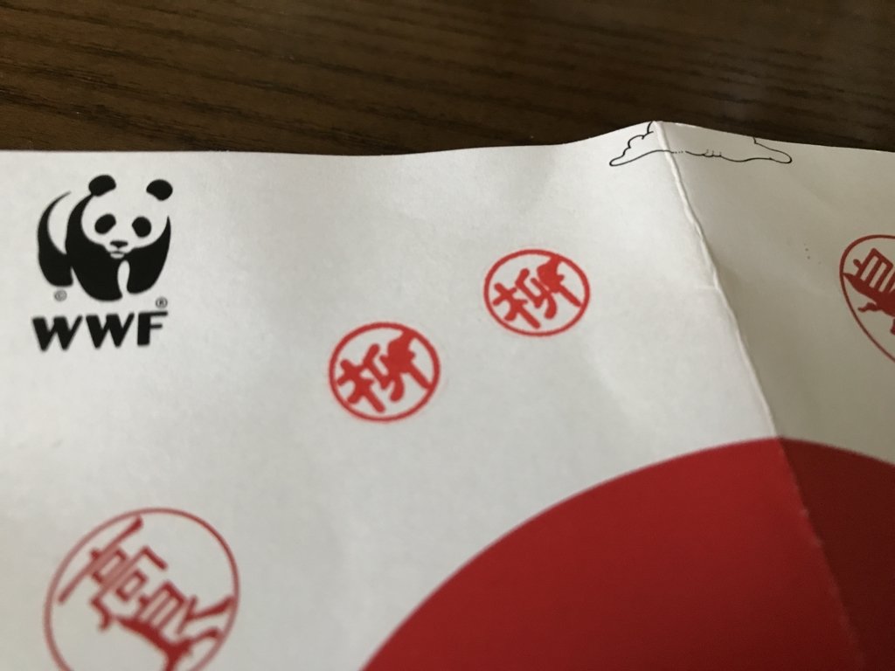

<blockquote class="twitter-tweet" data-lang="ja">
柳さんはアオコンゴウインコと一緒です。あなたの動物は何でしょう？名字と動物がいっしょになるスタンプ｜WITH STAMP <a href="https://t.co/vjyLycrHXc">https://t.co/vjyLycrHXc</a> <a href="https://twitter.com/hashtag/WITH_STAMP?src=hash">#WITH_STAMP</a> <a href="https://twitter.com/hashtag/WWF?src=hash">#WWF</a> <a href="https://twitter.com/hashtag/%E5%8B%95%E7%89%A9%E3%82%B9%E3%82%BF%E3%83%B3%E3%83%97?src=hash">#動物スタンプ</a>
&mdash; エロやなぎ先生 (@daruyanagi) <a href="https://twitter.com/daruyanagi/status/880267457176387585">2017年6月29日</a></blockquote>

Twitter で見かけたのでやってみました。名前の一部を絶滅危惧種の動物に置き換えた印影を自動生成するサービスみたいです（WWF のアイコンがあるし、世界自然保護基金と連携したサービスなんやろうな）。僕の場合は、<b>アオコンゴウインコ</b>でした。まったく知らん生き物だけど、こうやると少し身近に感じるかも。うまくアピールするもんだなー。

ちなみにこの子はブラジルに住んでいる（いた？）らしい。

<blockquote cite="https://ja.wikipedia.org/wiki/%E3%82%A2%E3%82%AA%E3%82%B3%E3%83%B3%E3%82%B4%E3%82%A6%E3%82%A4%E3%83%B3%E3%82%B3">

開発による生息地の破壊、乱獲などにより生息数は減少している。1967年にブラジルでは法的に保護の対象とされている。野生個体を捕獲しペアを形成することを試みた例もあるが、オスが本種のメスではなくアカビタイコンゴウインコのメスとペアを形成してしまい試みは失敗している。飼育下での繁殖には成功しているものの、飼育下繁殖個体を再導入することに対しての是非が問題視されている。1988年に5羽が捕獲され野生個体は絶滅したと考えられていたが、1990年に再発見されているものの以降は野生個体の発見例が無い。

<cite><a href="https://ja.wikipedia.org/wiki/%E3%82%A2%E3%82%AA%E3%82%B3%E3%83%B3%E3%82%B4%E3%82%A6%E3%82%A4%E3%83%B3%E3%82%B3">&#x30A2;&#x30AA;&#x30B3;&#x30F3;&#x30B4;&#x30A6;&#x30A4;&#x30F3;&#x30B3; - Wikipedia</a></cite>
</blockquote>

ほぼ絶滅してるみたいやな。結婚できへんわいにとっても、他人事とは思えへんで……。

というわけでもないのですが、印影を見て喜んでるだけではなんなので、実際にハンコを買ってみました。そう、これ、実際に発注できるんですよね。

値段は……忘れたけど、1,700円ぐらいだったかな。

まぁ、これっぽっちで何とかなるとも思わんし、そもそも自然保護活動とか言うても、どうせ人件費やらなんやら消えるんでしょ？　なんて思っちゃうんですが、こういう納得のできる“騙され方”（失礼）は嫌いじゃないしね。結構かわいいし、デザインとして好きかも。

実際はそんなにキレイに印影が出るわけじゃないのですが（ハンコのサイズの割りにデザインが細かすぎるのかもしれない）、シャチハタタイプになってて朱肉が要らないし、玄関にでも置いておいて、宅配便の受領印にでも使おうかなーって思っています。

