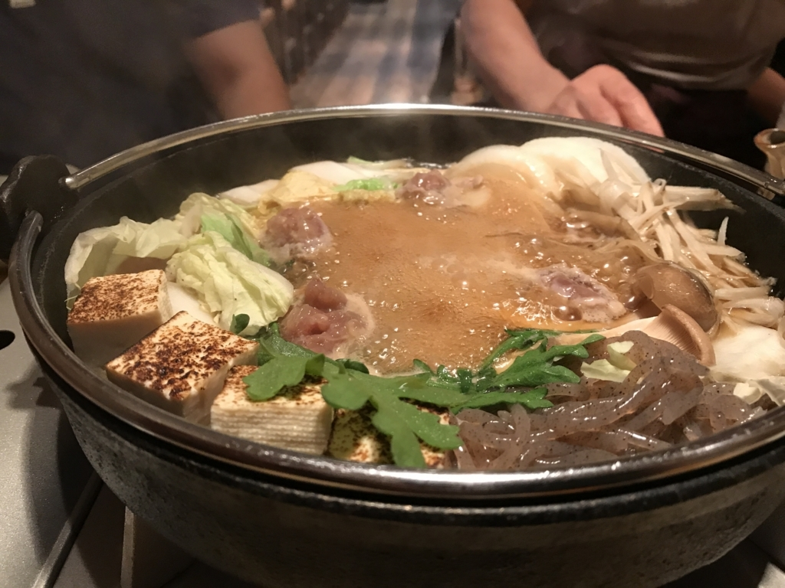
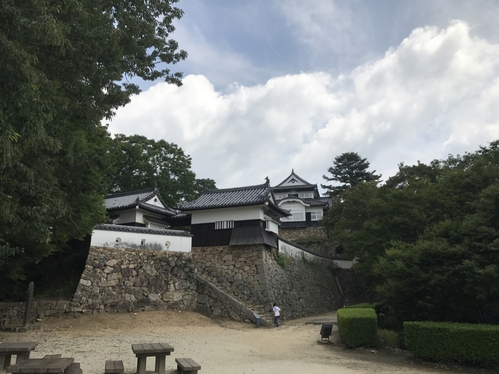

倉敷にデニム着物買いに行こうかなーなどと Twitter につぶやいていたところ、@mitsuba_yu が「高級マスカットたべたい」みたいなことを言っていたので、一緒に倉敷を回ることにしました。雨が降ったら電車で行こうと思っていたのですが、運よく晴れていたので、タンデムシートにカバンを括りつけてバイクで行きました。夜は 
@kiyokura さんに岡山でお店も予約してもらったのですが、めっちゃおいしかったデス（多分後述）。

ルートはこんな感じ。

<a href="http://www.amazon.co.jp/exec/obidos/ASIN/B00YC4TDLM/bestylesnet-22/">デイトナ（DAYTONA） スマートフォンホルダーWIDE IH-250D クイック 92602</a>
<ul><li>出版社/メーカー: デイトナ(Daytona)</li><li>メディア: Automotive</li><li><a href="http://d.hatena.ne.jp/asin/B00YC4TDLM/bestylesnet-22" target="_blank">この商品を含むブログを見る</a></li></ul>

この日のためにスマホホルダーを購入したのですが、凝ってる割りにあまり強度を感じず（いろんなスマホに対応しようとし過ぎて無駄に複雑になっているんだと思う）、付けるのを諦めました。ナビはヘルメットに装着した<b>「聴くだけブルートゥース」</b>の音声案内と、野生の勘でなんとかします。

<iframe src="https://hatenablog-parts.com/embed?url=http%3A%2F%2Fblog.daruyanagi.jp%2Fentry%2F2015%2F05%2F11%2F171113" title="バイク：デイトナ 聴くだけブルートゥースをヘルメットに付けてみた - だるろぐ" class="embed-card embed-blogcard" scrolling="no" frameborder="0" style="display: block; width: 100%; height: 190px; max-width: 500px; margin: 10px 0px;"></iframe><cite class="hatena-citation"><a href="http://blog.daruyanagi.jp/entry/2015/05/11/171113">blog.daruyanagi.jp</a></cite>

ちなみに今回買ったなかではこれが一番役に立ちました。

<a href="http://www.amazon.co.jp/exec/obidos/ASIN/B0041OKN4E/bestylesnet-22/">デイトナ(DAYTONA) UTネット2/M(400X500) 73223</a>
<ul><li>出版社/メーカー: デイトナ(Daytona)</li><li>発売日: 2012/08/29</li><li>メディア: Automotive</li><li><a href="http://d.hatena.ne.jp/asin/B0041OKN4E/bestylesnet-22" target="_blank">この商品を含むブログを見る</a></li></ul>

ツーリングネットが防水布になっているタイプ。適当に突っ込んでも網目から飛び出したりしないのがいいですね。今までタオルで汗を拭いたら、荷を解いてカバンに入れなおしていたような気がするのですが、これだとカバンと防水布の間にはさんでおけば OK。でも、ネットだけに頼るのは怖いので、ロープで2重に締めましたけど。

<h3>石鎚山サービスエリア</h3>

まずは 7:00、石鎚山サービスエリアで朝ごはん。ちょっとヘビーかなーと思ったのですが、今治名物。<b>焼き豚玉子丼</b>を食べました。830円なり。心配した通り、おなかがもたれて苦しかったけど、割とおいしかったです。

<h3>与島パーキングエリア</h3>

松山を出てしばらくは、山間にありがちな、ちょっとヒンヤリと湿った、少し重い感じの空気だったのですが（気持ちいい！）、川之江を過ぎるとかすかに潮の匂いが混じってきます。行く手にはポコッとした山がぽつぽつとあって、伊予の割と険しめな山とは好対照です。ようやく讃岐って感じですね。しばらく走ると瀬戸大橋に出たので、ここで2回目の休憩。

瀬戸内の海は島やら船やらでにぎやかで、とても好きです。みんなが暮らしてるっていう感じがする。

<h3>倉敷</h3>

10:00 前、倉敷駅前到着。松山からは休みを含めて3時間半ほどでしょうか。休憩なしで駆け抜ければ、2時間半程度かな。ここでホテルに荷物を預け、@mitsuba_yu と合流。美観地区や大原美術館を回ったりしました。これはまた稿を改めたいと思います。

<blockquote class="twitter-tweet" data-lang="ja">
真夏日の散歩で一喜一憂した俺達は <a href="https://t.co/H86DuzqqnQ">pic.twitter.com/H86DuzqqnQ</a>
&mdash; みつば＠SSA両日まゆ担当 (@mitsuba_yu) <a href="https://twitter.com/mitsuba_yu/status/886087393572290560">2017年7月15日</a></blockquote>

クッソ熱いのにこんな仕打ちに合い、（#^ω^）ﾋﾟｷﾋﾟｷ でした。でもいろいろ楽しかったです。

<h3>岡山</h3>

岡山は去年の暮れ以来？

<iframe src="https://hatenablog-parts.com/embed?url=http%3A%2F%2Fblog.daruyanagi.jp%2Fentry%2F2016%2F01%2F13%2F184454" title="大都会岡山で開催された“忘年会議2015”に参加してきた。 - だるろぐ" class="embed-card embed-blogcard" scrolling="no" frameborder="0" style="display: block; width: 100%; height: 190px; max-width: 500px; margin: 10px 0px;"></iframe><cite class="hatena-citation"><a href="http://blog.daruyanagi.jp/entry/2016/01/13/184454">blog.daruyanagi.jp</a></cite>

しょっちゅう通るのですが、なかなか寄ることはないので、お誘いをいただいたのはいい機会。

@mitsuba_yu とマスカットを割り勘しながら @kiyokura さんの到着を待ちました。

ほんとは 15,800 円のマスカットを攻めたかったのですが、さすがに気後れするよね。さっき食べてたのですら、一粒 100 円超えてるし……肉より高いゼ……。

晩御飯は岡山県の鳥・キジをすき焼きにしていただきました。

あとはバーでモモのカクテルをいただいたり。前回きたときより断然、岡山を堪能した気がしました。

<h3>備中高梁</h3>

翌日は9時にホテルを出て、備中松山城（高梁市）へ向かいました。12ある現存天守閣のうちの1つです……が、ライディングブーツで行くところじゃなかった。たっぷり山登りさせられて、半死半生でした。この件はまた別に書くかも。

高梁までの道は山と川が豊かで、走っていて楽しかったです。ここはまたきたいですねぇ。

<h3>鞆の浦</h3>

最後に寄ったのは、鞆の浦。瀬戸内の歴史を読むと必ず出てくるところなのですが、恥ずかしながら、どこにあるのかすらよくわかっていなかったので、ぜひ一度行ってみたかった。

ただ、とても狭いうえに、人が多くて大変でした。本当は宿をとろうかと思っていたのですが、あいにくどこも空いていなかったので、ちょっとぐるっと回って退散。ご飯も食べそこなったので、しまなみ海道の大浜パーキングエリアでカレー食って帰りました。

福山で<b>「聴くだけブルートゥース」</b>が使えなくなるなどのトラブルはありましたが、そのあたりまで帰ってこれれば地図なしでも大丈夫。午後の 5 時ぐらいに、無事松山にたどり着くことができました。

さすがに一泊では厳しかったけれど（備中松山城で登山もしたしな！！）、とりあえず無事に帰れてよかったデス。

