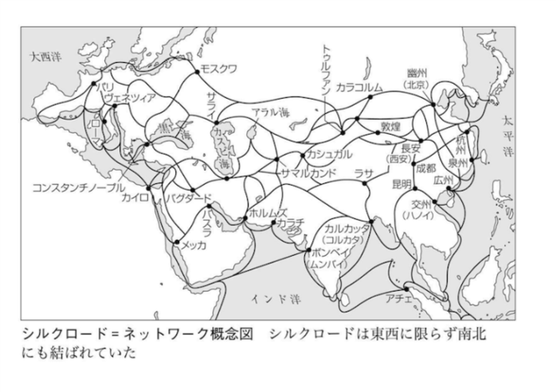

シルクロード（絹の道）は、<b>前近代におい</b>てユーラシア大陸の東西交流の舞台となった地域。

<ul>
<li>広義のシルクロード
<ul>
<li>海のシルクロード</li>
<li>陸のシルクロード（一般的なシルクロードの定義）
<ul>
<li>草原の道</li>
<li>オアシスの道（シルクロードのイメージ）</li>
</ul></li>
</ul></li>
</ul>
シルクロードは東西だけでなく、<b>南北にも網目状に</b>巡らされていたし、気候や政治・経済事情の移り変わりに応じて<b>めまぐるしく変化</b>してきた。また、運送はもっぱら家畜（もしくは人力）に頼っていたので、商品は<b>軽量・高価な奢侈品</b>を主力としていた。また、商品は一人が長距離を運ぶのではなく、複数で<b>中・短距離をリレーするのが普通</b>であったらしい（それらの点が、大航海時代・近代以降はネックとなり、海の道に取って代わられた）。

<h3>主な取引</h3>

<ul>
<li>中国：絹織物 ・紙 ・茶 </li>
<li>ペルシア ・東地中海方面：金銀器 ・ガラス製品 ・乳香 ・薬品 ・絨毯 </li>
<li>インド ・東南アジア：胡椒 ・香木 ・宝石 ・珊瑚 ・象牙 ・犀角 ・鼈甲 ・藍 </li>
<li>ロシア ・シベリア ・満洲：高級毛皮 ・朝鮮人参 ・鹿角 ・魚膠 </li>
<li>中央アジア
<ul>
<li>コ ータン：玉 </li>
<li>バダクシャン：ラピスラズリ </li>
<li>クチャ：硇砂 （どうしや ） </li>
<li>チベット：麝香やヤク牛の尻尾</li>
</ul></li>
<li>毛織物 ・綿織物 ・真珠 ・装身具 、鎖帷子 ・装飾鞍などの武具 、葡萄酒 ・蜂蜜 ・大黄など</li>
<li>奴隷と家畜（重いが、自分で動くため、障害にはならない）</li>
<li>ウマ、ラクダ：足が速く高価</li>
<li>ヒツジ、ヤギ、ウシ：安価、鈍足（短距離での重量物の輸送にはウシでも可？）</li>
</ul>

