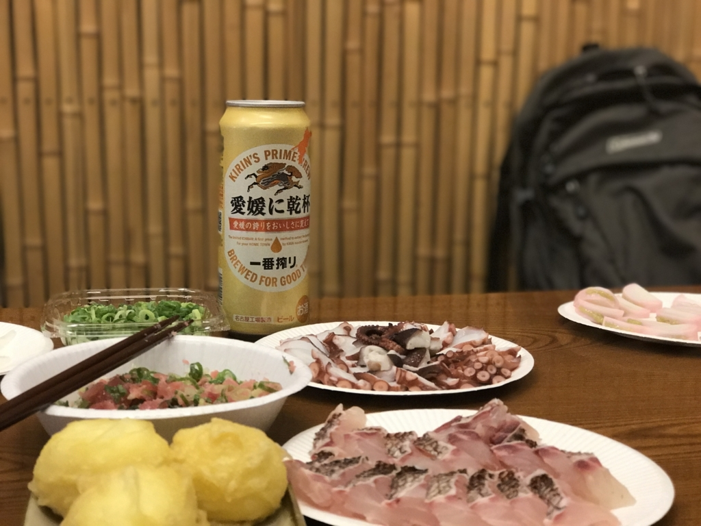
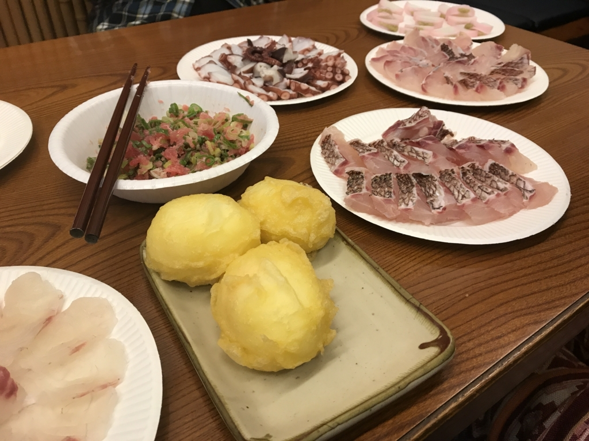
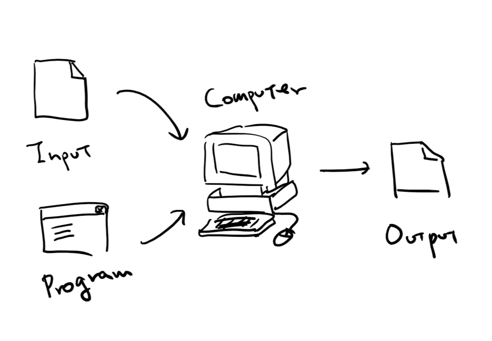
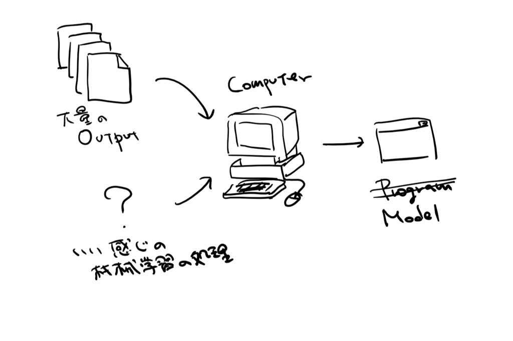
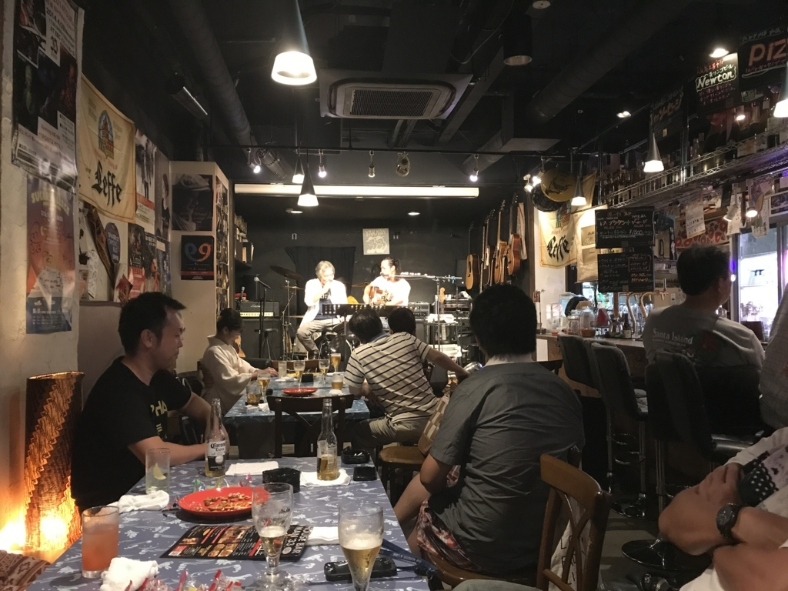

先週の金曜日、ゆるふわ.rb リータンズ in 三津浜 に参加してきました。

<iframe src="https://hatenablog-parts.com/embed?url=https%3A%2F%2Fconnpass.com%2Fevent%2F61909%2F" title="ゆるふわ.rb リータンズ in 三津浜 (2017/08/11 17:00〜)" class="embed-card embed-webcard" scrolling="no" frameborder="0" style="display: block; width: 100%; height: 155px; max-width: 500px; margin: 10px 0px;"></iframe><cite class="hatena-citation"><a href="https://connpass.com/event/61909/">connpass.com</a></cite>

ゆるふわ.rb は Ruby の勉強会です。おまけとしてお刺身とビールがついてきますが、この手のモノの宿命として、本体よりオマケがメインになっているのが大変高尚だと思います。

以前にも何回か愛媛県大洲市で開催されており、僕も参加しましたことがありましたが――

<ul>
<li><a href="http://blog.daruyanagi.jp/entry/2016/04/25/221908">&#x3086;&#x308B;&#x3075;&#x308F;.rb in &#x5927;&#x6D32; &#x301C;Rails 5 &#x306E;&#x65B0;&#x6A5F;&#x80FD;&#x3092;&#x63A2;&#x305B;&#xFF01;&#x301C; &#x306B;&#x53C2;&#x52A0;&#x3057;&#x3066;&#x304D;&#x307E;&#x3057;&#x305F;&#x3002; - &#x3060;&#x308B;&#x308D;&#x3050;</a></li>
<li><a href="http://blog.daruyanagi.jp/entry/2016/02/01/202800">&#x300C;&#x3086;&#x308B;&#x3075;&#x308F;.rb in &#x5927;&#x6D32; &#x301C;&#x4F5C;&#x3063;&#x3066;&#x307F;&#x3088;&#x3046; Slack bot&#x301C;&#x300D;&#x3067;&#x304A;&#x523A;&#x8EAB;&#x98DF;&#x3079;&#x3066;&#x304D;&#x307E;&#x3057;&#x305F;&#x3002; - &#x3060;&#x308B;&#x308D;&#x3050;</a></li>
<li><a href="http://blog.daruyanagi.jp/entry/2016/02/01/202800">&#x300C;&#x3086;&#x308B;&#x3075;&#x308F;.rb in &#x5927;&#x6D32; &#x301C;&#x4F5C;&#x3063;&#x3066;&#x307F;&#x3088;&#x3046; Slack bot&#x301C;&#x300D;&#x3067;&#x304A;&#x523A;&#x8EAB;&#x98DF;&#x3079;&#x3066;&#x304D;&#x307E;&#x3057;&#x305F;&#x3002; - &#x3060;&#x308B;&#x308D;&#x3050;</a></li>
<li><a href="http://blog.daruyanagi.jp/entry/2015/07/23/010230">&#x3086;&#x308B;&#x3075;&#x308F;.rb in &#x5927;&#x6D32; &#x3067;&#x304A;&#x8179;&#x3044;&#x3063;&#x3071;&#x3044;&#x306B; Ruby &#x3092;&#x5B66;&#x3093;&#x3067;&#x304D;&#x305F;&#x3002; - &#x3060;&#x308B;&#x308D;&#x3050;</a></li>
</ul>
主催者の <a href="http://blog.hatena.ne.jp/ogin_s57/">id:ogin_s57</a> さんが活躍の場を関東に移され、断絶していました。今回は帰省を機に、久しぶりに復活。

<blockquote>

ゆるふわの後継になるかはわかんないけど、こういうゆるい集まりは松山でもやりたいですねー。まずは刺身包丁を買わねば。

</blockquote>

などと言っていたのですが、結局はおんぶにだっこで大変すみませんなー。

場所は「踊るうどん永木」さんにお借りしました。

<ul>
<li><a href="http://odoruudon.net/">&#x8E0A;&#x308B;&#x3046;&#x3069;&#x3093;&#x6C38;&#x6728; &#x516C;&#x5F0F;&#x30A6;&#x30A7;&#x30D6;&#x30B5;&#x30A4;&#x30C8;&#xFF5C;&#x611B;&#x5A9B;&#x770C;&#x677E;&#x5C71;&#x5E02;</a></li>
</ul>
おいしいので、近場でまだ行ったことのない人はぜひ行くべし。

さて、今回は RubyFann というライブラリを使って機械学習に触れてみるやでーというテーマで少しだけお勉強しました。RubyFann はオープンソースのニューラルネットワークライブラリ FANN（Fast Artificial Neural Network、C++ 言語で書かれているみたい）を Ruby で扱えるようにした Gem みたいですね。

<iframe src="https://hatenablog-parts.com/embed?url=https%3A%2F%2Fgithub.com%2Ftangledpath%2Fruby-fann" title="tangledpath/ruby-fann" class="embed-card embed-webcard" scrolling="no" frameborder="0" style="display: block; width: 100%; height: 155px; max-width: 500px; margin: 10px 0px;"></iframe><cite class="hatena-citation"><a href="https://github.com/tangledpath/ruby-fann">github.com</a></cite>

話は変わりますが、機械学習というのは僕たちがいつもやっていることの逆をやることなのだそうです<a href="#f-052da40f" name="fn-052da40f" title="確かそういう話をこの前の de:code で学びました……間違ってたら僕の勘違いです">*1</a>。

普通は、何らかのプログラム（関数、アプリ）を用いてインプットからアウトプットを得ますが――

機械学習の目的は、逆に インプット→アウトプット の組み合わせを大量に用意して、インプットを入れるといい感じのアウトプットを吐き出してくれるプログラム（関数）を作るのが目的です（このプログラムは“モデル”と呼ばれます）。

たとえば、きのこの山とたけのこの里を見分けるのは、人間にはたやすいことですが（無論、食べたことがない人には無理でしょうけど）、これをまじめにプログラムとして組むとかなり難しい。

けれど、あらかじめ「これがきのこの山」「あれがたけのこの里」というデータを大量に用意して、人間の脳みその仕組みを応用したいい感じのやり方（← たぶん FANN がやってくれていること）でモデルを訓練してあげると、割とうまくやれることが分かった――みたいな。勉強会でもチラッと出ましたが、分野を絞れば“コドモの脳”程度のことは再現できるようになった……かも。

しゅごい（文系的感想

僕はみんながカリカリやっているのを後ろから見ながら「へー、なるほどー（わかったふり」していただけですが、見てるだけでも結構面白いものです。「結果がランダムになっちゃうのはなぜだ？」という疑問も、おかげさまで大体解決しました。

また話が脱線しますが、それにしてもスクリプト使いは器用ですね――リファレンスサイトとエディターを行ったり来たりしながら高速でカリカリとスクリプトを編集してる……僕は Visual Studio に助けてもらわないと何もできない体になってしまったので、とても新鮮でした。昔はちょっと Ruby をしていたはずなんですが（Rails 2.0 時代）、今はもう、できる気がしないｗ

二次会はタクシーで街にでて、いい感じのバーで遅くまで飲みました。ギターやドラムの生演奏でカラオケすると、いいですね。僕は人前で歌うのが苦手なので聞くだけですけどｗ

ありきたりな感想ですが、楽しかったです。またできたらいいですねー。

<a href="#fn-052da40f" name="f-052da40f" class="footnote-number">*1</a>:確かそういう話をこの前の de:code で学びました……間違ってたら僕の勘違いです

