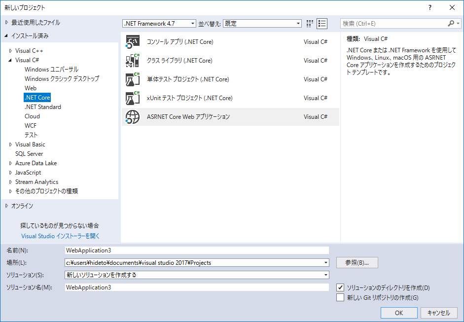
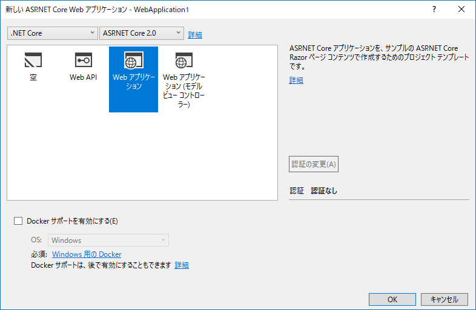
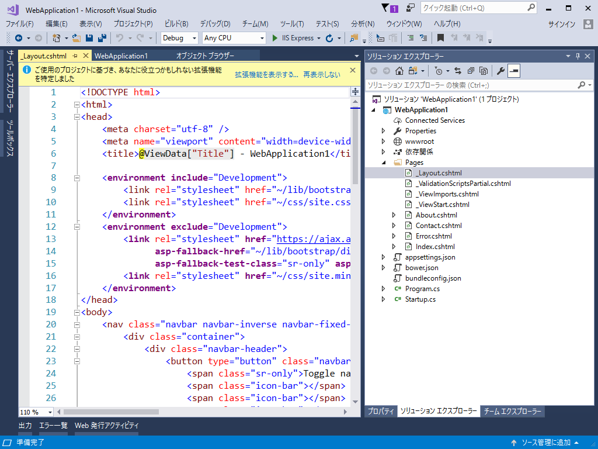
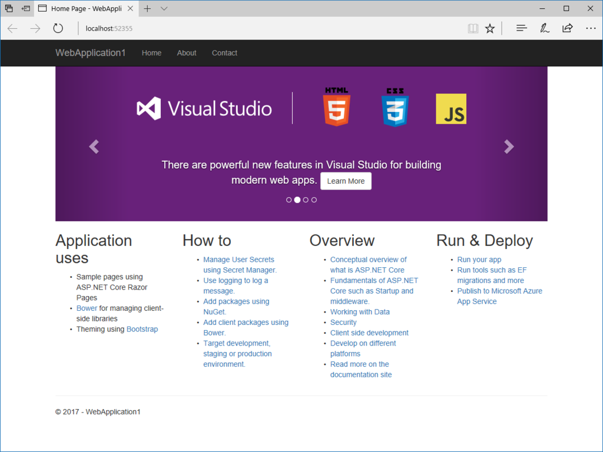
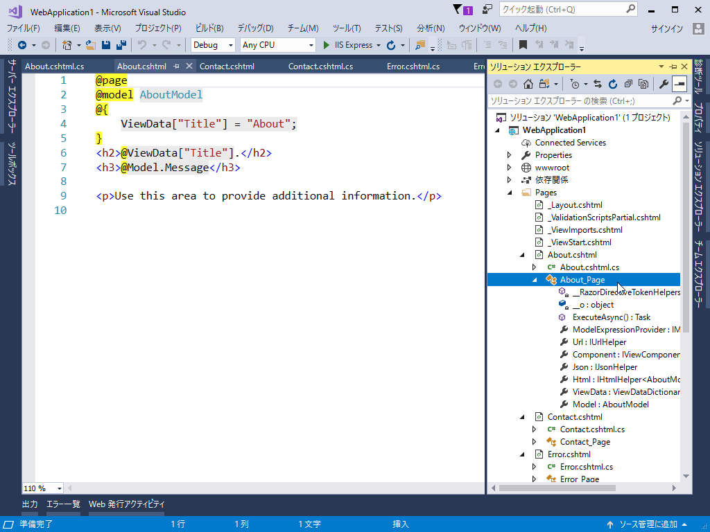
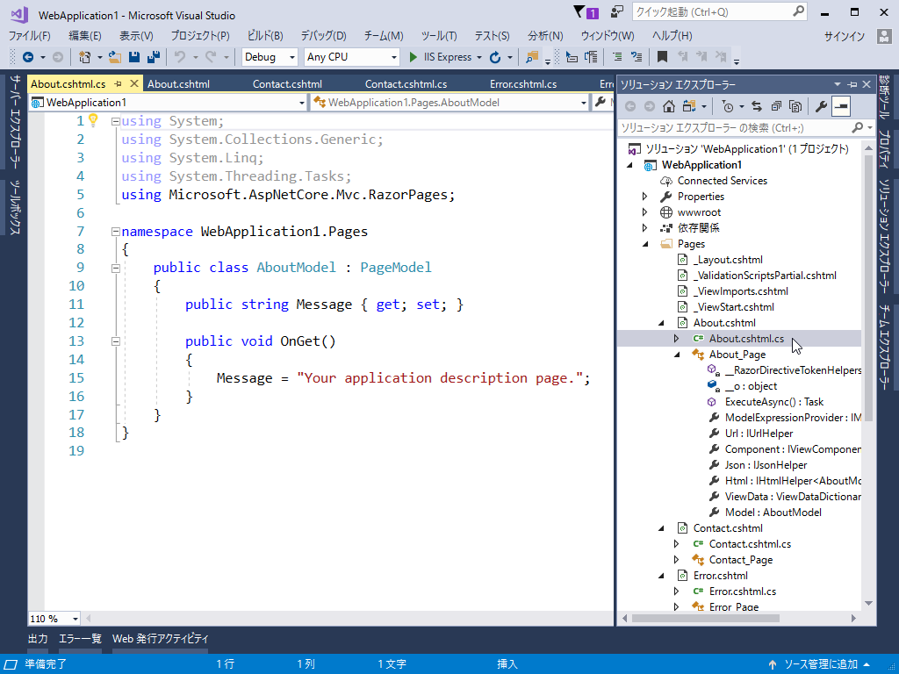

<iframe src="https://hatenablog-parts.com/embed?url=https%3A%2F%2Fblogs.msdn.microsoft.com%2Fvisualstudio%2F2017%2F08%2F14%2Fvisual-studio-2017-version-15-3-released%2F" title="Visual Studio 2017 Version 15.3 Released" class="embed-card embed-webcard" scrolling="no" frameborder="0" style="display: block; width: 100%; height: 155px; max-width: 500px; margin: 10px 0px;"></iframe><cite class="hatena-citation"><a href="https://blogs.msdn.microsoft.com/visualstudio/2017/08/14/visual-studio-2017-version-15-3-released/">blogs.msdn.microsoft.com</a></cite>

<b>Visual Studio 2017.3</b> に合わせて .NET Core 2.0 などもリリースされたみたいなので、かねてからやってみたかった <b>Razor Pages</b> をチラ見してみました。

<b>ASP.NET Core Razor Pages</b> は、とっても単純にいうと、C# で PHP みたいにサクッと Web ページ（CSHTML、名前の通り HTML に C# を埋め込んだ感じ）を書くためのフレームワークです。<i>MVC とかめんどくせえ、ペライチのサイト（でも、サーバーサイドでの処理はちょっと必要）を作りたいだけなんじゃー！　</i>というときに便利。むかしは <b>ASP.NET Web Pages</b> という技術があったのですが、ASP.NET Core ではこれを使うようですね、よく知らんけど。

<h3>プロジェクトの作成</h3>

まず、［新しいプロジェクト］コマンドで .NET Core、ASP.NET Core Web アプリケーションと辿ってソリューションを作ります。上の方に“.NET Framework 4.7”とか書いてあるのは気にしない。

ソリューションを作成するとアプリケーションのタイプを選択するダイアログが現れるので、今度は上部のプルダウンメニューから“.NET Core”、“ASP.NET Core 2.0”を選択し、“Web アプリケーション”を作成。これで ASP.NET Core Razor Page のサンプルページが出力されるはずです。今回は“チラ見”なのでそのまま進みますが、一度“空”のアプリケーションから Razor Pages を使うまでもやってみたいですね。

とりあえず［F5］キーで実行。Twitter Bootstrap＋jQuery ベースの割とごついサンプルページをブラウザーで表示することができました。

 

<h3>ファーストインプレッション</h3>

詳しいことは以下のサイトで学べるので、今回は省略。自分もまだ斜め読みしかしていません（汗

<iframe src="https://hatenablog-parts.com/embed?url=https%3A%2F%2Fdocs.microsoft.com%2Fen-us%2Faspnet%2Fcore%2Ftutorials%2Frazor-pages%2Frazor-pages-start" title="Getting started with Razor Pages in ASP.NET Core" class="embed-card embed-webcard" scrolling="no" frameborder="0" style="display: block; width: 100%; height: 155px; max-width: 500px; margin: 10px 0px;"></iframe><cite class="hatena-citation"><a href="https://docs.microsoft.com/en-us/aspnet/core/tutorials/razor-pages/razor-pages-start">docs.microsoft.com</a></cite>

でも、パッと見た感じ、ASP.NET Web Pages とあまり変わらないですね。目につく違いは、

<ul>
<li>ページの先頭に @Page ディレクティブが必要</li>
<li>ルートではなく <b>/Page</b> 以下に *.cshtml を配置する（変更可能）</li>
<li>ビューモデル（MVVM のアレではない）を *.cs ファイルに分離して紐づけられる（一枚の *.cshtml に @functions{ } でガリガリ書いていた処理を分離できる）</li>
<li>OnGet などでリクエストを処理。非同期版もあるみたい <b>public async Task<IActionResult> OnPostAsync()</b>！</li>
</ul>
ぐらいでしょうか。

ひな型には message メンバーを OnGet（GET リクエスト）で吐く感じのコードが書かれています。新しいビューを追加すると、CSHTML/CS の両方が吐き出されるんだなー。

一方、ASP.NET Web Pages 時代に慣れ親しんでたけど見当たらない、

<ul>
<li>/App_Code や /App_Data の代わりになるものはどれ？</li>
<li>_ViewStarat.cshtml（それぞれのビューをレンダリングする前に呼び出される）などはあるけど、_AppStart.cshtml はどこにいったんだろう（アプリケーション名など、App レベルで変数をもちたい場合はどこに？）</li>
</ul>
などの点は、今後の個人的課題ですね。ASP.NET と ASP.NET Core の違いもあるだろうし、ちょっとまた頑張らんと。

あと、<b>モデルバインディング</b>や<b>タグヘルパー</b>といった技術がより身近になるみたいです。必須というわけではないようですが、それを前提としているところも多いので（ひな型でもバシバシ使われてるしな……）、避けて通るのは難しそう。使いこなせれば便利なようなので、おいおい勉強していきたいと思います。

