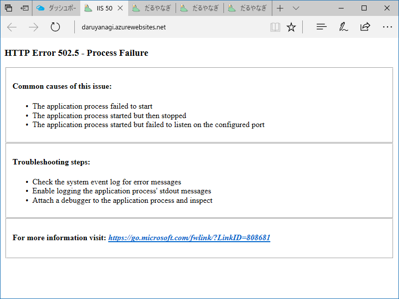

ASP.NET Core 2.0 がリリースされたので、<a href="http://darunagai.jp/">http://darunagai.jp/</a> を Razor Page で書き直しました。大したサイトではないので、MVC よりも Razor Pages にした方がシンプルでいい感じ。ローカルでいい感じに動いていたので、さっそく Azure に発行してみました。

死にました／(^o^)＼　

<b>HTTP Error 502.5 - Process Failure</b> だそうです。見たことないエラーページでちょっと焦る……。

いろいろガチャガチャいじっていたのですが、どうやらゴミが残っていたようで。Web 発行のときに消すようにしてみたらうまくいきました。

<b>発行先の追加ファイルを削除する</b>という日本語がイマイチよくわからなかったのですが、動いたからこれでいいんだろうと思う。

