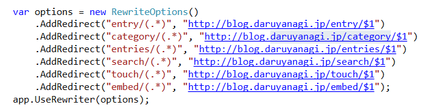

旧ドメインから新ドメインへのリダイレクトを Controller でやっていたのだけど、実はミドルウェアでできることを今日知った……。情報弱者にもほどがある。

<iframe src="https://hatenablog-parts.com/embed?url=https%3A%2F%2Fdocs.microsoft.com%2Fen-us%2Faspnet%2Fcore%2Ffundamentals%2Furl-rewriting" title="URL Rewriting Middleware in ASP.NET Core" class="embed-card embed-webcard" scrolling="no" frameborder="0" style="display: block; width: 100%; height: 155px; max-width: 500px; margin: 10px 0px;"></iframe><cite class="hatena-citation"><a href="https://docs.microsoft.com/en-us/aspnet/core/fundamentals/url-rewriting">docs.microsoft.com</a></cite>

具体的には、こんな感じ。

<pre class="code lang-cs" data-lang="cs" data-unlink>public class Startup
{
public void ConfigureServices(IServiceCollection services)
{
services.AddMvc();
}

public void Configure(IApplicationBuilder app, IHostingEnvironment env)
{
if (env.IsDevelopment())
{
app.UseDeveloperExceptionPage();
}

var options = new RewriteOptions()
.AddRedirect(&quot;entry/(.*)&quot;, &quot;http://blog.daruyanagi.jp/entry/$1&quot;)
.AddRedirect(&quot;category/(.*)&quot;, &quot;http://blog.daruyanagi.jp/category/$1&quot;)
.AddRedirect(&quot;entries/(.*)&quot;, &quot;http://blog.daruyanagi.jp/entries/$1&quot;)
.AddRedirect(&quot;search/(.*)&quot;, &quot;http://blog.daruyanagi.jp/search/$1&quot;)
.AddRedirect(&quot;touch/(.*)&quot;, &quot;http://blog.daruyanagi.jp/touch/$1&quot;)
.AddRedirect(&quot;embed/(.*)&quot;, &quot;http://blog.daruyanagi.jp/embed/$1&quot;);
app.UseRewriter(options);

app.UseStaticFiles();
app.UseMvc();
}
}
</pre>
今まで自分がやってきたやり方はクソなので、もう忘れようと思う。

<iframe src="https://hatenablog-parts.com/embed?url=http%3A%2F%2Fblog.daruyanagi.jp%2Fentry%2F2017%2F07%2F17%2F143323" title="ASP.NET Core MVC：特定のリクエストを他のサイトにリダイレクトする - だるろぐ" class="embed-card embed-blogcard" scrolling="no" frameborder="0" style="display: block; width: 100%; height: 190px; max-width: 500px; margin: 10px 0px;"></iframe><cite class="hatena-citation"><a href="http://blog.daruyanagi.jp/entry/2017/07/17/143323">blog.daruyanagi.jp</a></cite>

<iframe src="https://hatenablog-parts.com/embed?url=http%3A%2F%2Fblog.daruyanagi.jp%2Fentry%2F2017%2F07%2F17%2F143323" title="ASP.NET Core MVC：特定のリクエストを他のサイトにリダイレクトする - だるろぐ" class="embed-card embed-blogcard" scrolling="no" frameborder="0" style="display: block; width: 100%; height: 190px; max-width: 500px; margin: 10px 0px;"></iframe><cite class="hatena-citation"><a href="http://blog.daruyanagi.jp/entry/2017/07/17/143323">blog.daruyanagi.jp</a></cite>

そのほかにも URL リライトを行ったり、IIS や Apache のリライトルールを読み込んで利用したり、ルールをメソッドで記述したり、IRule インターフェースでリライトを定義したりできるみたいですね。　

