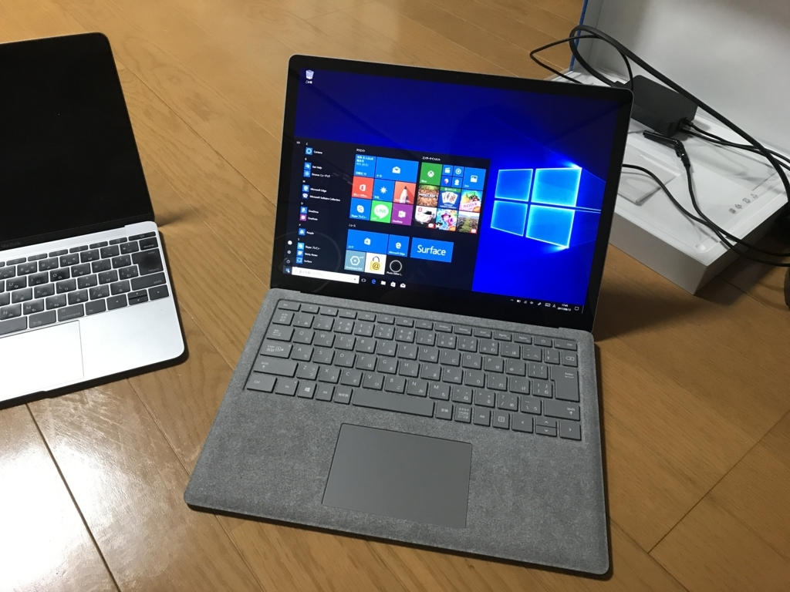

Surface Laptop がほしくなったので、近所のエディオンまでバイクをかっ飛ばして買ってきました。Windows 10 S を実機で使ってみたかったのダ！

それにしても、Windows 10 S 縛りはキツいですね。最近はストアも充実してきたのだけど、まだまだ圧倒的にアプリが足りない。でも、アレもない、コレもないと愚痴ってるだけってのもアレなので、とりあえず急場しのぎでほしかった Diff ツールをサクッと作ってみました（秀丸のは使いにくいなぁ……orz）。

基本的に2つのテキストファイルを開いて比較し、変更箇所を色分けするだけです。フォルダーボタンを押すとファイルピッカーが現れるので、比較したいファイルを指定してください。色分けの意味は以下の通り。

<ul>
<li>黄色：変更（変更された段落は薄い黄色）</li>
<li>赤色：削除</li>
<li>緑色：追加（挿入された段落は薄い緑色）</li>
</ul>
内部的には色のカスタマイズは打ち消し線・下線などの追加が可能になっているので、将来バージョンがでることがあれば設定画面から変更できるようになるはずです（現バージョンはテーマの変更機能のみを実装）。

ファイルのドラッグ＆ドロップも一応対応しています。ターゲットはフォルダーボタンが無難です（あとで気が付いたんだけど、バグってて他の部分ではドラッグが受け付けてもらえない）。

<ul>
<li>単一ファイルの場合：ドロップしたポイントで判定して、左右どちらかで開くようになってます</li>
<li>複数ファイルの場合：1つは左側、もう1つは右側で開くようになってます（3つ目以降は無視）</li>
</ul>
Diff のアルゴリズムは、以下から拝借しました。

<iframe src="https://hatenablog-parts.com/embed?url=http%3A%2F%2Fd.hatena.ne.jp%2Fsiokoshou%2F20070315" title="2007/3/15 (木)" class="embed-card embed-webcard" scrolling="no" frameborder="0" style="display: block; width: 100%; height: 155px; max-width: 500px; margin: 10px 0px;"></iframe><cite class="hatena-citation"><a href="http://d.hatena.ne.jp/siokoshou/20070315">d.hatena.ne.jp</a></cite>

ほかにも Google が作った Diff ライブラリが有名みたいです。

<ul>
<li><a href="https://code.google.com/archive/p/google-diff-match-patch/">Google Code Archive - Long-term storage for Google Code Project Hosting.</a></li>
</ul>
こっちは人間に読みやすいよう、ごちゃごちゃしてくれる機能なんかがついているようですが、行単位の比較がないのかな？　使うだけなら割と簡単でしたが。

<h3>ダウンロード</h3>

<iframe src="https://hatenablog-parts.com/embed?url=https%3A%2F%2Fwww.microsoft.com%2Fja-jp%2Fstore%2Fp%2Fsabun%2F9pdrdtvdp8fm" title="Sabun を購入 - Microsoft ストア 日本" class="embed-card embed-webcard" scrolling="no" frameborder="0" style="display: block; width: 100%; height: 155px; max-width: 500px; margin: 10px 0px;"></iframe><cite class="hatena-citation"><a href="https://www.microsoft.com/ja-jp/store/p/sabun/9pdrdtvdp8fm">www.microsoft.com</a></cite>

Windows 10 Mobile でも利用できるようですが、ユーザーインターフェイスのテストをまったくしていないので、おそらく使い物にならないでしょう。

