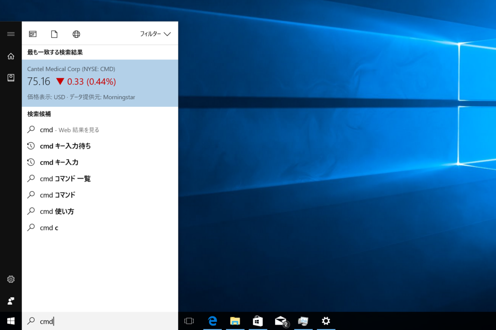

昨日の記事には少し言葉足らずな点があって、あとでいろいろツッコミをいただいたので補足しておきたいと思います。

<iframe src="https://hatenablog-parts.com/embed?url=http%3A%2F%2Fblog.daruyanagi.jp%2Fentry%2F2017%2F08%2F20%2F144645" title="Surface Laptop を買ったので、Windows 10 S 縛りで一週間頑張った - だるろぐ" class="embed-card embed-blogcard" scrolling="no" frameborder="0" style="display: block; width: 100%; height: 190px; max-width: 500px; margin: 10px 0px;"></iframe><cite class="hatena-citation"><a href="http://blog.daruyanagi.jp/entry/2017/08/20/144645">blog.daruyanagi.jp</a></cite> 

<h3>Microsoft Edge の Bing 検索が嫌なら Google にでも変えれば？</h3>

一番多くいただいたのは<b>「Bing が辛いなら Google にすればいいじゃない（マリー・なんとかねっと」</b>という意見でしたが、結論からいうとそれはできません。

まず復習ですが、一般の Microsoft Edge では［詳細設定］画面で検索プロバイダーの変更が可能です。

［検索エンジンの変更］というボタンを押すと――

過去に訪れたサイトの検索エンジンが列挙されるので、好きなのを選べば OK<a href="#f-a9ddd10f" name="fn-a9ddd10f" title="たぶん OpenSearch か何かなんでしょうね">*1</a>。Google に変更したい場合は、一度 Google のトップページにアクセスしてから、検索エンジンの変更を行えばいい。

けれど、Windows 10 S ではこの機能が無効化されています<a href="#f-4b53a2f1" name="fn-4b53a2f1" title="よく知らんのだけど、グループポリシー的なもので殺せるのかな">*2</a>。

かつて <b>Windows 8.1 with Bing</b> という SKU があったみたいで、その血も受け継いでいるのかもしれないけど、そういう“思惑”で可能性を縛ろうとしているあたりが、Windows 10 S のわかりにくさにつながっていると思いますね。

ちなみに僕は既定のページを Google のトップ画面にして凌いでますが、選択テキストの Web 検索は［コルタナに質問］を使うしかないので Bing からは逃れられない……「右クリックメニューからググれる拡張機能」が早くストアに登場しますように！

<h3>Windows 10 Pro にアップグレード → Windows 10 S に戻して、来年またアップグレードしようとしたらお金がかかる？</h3>

正直なところよくわからないです（ごめんなさい

けれど、Windows 10 Pro にアップグレードしてライセンスを取得したときに Microsoft アカウントにリンクさせておけば（デジタルライセンス）、おそらく問題はないだろうと思います。インストール時にプロダクトキーの入力をスキップし、あとで Microsoft アカウントに接続すれば、ライセンス認証できるはずです。

たぶんね。

組織アカウントならばどうなるの？　とかも気になるんですが、Windows 10 S は Active Directory が使えないし、基本的に個人（or AD が要らないような小規模組織）が使うんだろうなって感じ。

<h3>cmd や PowerShell がない</h3>

一応あるっぽいのだけど、KONOZAMA なのでほぼ何もできないものと思っていいと思います。

スタートメニューにもないし――

［Windows］＋［X］メニューにもないです。「コンピューターの管理」「デバイス マネージャー」あたりにはアクセスできるので、そこらへんは弄れそうです。

あとは…… regedit なんかもアクセスできませんね。Windows Subsystem for Linux が使えないことも、公式に明言されています。Windows 10 Fall Creators Update になっても Ubuntu をストアから導入なんてことはできないはずです。

Windows 10 S でプログラミングを学びたい場合は、Small Basic あたりで遊ぶぐらいしかないと思います。

<iframe src="https://hatenablog-parts.com/embed?url=http%3A%2F%2Fforest.watch.impress.co.jp%2Fdocs%2Fnews%2F1076082.html" title="Microsoft、「Small Basic」v1.3を“ストア”で公開 ～入門者向けプログラミング環境／アプリケーションアイコンを刷新。起動時にクイックガイドが表示するなどの改善も" class="embed-card embed-webcard" scrolling="no" frameborder="0" style="display: block; width: 100%; height: 155px; max-width: 500px; margin: 10px 0px;"></iframe><cite class="hatena-citation"><a href="http://forest.watch.impress.co.jp/docs/news/1076082.html">forest.watch.impress.co.jp</a></cite>

もっとも、うちの環境では起動しませんでしたが！（ほかの人の環境ではイケるみたいなんだけど……なぜだろ？）

思いついたのはそれぐらい。まだ何か足りないかな……？　ちなみにこのブログ記事も Surface Laptop ＋ Windows 10 S で書いてます。それぐらいであれば全然問題はない感じ。Microsoft Edge がいろいろアレなので、ちょっと肩凝るけど。

<a href="#fn-a9ddd10f" name="f-a9ddd10f" class="footnote-number">*1</a>:たぶん OpenSearch か何かなんでしょうね

<a href="#fn-4b53a2f1" name="f-4b53a2f1" class="footnote-number">*2</a>:よく知らんのだけど、グループポリシー的なもので殺せるのかな

