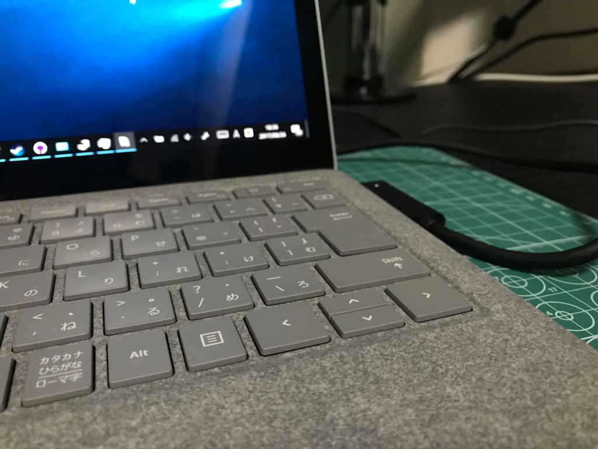
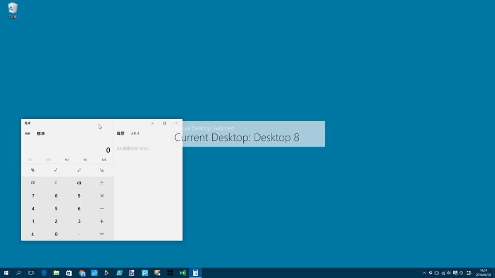

今日は重い腰を上げて、たまっていたタスクをいっぺんに片づけた。

<ul>
<li>メインのデスクトップ PC に貰い物のグラボを刺した（5月にもらったのに、そのまんま放置！　電源が足りててよかったー）</li>
<li>Surface 3 を Windows 10 S（Insider Preview）にした（これはまた後日書くと思う）</li>
<li>Surface Laptop を Windows 10 Pro にして、いろいろお仕事ができる環境にした</li>
<li>週末までに Amazon で買いあさった便利グッズで部屋を整理した</li>
</ul>
ついでに、Surface Laptop ＋デュアルディスプレイ環境をより使いやすくするための AutoHotKey スクリプトをしこしこ書いてた。慣れないからやたら時間かかったけど、だいぶ使い勝手が上がった気がする。

<h3>マルチモニター環境でウィンドウを移動する</h3>

Windows 10 では［Windows］＋［Shift］＋［→］キーや［Windows］＋［Shift］＋［←］キーで<b>“アクティブウィンドウを隣のモニターへ移動”</b>できるのだけど、このショートカットを押すのがめんどくさい。Surface Laptop のキーボードには、右［Windows］キーがないので、どうしても両手を使う必要がある。

というわけで、右側の［Shift］キーをと矢印キー（<b>要するにキーボードの右下らへん</b>）だけで移動できるようにした。

<pre class="code" data-lang="" data-unlink>&gt;+Right::Send,{RWin Down}{RShift Down}{Right}{RShift Up}{RWin Up}</pre>
［Windows］＋［Shift］＋［→］キーは<code>#+Right</code>と書けると思ったのだけど、それではうまくいかないみたいで、解決策を探すのにだいぶ時間を食ってしまった。でも、おかげでアクティブウィンドウを片手でほいほいモニター移動できるようになった。要らないウィンドウはポイだ！

<h3>ドックに接続せずに使うときは仮想デスクトップをバリバリ使う</h3>

さて、ドックから外したときは画面が一つになってしまうので、代わりに仮想デスクトップをバリバリ使いたいよね。でも、仮想デスクトップ関連のホットキーも［Windows］キーを使うので、同じような問題に直面してしまう。というわけで、これも右手だけで行えるようにしてみた。

<pre class="code" data-lang="" data-unlink>; Virtual desktop (Left Move)
&gt;!Left::Send,#^{Left}
AppsKey &amp; Left::Send,#^{Left}

; Virtual desktop (Right Move)
&gt;!Right::Send,#^{Right}
AppsKey &amp; Right::Send,#^{Right}

; Virtual desktop (Create)
&gt;!Up::Send,#^d
AppsKey &amp; Up::Send,#^d

; Virtual desktop (Delete)
AppsKey &amp; Down::Send,#^{F4}
&gt;!Down::Send,#^{F4}</pre>
右［Alt］キーと

<ul>
<li>［→］キーで次の仮想デスクトップへ切り替え</li>
<li>［←］キーで前の仮想デスクトップへ切り替え</li>
<li>［↑］キーで仮想デスクトップの作成</li>
<li>［↓］キーで仮想デスクトップの削除</li>
</ul>
に割り当ててみた（右［Alt］キーの代わりに［Apps］キーも使える。どっちにするか迷ったので、両方とも使えるようにした）。実は MacBook（BootCamp）は三本指ジェスチャーが使えないので、日頃から似たような AHK スクリプトを書いて使っている。

<iframe src="https://hatenablog-parts.com/embed?url=http%3A%2F%2Fblog.daruyanagi.jp%2Fentry%2F2016%2F10%2F05%2F213634" title="Macbook でサクッと Task View が呼べたらいいのになぁ、という話。 - だるろぐ" class="embed-card embed-blogcard" scrolling="no" frameborder="0" style="display: block; width: 100%; height: 190px; max-width: 500px; margin: 10px 0px;"></iframe><cite class="hatena-citation"><a href="http://blog.daruyanagi.jp/entry/2016/10/05/213634">blog.daruyanagi.jp</a></cite>

それに操作感が似ているので、個人的には割と使いやすい（慣れちゃったんだよね）。タッチパッドを三本指だの四本指だのでスワイプするよりも楽だと思うし（たまにミスるし、Surface Laptop のタッチパッドは Mac に比べると少し狭い）。

あと、仮想デスクトップを使うならおすすめの「<b>SylphyHorn</b>」も入れた。仮想デスクトップの番号を出したり、アクティブウィンドウを隣の仮想デスクトップへホットキーで飛ばしたり、仮想デスクトップの切り替えをローテーション（最後だったら最初に戻す）してくれる。

<iframe src="https://hatenablog-parts.com/embed?url=http%3A%2F%2Fforest.watch.impress.co.jp%2Fdocs%2Freview%2F755254.html" title="ホットキー一発で作業中のウィンドウを別の仮想デスクトップへ移動させる「SylphyHorn」NOT SUPPORTED" class="embed-card embed-webcard" scrolling="no" frameborder="0" style="display: block; width: 100%; height: 155px; max-width: 500px; margin: 10px 0px;"></iframe><cite class="hatena-citation"><a href="http://forest.watch.impress.co.jp/docs/review/755254.html">forest.watch.impress.co.jp</a></cite>

ストアで配布されてるのも素晴らしい……。

<iframe src="https://hatenablog-parts.com/embed?url=https%3A%2F%2Fwww.microsoft.com%2Fja-jp%2Fstore%2Fp%2Fsylphyhorn%2F9nblggh58t01" title="SylphyHorn を購入 - Microsoft ストア 日本" class="embed-card embed-webcard" scrolling="no" frameborder="0" style="display: block; width: 100%; height: 155px; max-width: 500px; margin: 10px 0px;"></iframe><cite class="hatena-citation"><a href="https://www.microsoft.com/ja-jp/store/p/sylphyhorn/9nblggh58t01">www.microsoft.com</a></cite>

さっき書いた<b>「ほかのモニターへアクティブウィンドウを移動させる」</b>機能は、ドックにつないでいないときは無駄なので、代わりに「SylphyHorn」の機能で隣の仮想デスクトップへ飛ばしてみるようにしてみた。

<pre class="code" data-lang="" data-unlink>IsMultimonitor()
{
sysget, cnt, MonitorCount
return cnt &gt; 1
}

; Move to next monitor (とりあえず右の場合だけ)
&gt;+Right::
if IsMultimonitor()
{
Send,{RWin Down}{RShift Down}{Right}{RShift Up}{RWin Up}
}
else
{
Send,{LWin Down}{LCtrl Down}{LAlt Down}{Right}{LAlt Up}{LCtrl Up}{LWin Up}
}
return</pre>
コンテキストによって挙動が違うのはあまりよくないかもしれないけど、自分の中では<b>「邪魔なウィンドウをほかのモニター or デスクトップに飛ばす」</b>という点では大して変わりがないので、あんまり混乱はないかも。

せっかく書いたスクリプトなので、なくさないように GitHub で管理。バイナリもあるので、もしほしい人がいたら使ってください（ほかの人にとって使い勝手のいいものかどうかは知らんが……）。

<iframe src="https://hatenablog-parts.com/embed?url=https%3A%2F%2Fgithub.com%2Fdaruyanagi%2FDesktopHelper" title="daruyanagi/DesktopHelper" class="embed-card embed-webcard" scrolling="no" frameborder="0" style="display: block; width: 100%; height: 155px; max-width: 500px; margin: 10px 0px;"></iframe><cite class="hatena-citation"><a href="https://github.com/daruyanagi/DesktopHelper">github.com</a></cite>

