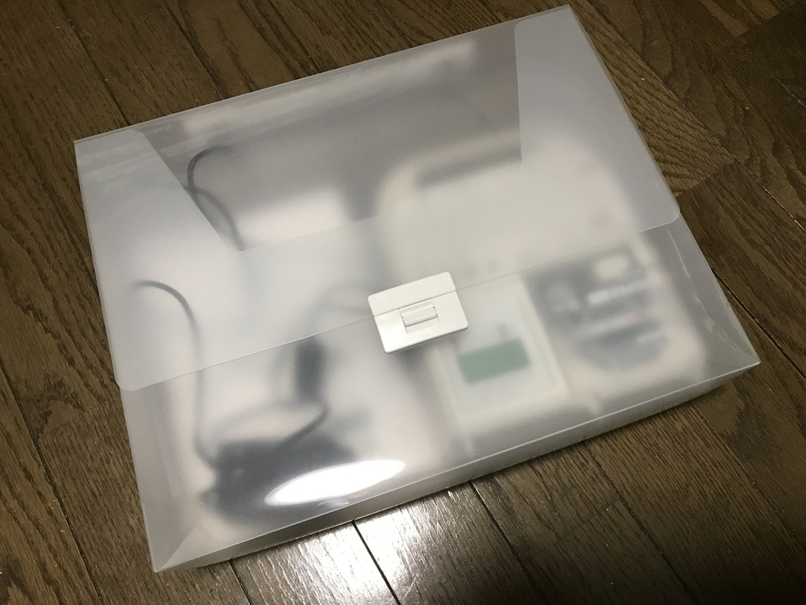

テプラを買ったのは10年ぶりぐらいかな……前の前の会社で事務所を整理するのに使っていましたが、それ以来、まったくのご無沙汰。たまたま Amazon を散歩していて「へぇ、テプラって割と安いんだなぁ」などと思っていたら、いつの間にか購入ボタンを押していたみたいです。

<a href="http://www.amazon.co.jp/exec/obidos/ASIN/B006GM1ISY/bestylesnet-22/">キングジム ラベルライター テプラPRO  SR150 オフホワイト</a>
<ul><li>出版社/メーカー: キングジム(KINGJIM)</li><li>発売日: 2011/12/16</li><li>メディア: オフィス用品</li><li>購入: 5人 クリック: 18回</li><li><a href="http://d.hatena.ne.jp/asin/B006GM1ISY/bestylesnet-22" target="_blank">この商品を含むブログ (4件) を見る</a></li></ul>

テプラにはいろいろ種類があるようですが、このスタンダードモデル SR150 は実売で 5,000 円ぐらいです。きっとテープカートリッジで利益を上げるんだろうなー。

電池で動くのは手軽でいいなと思いましたが（エネループは推奨されていないかもなので注意）、説明書をよく読むと電池での駆動はあまり効率的ではないようで、AC アダプターで使うのが正しいみたい。

というわけで、さっそく AC アダプターにテプラを貼りました。アダプターってどれがどれのかよくわからなくなるじゃないですか。でも、こうしておけば一発でわかるよね、多分。

どうしても覚えられない Mac のショートカットも、Macbook のパームレストにメモしておきました。これで Mac を使わなくちゃいけなくなった時も大丈夫。それにしても、10年経つのに相変わらず字はギザギザなんだな……みんなあんまり気にしないものなのか。

あと、収納も考えてみたのですが、本体は B5 程度。アダプターと説明書も入れておきたいので、今回は A4 のキャリングケースにいれることにしました。今回はこれもキングジム製で統一してみましたよ。

<a href="http://www.amazon.co.jp/exec/obidos/ASIN/B006518VCW/bestylesnet-22/">キングジム キャリングケース シンプリーズ A4 グリップタイプ 294TSPW 透明</a>
<ul><li>出版社/メーカー: キングジム(KINGJIM)</li><li>発売日: 2010/12/24</li><li>メディア: オフィス用品</li><li><a href="http://d.hatena.ne.jp/asin/B006518VCW/bestylesnet-22" target="_blank">この商品を含むブログを見る</a></li></ul>

ちょっとゆったり目ですが、入らないよりはいいかな。透明なので中がわかるのもいいかも。100円均一のケースよりは全然質がいいので、まとめ買いで安くなったりしないかなーなんて思いました。

本棚にツッコんでおけるのでなかなかいいかなと思います。

