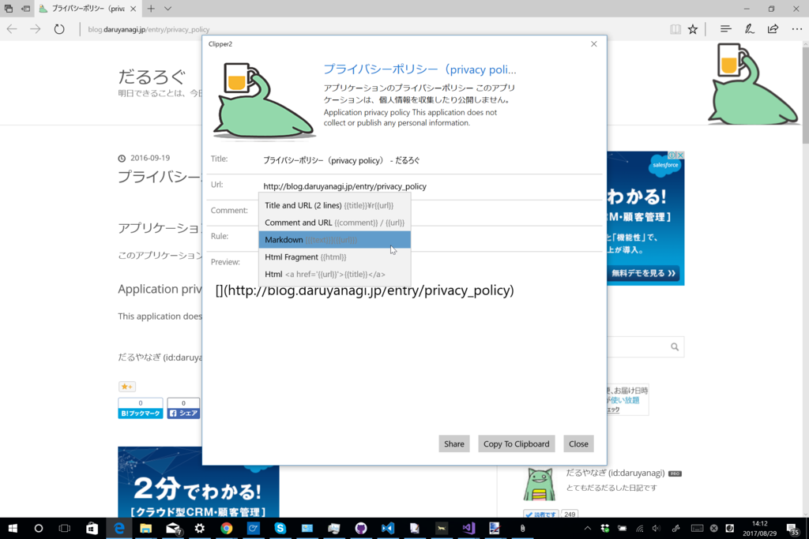
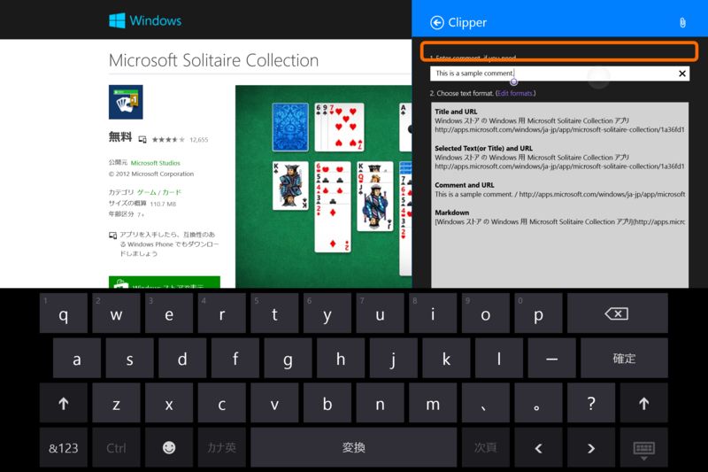
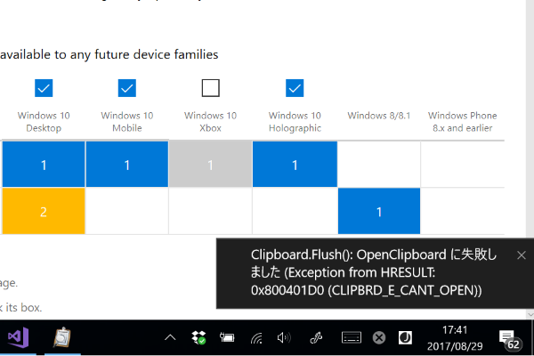
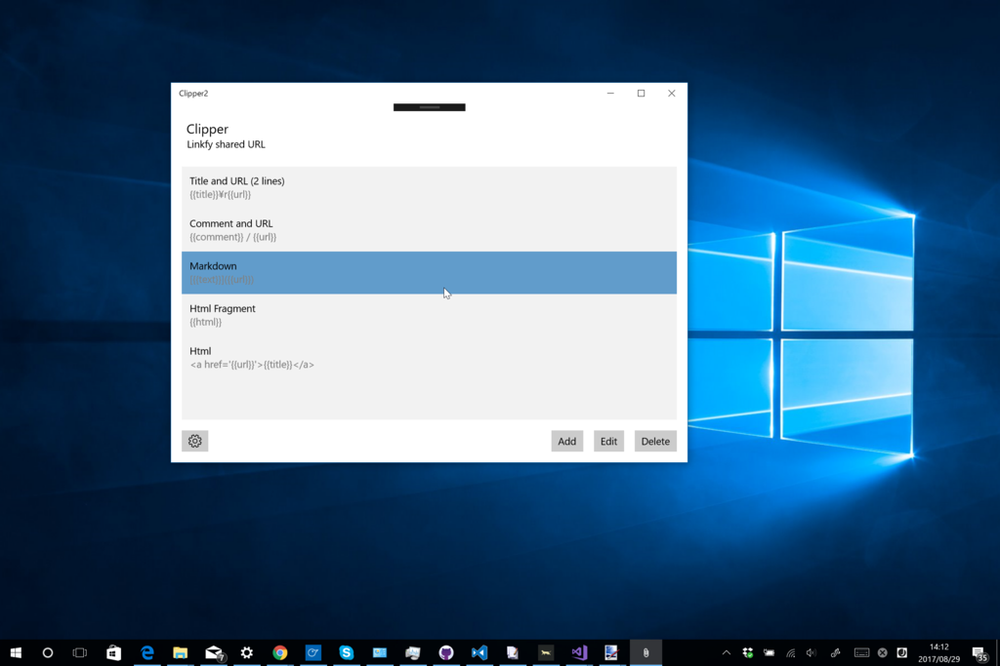
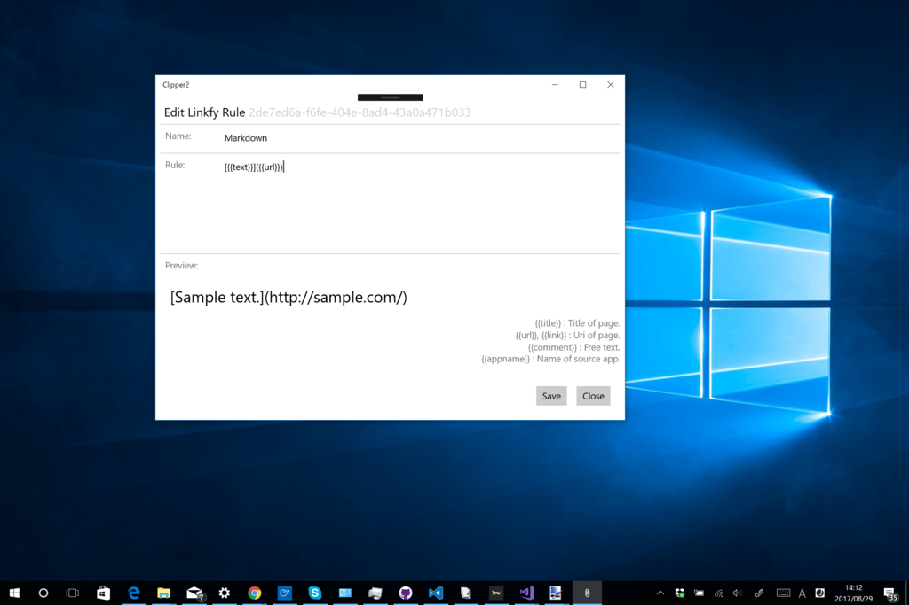
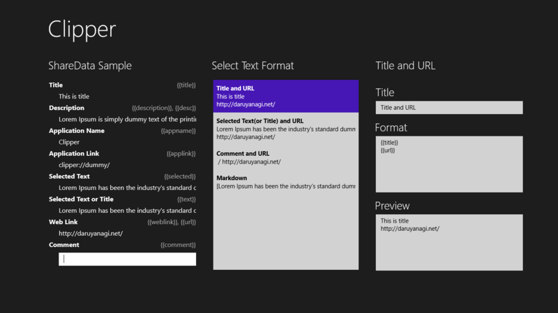
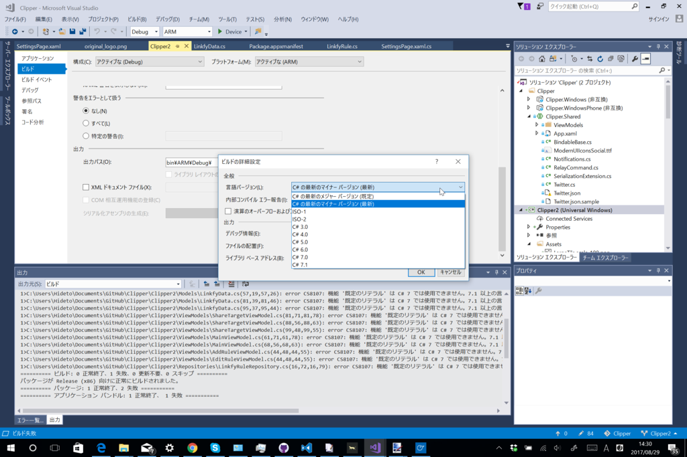

Windows の［共有］機能からシェアした URL を整形してクリップボードにコピーできるストアアプリ「Clipper」を<b>3年ぶりに</b>アップデートしました！ 「Microsoft Edge」の拡張機能が充実すれば要らない子になるはずだったのですが、意外に全然ダメダメなのでサクッとね。

<ul>
<li>Release 4: 3.0 (17/08/29)
<ul>
<li>new design</li>
<li>improve error handling</li>
</ul></li>
</ul>
ほんとは Visual Studio 2013 のプロジェクト（旧ストアアプリ、なんていうの？ WinRT？）をちまちまアップデートを……と思っていたのですが、途中でめんどくさくなって、また一から作り直しました！　さすがに3回目ともなると、半日立たず作れていい気分です（吐血

昔と比べたらだいぶ良くなったと思いますが、プルダウンメニューにしたのはイマイチかもしれない。自分で使いながら改善を模索していこうかと思います。

ちょっと面白いのは、<b>このアプリからまた［共有］機能が呼べる</b>ことです。整形した URL をさらにほかのアプリへ渡す、なんてこともできるようになりました。これに伴い、Twitter へ投稿する機能は削除しています。［共有］機能を使った方がいいと思います。

一方、<b>ときどきデータがクリップボードにコピーされない</b>という不具合は根絶できませんでした。 Clipboard.Flush() を呼べばアプリケーションのライフサイクルが終わってもデータがクリップボードに保持されるみたいなので、それで解決かと思ったのですが、たまに COM 側で例外が飛んできます。とりあえず通知だけ実装してリリースしましたが、今後の課題です<a href="#f-341c777e" name="fn-341c777e" title="WPF での解決策はみかけるけど、UWP での解決は見つからない……ワークアラウンドもいろいろ考えたけど、実装が面倒なだけで効果的な解決にはなってなかったのでとりあえず削除">*1</a>。

整形ルールの管理画面も新しくなりました。

昔は画面遷移がよくわかってなかったのですべての要素を一画面にツッコむという荒業でしのいでいましたが、それに比べるとだいぶ使いやすいはずです。正直、昔の画面は、しばらくたつと作った本人ですらよくわからなくなるひどいものでした。

あと、機能には関係ないですが、C# 7.1 を使ってみました。いろいろ簡単に書けて幸せですけど、間違って x86/Debug の C# のバージョンだけを latest に設定していたので、パッケージのビルド（Release）でコンパイルがコケて 3 分ぐらい悩みました。こんなことで躓くのは僕だけかもですが、皆さん気を付けましょう（

<iframe src="https://hatenablog-parts.com/embed?url=http%3A%2F%2Fstore-watch.hatenadiary.jp%2Fentry%2F2017%2F09%2F01%2F084209" title="【更新】Clipper - Windows Store Watch" class="embed-card embed-blogcard" scrolling="no" frameborder="0" style="display: block; width: 100%; height: 190px; max-width: 500px; margin: 10px 0px;"></iframe><cite class="hatena-citation"><a href="http://store-watch.hatenadiary.jp/entry/2017/09/01/084209">store-watch.hatenadiary.jp</a></cite>

<iframe src="https://hatenablog-parts.com/embed?url=https%3A%2F%2Fwww.microsoft.com%2Fja-jp%2Fstore%2Fp%2Fclipper%2F9wzdncrdf8kz" title="Clipper を購入 - Microsoft ストア 日本" class="embed-card embed-webcard" scrolling="no" frameborder="0" style="display: block; width: 100%; height: 155px; max-width: 500px; margin: 10px 0px;"></iframe><cite class="hatena-citation"><a href="https://www.microsoft.com/ja-jp/store/p/clipper/9wzdncrdf8kz">www.microsoft.com</a></cite>

<a href="#fn-341c777e" name="f-341c777e" class="footnote-number">*1</a>:WPF での解決策はみかけるけど、UWP での解決は見つからない……ワークアラウンドもいろいろ考えたけど、実装が面倒なだけで効果的な解決にはなってなかったのでとりあえず削除

