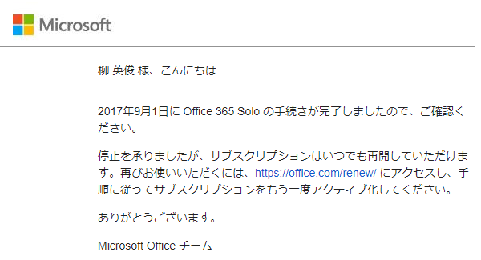
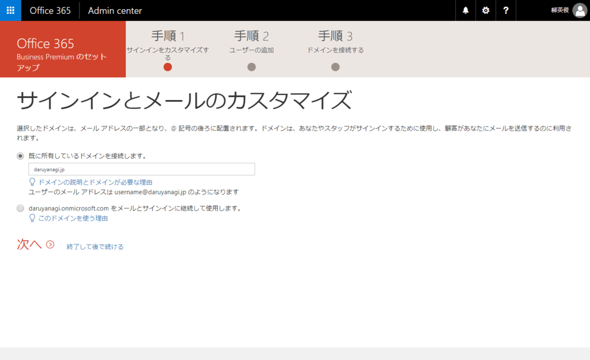
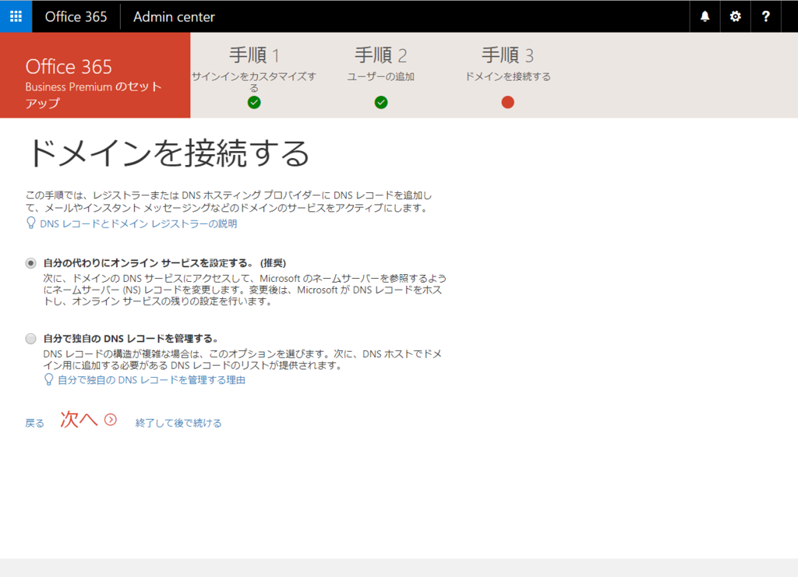

Microsoft Office はこれまで Office 365 Solo を契約していたのですが、今回、契約満了を機に、Office 365 Bussiness Premium に変えてみました。

Office 365 のライセンスはややこしいですけど、個人て使うなら以下のプランが候補に挙がりそうです。

<table>
<tr>
<td></td>
<td>Solo（個人用）</td>
<td>Business</td>
<td>Business Premium</td>
<td>Business Essentials</td>
</tr>
<tr>
<td>一年払いにしたときの月額</td>
<td>¥1,274（税込）</td>
<td>¥900（税抜）</td>
<td>¥1,360（税抜）</td>
<td>¥540（税抜）</td>
</tr>
<tr>
<td>Office アプリ</td>
<td>2台</td>
<td>5台</td>
<td>5台</td>
<td>×</td>
</tr>
<tr>
<td>OneDrive</td>
<td>個人向け1TB</td>
<td>法人向け1TB</td>
<td>法人向け1TB</td>
<td>法人向け1TB</td>
</tr>
<tr>
<td>独自ドメインのメール アドレス </td>
<td>×</td>
<td>×</td>
<td>○</td>
<td>○</td>
</tr>
</table>
要するに、Bussiness は割と安い（大雑把）。Office アプリの有無とサービス群の利用可否で無印、Premium、Essentials の違いがありますが、ちょっと足し前して全部入りの Bussiness Premium にする（¥1,274（税込）→ ¥1,360（税抜））だけで、Solo と比較して

<ul>
<li>インストール可能台数が 2台 → 5台</li>
<li>独自ドメインメールアドレス</li>
<li>Microsoft Teams のような法人向けサービスをちょっと覗くことができる（一人だからほとんど意味ないけど）</li>
</ul>
みたいなメリットが得られるようです。かつては「Solo では使える Access が Business では使えない」などの違いがあったようですが、今はないみたいですね。自分のような

<ul>
<li>PC やタブレット、スマホをやたらいっぱい持ってる</li>
<li>独自ドメインもってるのにメールは運用していない</li>
<li>Office 365 サービスにちょっと興味がある</li>
</ul>
というような人間にはピッタリと言えそうです。

実際にセットアップしてみましたが、昔やってた Google Apps よりはいろいろ面倒なものの、それほど手間もかからずにセットアップすることができました<a href="#f-bc3f664d" name="fn-bc3f664d" title="面倒なのはだいたい Lync/Skype for Bussiness など追加サービスのせいです。使わないならば、同等の手間でセットアップできそう">*1</a>。あと、言い忘れてましたが、独自ドメインがなくても運用は可能です（onmicrosoft.com というダサいドメインで運用できるようです）。

唯一、DNS の設定で少しもたついてしまいましたけど。うちは Value-Domain でドメインを管理してもらってるのですが――

<pre class="code" data-lang="" data-unlink>mx daruyanagi-jp.mail.protection.outlook.com. 0 // ← ここだけドメインにより異なります
cname autodiscover autodiscover.outlook.com.
cname sip sipdir.online.lync.com.
cname lyncdiscover webdir.online.lync.com.
cname msoid clientconfig.microsoftonline-p.net.
cname enterpriseregistration enterpriseregistration.windows.net.
cname enterpriseenrollment enterpriseenrollment.manage.microsoft.com.
txt @ v=spf1 include:spf.protection.outlook.com -all
srv _sip._tls 100 1 443 sipdir.online.lync.com.
srv _sipfederationtls._tcp 100 1 5061 sipfed.online.lync.com.</pre>
DNS 設定はこんな感じ。

<ul>
<li><a href="https://help.value-domain.com/f_domain/index.cgi?read=178&ukey=0">https://help.value-domain.com/f_domain/index.cgi?read=178&ukey=0</a></li>
</ul>
当初は srv だけが反映されず、セットアップでエラーになったのですが、一晩放置してセットアップを再開したら無事通ったのでこれでよいのでしょう。これは Lync 関連の設定のようですので、この辺りは上手くいかなくて放置しても、メール（Exchange）などはそのまま使えるみたいで、実際、Exchange の設定に進むことができました。

そのあともいろいろごにょごにょして、無事 mail(a)daruyanagi.jp でメールをやり取りできるように<a href="#f-ca5ef3fc" name="fn-ca5ef3fc" title="共有メールボックスというのを作成しています。これについてはまた今度メモするかも">*2</a>。 複数もっていた私用の Gmail もこちらへ転送して 1 つのメールアドレスで管理できるようにしました。問題がなければ、この運用で続けていきたいかなって思います。

<h3>追伸</h3>

<blockquote class="twitter-tweet" data-lang="ja">
Access と Outlook を捧げるから Visio ほしいかな
&mdash; たるやなき (@daruyanagi) <a href="https://twitter.com/daruyanagi/status/869711294852616194">2017年5月31日</a></blockquote>

<a href="#fn-bc3f664d" name="f-bc3f664d" class="footnote-number">*1</a>:面倒なのはだいたい Lync/Skype for Bussiness など追加サービスのせいです。使わないならば、同等の手間でセットアップできそう

<a href="#fn-ca5ef3fc" name="f-ca5ef3fc" class="footnote-number">*2</a>:共有メールボックスというのを作成しています。これについてはまた今度メモするかも

