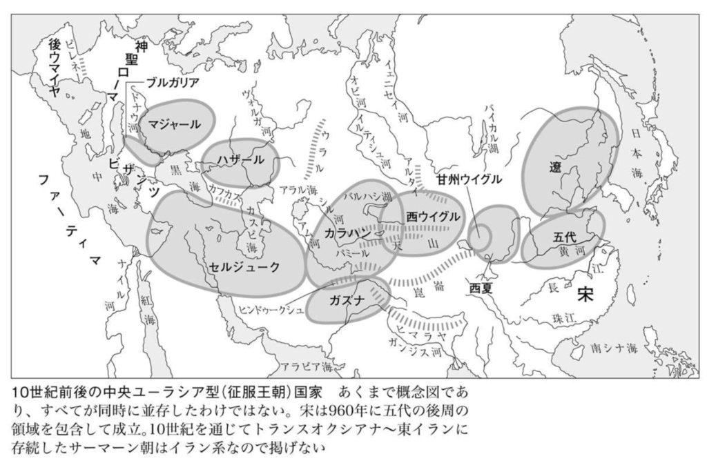
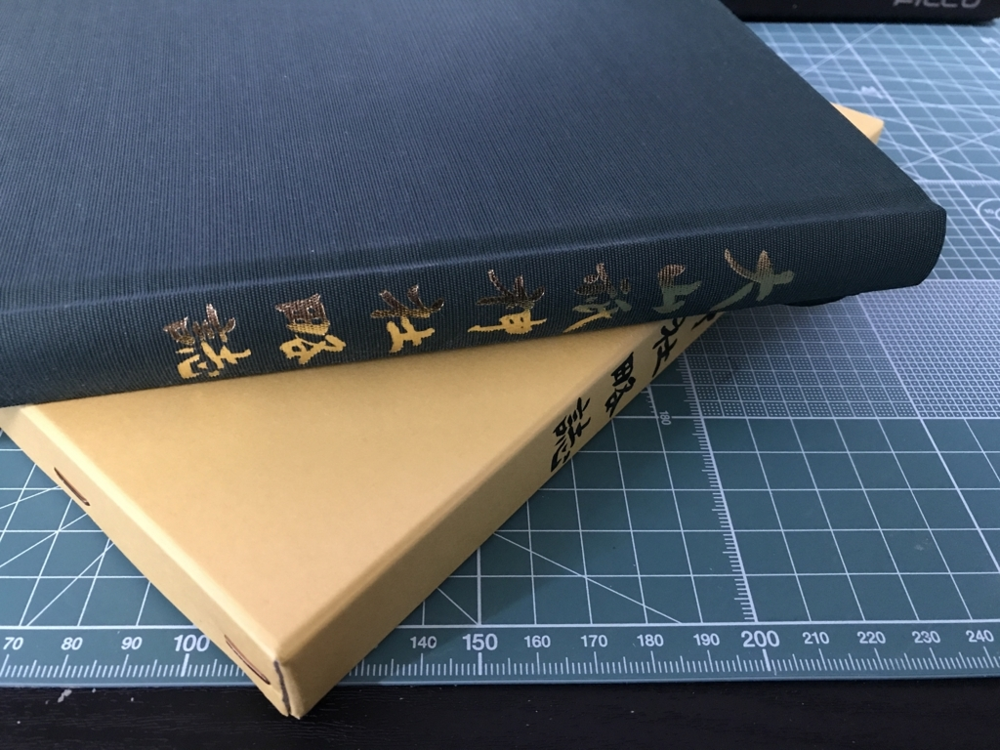

<h3>『興亡の世界史　アレクサンドロスの征服と神話』</h3>

最近はあんまりパワーがなくて、アリアノスの『アレクサンドロス大王東征記』なども積んだままにしてる。――というわけで、まずはリハビリでもしようかと読んでみた。

内容は……普通に面白かった（パワーレス

<a href="http://www.amazon.co.jp/exec/obidos/ASIN/B01BWMRJWG/bestylesnet-22/">興亡の世界史　アレクサンドロスの征服と神話 (講談社学術文庫)</a>
<ul><li>作者: 森谷公俊</li><li>出版社/メーカー: 講談社</li><li>発売日: 2016/02/26</li><li>メディア: Kindle版</li><li><a href="http://d.hatena.ne.jp/asin/B01BWMRJWG/bestylesnet-22" target="_blank">この商品を含むブログを見る</a></li></ul>

<h3>『興亡の世界史　シルクロードと唐帝国』</h3>

『アレクサンドロスの征服と神話』を呼んだたら“おすすめ”に出てきたので惰性で注文した。

まず、序文が鬱陶しかった。西洋中心史観を批判するのはまぁ、いいとして、現在の日本の外交観が……“敗戦を拗らせた”感じで鼻につく。同意するところも少なくないんだが、そういうのは自分のブログや Twitter でやっときゃいいわけで。自分はこの本に『シルクロードと唐帝国』しか期待してないんだから、それに応えてくれれば十分、それ以上は蛇足なんだ。あと、学説の縄張り意識の強さも感じた。もっとも、これは学者としてのガッツの源でもあろうし、学者という人は多かれ少なかれそういうものだから<a href="#f-3317ef37" name="fn-3317ef37" title="この点では役人と親和性があるのだけど、進取性という点では水と油なんだな。もっとも役人臭い保守的・訓詁学的な学者や、学者だけど安定して暮らしたいから役所を選ぶ人もいる">*1</a>仕方ないかなって思った。

内容は……なるほどと頷かされるところが少なからずあって、読んでよかったと思う。「唐≒拓跋＜タグバチ＞」ととらえてユーラシアを俯瞰すると、この時代の歴史が全然異なって見えてくるな。

（少し下った時代の概念図だけど、こうやって見ると「タグバチ」みたいに書き加えてあっても違和感ないよね）

<blockquote class="twitter-tweet" data-lang="ja">
ウイグルが安史の乱の際に唐に援軍を送ったことはやたらセンターで出題されるわよね。
&mdash; 世界史たん (@sekaishitan) <a href="https://twitter.com/sekaishitan/status/905181532909780993">2017年9月5日</a></blockquote>

唐という王朝も、ユーラシアにおける合従連衡の一つの駒としてみると、いろんなことが繋がってくる感じがある。まぁ、個人的には「江南はオマケなの？」ってところが気になったりもするけど。「征服王朝っていったいなんだったんだ？」とか。

シルクロード≒絹の道だけじゃないよっていう史観も今では割と当たり前かなって思うけど（海の道、草原の道っていう見方も今では習うよね）、この方が広めたのかな。シルクロード → 西域 → ロマン！　っていう歴史の見方に飽き足らない人はぜひ読むべきだと思う。とくに奴隷交易については見逃されがちな視点なんじゃないだろうか。

<a href="http://www.amazon.co.jp/exec/obidos/ASIN/B01D06QMJS/bestylesnet-22/">興亡の世界史　シルクロードと唐帝国 (講談社学術文庫)</a>
<ul><li>作者: 森安孝夫</li><li>出版社/メーカー: 講談社</li><li>発売日: 2016/03/25</li><li>メディア: Kindle版</li><li><a href="http://d.hatena.ne.jp/asin/B01D06QMJS/bestylesnet-22" target="_blank">この商品を含むブログを見る</a></li></ul>

<h3>『世界の文字の図典 普及版』</h3>

松山のジュンク堂で衝動買いしたけど、たまにチラチラみてる。『興亡の世界史　シルクロードと唐帝国』を読んだときも、「ソグド文字ってなんだろ」って思ってすぐに参照できるのがいいわな<a href="#f-25af955f" name="fn-25af955f" title="さっき書き忘れたけど、あの時代はほんまソグド人の時代と言っても過言ではないな。ソグド人の重要性はわきまえてたつもりだが、もうちょっと自分の中で重りを加えてあげようと思った">*2</a>。普及版だけど、そういった軽い用途であればそんなに不足を感じないと思う。

あんまり関係ないけど、音符まで載ってて「あ、そうか、これも文字と言えば文字かー」なんて気付かされるなど。自分の頭が固すぎるだけかもだけど、そういう発見もある。

<a href="http://www.amazon.co.jp/exec/obidos/ASIN/4642014519/bestylesnet-22/">世界の文字の図典 普及版</a>
<ul><li>作者: 世界の文字研究会</li><li>出版社/メーカー: 吉川弘文館</li><li>発売日: 2009/05/20</li><li>メディア: 単行本</li><li>購入: 2人 クリック: 16回</li><li><a href="http://d.hatena.ne.jp/asin/4642014519/bestylesnet-22" target="_blank">この商品を含むブログ (8件) を見る</a></li></ul>

<h3>『大山祇神社略史』</h3>

大山祇神社の宝物館で3,000円ぐらいで買った。あんまり期待せずにペラペラめくって読んでたけど、割と面白かった。全国の大山積・三島社の分布統計とか、神仏習合の話、「白鷺」と「うなぎ」の神使、参拝した帝国海軍の軍人の一覧（あー、だから絵を飾ってたんだなーみたいな）、そして国宝・重文てんこ盛りの国宝館の建設まで……そういうのをサラッと解説してくれてるので、ぼーっとお参りして終わりにしたくない人にはぜひぜひ。

巻末の付録に文書が収録されてるのいいね。

<a href="#fn-3317ef37" name="f-3317ef37" class="footnote-number">*1</a>:この点では役人と親和性があるのだけど、進取性という点では水と油なんだな。もっとも役人臭い保守的・訓詁学的な学者や、学者だけど安定して暮らしたいから役所を選ぶ人もいる

<a href="#fn-25af955f" name="f-25af955f" class="footnote-number">*2</a>:さっき書き忘れたけど、あの時代はほんまソグド人の時代と言っても過言ではないな。ソグド人の重要性はわきまえてたつもりだが、もうちょっと自分の中で重りを加えてあげようと思った

