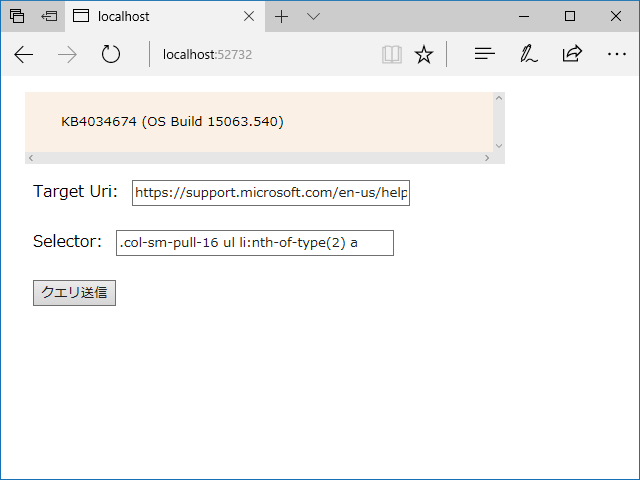

（Windows 10 version 1703 の最新ビルドの番号をテキトーに得るサンプル）

静的サイトのスクレイピングは HTML をダウンロードしてごちゃごちゃっとやればいいけど、動的サイトの場合はブラウザーで JavaScript の評価をしたあとの HTML（DOM ツリーっていうの？）がほしい。というわけで、ヘッドレスブラウザー「PhantomJS」でアクセス → 評価するサンプルを Razor Pages で作ってみた。

ソリューションはこんな構成になった。

ASP.NET Core＋Razor Pagesの導入方法は以下のページを参照のこと（別にこの通りにやる必要はないけど）。

<iframe src="https://hatenablog-parts.com/embed?url=http%3A%2F%2Fblog.daruyanagi.jp%2Fentry%2F2017%2F08%2F15%2F043634" title="空のアプリケーションから ASP.NET Core Razor Page を始める - だるろぐ" class="embed-card embed-blogcard" scrolling="no" frameborder="0" style="display: block; width: 100%; height: 190px; max-width: 500px; margin: 10px 0px;"></iframe><cite class="hatena-citation"><a href="http://blog.daruyanagi.jp/entry/2017/08/15/043634">blog.daruyanagi.jp</a></cite> 

<h3>基本的な流れ</h3>

PhantomJS.exe にスクリプトと Uri とセレクターを渡し、標準出力を介して結果（JSON）を得る。標準出力には PhantomJS が吐くエラーが混じることがあるので、適当な正規表現で除去しておく。

<h3>Index.cshtml</h3>

コードビハインド？　MVVM じゃない方の ViewModel？　なんて言っていいのかは知らんけど（変な言葉遣いしたらその手のケーサツが来そうだし）、Index.cshtml の裏はこんな感じ。

<pre class="code lang-cs" data-lang="cs" data-unlink>// index.cshtml.cs

using System;
using System.Collections.Generic;
using System.Linq;
using System.Threading.Tasks;
using Microsoft.AspNetCore.Mvc;
using Microsoft.AspNetCore.Mvc.RazorPages;
using System.Diagnostics;
using System.IO;

namespace WebApplication5.Pages
{
public class IndexModel : PageModel
{
[BindProperty]
public Uri Target { get; set; }

[BindProperty]
public string Selector { get; set; }

[BindProperty]
public Models.ScrapingResult Result { get; private set; }

public IActionResult OnPost(string message)
{
if (!ModelState.IsValid) return Page();

var root_dir = Hosting.Environment.ContentRootPath;
var work_dir = System.IO.Path.Combine(root_dir, &quot;Tools&quot;);
var script_name = &quot;scrape.js&quot;;

var info = new ProcessStartInfo()
{
Arguments = $@&quot;&quot;&quot;{script_name}&quot;&quot; &quot;&quot;{Target}&quot;&quot; &quot;&quot;{Selector}&quot;&quot;&quot;,
FileName = Path.Combine(work_dir, &quot;phantomjs.exe&quot;),
CreateNoWindow = true,
RedirectStandardOutput = true,
StandardOutputEncoding = System.Text.Encoding.UTF8,
UseShellExecute = false,
WorkingDirectory = work_dir,
};

using (var process = new Process() { StartInfo = info, })
{
var output = string.Empty;

process.OutputDataReceived += (s, a) =&gt; { output += a.Data; Debug.WriteLine(a.Data); };

process.Start();
process.BeginOutputReadLine();
process.WaitForExit();

// エラー出力をちょん切る
var r = new System.Text.RegularExpressions.Regex(&quot;{.+}&quot;);
output = r.Match(output).Value;

Result = Newtonsoft.Json.JsonConvert.DeserializeObject&lt;Models.ScrapingResult&gt;(output);
}

return Page();
}
}
}
</pre>
ユーザーインターフェイス（Index.cshtml）はこんな感じ。まだ慣れてないのでこれいいのかよくわかんないけど、タグヘルパーってやつでバインディングできるんだなー。便利ンゴ。

<pre class="code lang-cs" data-lang="cs" data-unlink>// Index.cshtml
@page
@model WebApplication5.Pages.IndexModel
@addTagHelper *, Microsoft.AspNetCore.Mvc.TagHelpers

&lt;html&gt;
&lt;body&gt;
&lt;style&gt;
*, input { font-family: Meiryo; margin: 8px; }
pre { background-color: linen; width: 480px; overflow: scroll; }
&lt;/style&gt;
&lt;pre&gt;&lt;code&gt;
@Model.Result?.Text
&lt;/code&gt;&lt;/pre&gt;
&lt;div asp-validation-summary=&quot;All&quot;&gt;&lt;/div&gt;
&lt;form method=&quot;POST&quot;&gt;
&lt;div&gt;Target Uri: &lt;input asp-for=&quot;Target&quot; /&gt;&lt;/div&gt;
&lt;div&gt;Selector: &lt;input asp-for=&quot;Selector&quot; /&gt;&lt;/div&gt;
&lt;input type=&quot;submit&quot; /&gt;
&lt;/form&gt;
&lt;/body&gt;
&lt;/html&gt;
</pre>

<h3>モデル</h3>

スクレイピングの結果を表すモデル（？）クラスはこんな感じ。スクリプトが返す JSON の形式が固まるまでは dynamic にしちゃうと楽だね。

<pre class="code lang-cs" data-lang="cs" data-unlink>using Newtonsoft.Json;
using System;
using System.Collections.Generic;
using System.Linq;
using System.Threading.Tasks;

namespace WebApplication5.Models
{

public class ScrapingResult
{
[JsonProperty(&quot;uri&quot;)]
public string Url { get; set; }

//[JsonProperty(&quot;selector&quot;)]
public string Selector { get; set; }

public string Status { get; set; }

public string Text { get; set; }
}
}
</pre>
<code>[JsonProperty("uri")]</code> は要らんのか？　コメントアウトしても動いたから、命名規約ベースでよしなにしてくれるのかもしれない。

<h3>PhantomJS スクリプト</h3>

PhantomJS に渡したスクリプトの中身はこんな感じ。

<pre class="code lang-javascript" data-lang="javascript" data-unlink>var page = require('webpage').create();
var system = require('system');
var url = system.args[1];
var selector = system.args[2];

page.open(url, function (status) {
var text = null;
if (status === 'success') {
text = page.evaluate(function (selector) {
var element = document.body.querySelector(selector);
if (element == null) return null;
return element.innerHTML;
}, selector);
}
console.log(JSON.stringify({ url: url, selector: selector, status: status, text: text, }));
phantom.exit();
});
</pre>
ちょっと悩んだのは page.evaluate() がサンドボックスになっていたこと。プリミティブ型じゃないとやり取りできないのかな。page.evaluate() に変数を渡す方法も悩んだけど、だいたいこれでイケそう<a href="#f-54d78508" name="fn-54d78508" title="JavaScript のスコープとか、基本があんまりわかってないのですごく悩んだ">*1</a>。

ほんとは引数チェックしたり、エラートラップして終了コードを渡したりした方がいいよね。まぁ、サンプルなのでいろいろ適当でいい気がする。

で、ここまで完成させたあとに昔ブックマークしたページのことを思い出した。

<iframe src="https://hatenablog-parts.com/embed?url=http%3A%2F%2Fqiita.com%2Fmatarillo%2Fitems%2Fa92e7efbfd2fdec62595" title="C#でモダンにスクレイピングするならAngleSharp - Qiita" class="embed-card embed-webcard" scrolling="no" frameborder="0" style="display: block; width: 100%; height: 155px; max-width: 500px; margin: 10px 0px;"></iframe><cite class="hatena-citation"><a href="http://qiita.com/matarillo/items/a92e7efbfd2fdec62595">qiita.com</a></cite>

JavaScript の評価もできるなら、こっちを使った方がよかったかもしれない。

<a href="#fn-54d78508" name="f-54d78508" class="footnote-number">*1</a>:JavaScript のスコープとか、基本があんまりわかってないのですごく悩んだ

