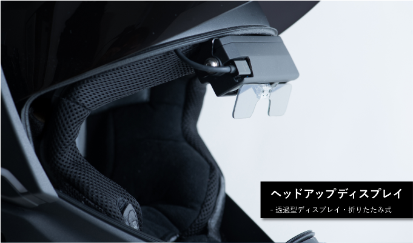
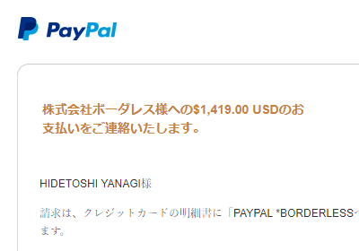

前々から話に聞いていて気になっていたのだけど、日本語版 Kickstarter がローンチしたので散歩していたら<b>クロスヘルメット</b>を見つけたので、速攻で参加してしまった。

早期参加でも15万円ぐらいするけど、気にしない。俺は、ヘルメットの未来を買ったのだ。

デリバリーは来年の10月らしい。この手のものは予定通りにちゃんと手に届くとは限らないけど、今度はなにがあっても後悔はすまい（ドイツ語キーボードを抱きながら、涙目で

<h3>クロスヘルメットとは</h3>

<blockquote cite="http://crosshelmet.com/jp/kickstarter/">

クロスヘルメットとは？

従来からモーターサイクルは、ヘルメットよりもずっと早く高性能なものとして進化してきました。我々が開発しているクロスヘルメットは、新しい技術を用いて、ヘルメットを再発明しようとしています。 より安全で、より快適なライディング体験を提供したい。クロスヘルメットは360°視野、サウンドコントロールによるノイズ低減を可能にします。 また、Bluetoothを搭載し、スマートフォンとの接続を可能にします。 これまでになかった、最もスマートなモーターサイクルヘルメットです。

<cite><a href="http://crosshelmet.com/jp/kickstarter/">http://crosshelmet.com/jp/kickstarter/</a></cite>
</blockquote>

とても単純にいえば、無線でスマホと連携できるヘルメット。ヘッドアップディスプレイが内蔵されているので、ヘルメットのなかでさまざまな情報を確認できる……というのが触れ込み。ハンドルにナビを括りつける必要がなくなる！

あと、リアカメラで後ろが見えるというのもすごいよね。

実際のところは少なからず遅延があるだろうし、それほど期待していない。結局はミラーで後方確認するのが基本なのは変わらないだろうし。

でも、これぞテクノロジー！　って感じがして好きかも。画像認識で背後から高速で迫ってくるクルマをキャッチして警告できる……みたいなシステムが作れたら夢あるよなぁ。

<h3>ちょっと心配なこと</h3>

開発が順調に進むかどうか、みたいなことはとりあえず置いておくとして、パッと思いついた懸念点をいくつかメモしておこうかと思う。

まずは、なんといっても<b>安全性</b>。コケたときにちゃんと頭を保護してくれるんだろうか。きっと JIS 規格なんかはクリアするんだろうし、あまり心配はしていないけど、まずそこは譲歩しないでほしいかな。一応、ノウハウのある製造元の協力は仰ぐみたいだけど。

次に、<b>サイズ</b>。というか、<b>カタチ</b>。自分の頭は SHOEI 頭なので（わかるひとにはわかる）、ちゃんとハマってくれたらうれしいなぁ。頭も大きめ（帽子のサイズで60cmぐらい）だけど、たぶん M サイズでいいと思う。

<b>重さ</b>も少し気になる。色々てんこ盛りだろうから、重量はフツウのヘルメットよりはかさむだろう。もちろんそのあたりは十分考えているみたいで、カタログスペックでは 1.7kg とあった。ちなみにフツウのヘルメットは 1.3kg ～ 1.7kg らしいから十分許容範囲と言えるけど、ほんとにそれで収まるのだろうか。

ちなみに、電源はバッテリー駆動で、リスクフリーなリチウムセラミックバッテリー（LCB）が使われているらしい（文系なので詳細は知らん）。「理的衝撃、穿刺、熱的損傷において、漏れ、煙、火災、爆発などを起こしません」とのことで、頭が火あぶりになることはなさそう。ただ、6～8時間という<b>稼働時間</b>はちょっと不安。実質的な駆動時間はもう少し短くなるかもなので（カタログスペック不信！）、もう少し盛ってほしいかも。

あとは、<b>耐久性</b>。色々精密っぽいから、ちょっと心配かな。コンポーネント化されてて、修理が簡単だったりしたら、うれしいんだけど。ある程度値段がするから、壊れて即粗大ごみってわけにはいかんよね。高いといえば<b>盗難</b>とかも心配なので、ヘルメットをロックするためのちょっとした配慮があったらいいかも。ワイヤーが通せる穴があるとか、そんなのでいいから。もっとも、日頃ヘルメットの盗難を気にして生きていないので、高いヘルメット（スオーミーのペイントが凝ってるヤツとか）を使ってる人たちが日頃どういう対策をしているのかはあまり知らない……。

<h3>プラスアルファで望むこと</h3>

<b>旅の記録</b>ができたらいいな。アクションカメラ的な。<b>ドライブレコーダー</b>としても働いてくれたらなおうれしい。まぁ、こういうのはアプリケーション層で実現できることな気がするので、そっちに期待なのかも。一応、ドライビング情報を表示する機能はあるみたいだけど、それをログとして保存してくれるかどうかまではちょっとわかんなかった。

<blockquote>

クロスヘルメットを使用すると、ライダーは天気、気温、方角など、ツーリングに関連する情報に簡単にアクセスできます。ネットワーク接続やバッテリー残量などの情報も合わせて表示され、さらに交差点のポイント、目的地までの距離、走行時間なども表示されます。

</blockquote>

フラッシュストレージは 8GB で、SD カードスロットが付くとかいう記載はないから望み薄かもしれない。

とにかく、来年が楽しみ（＾ｖ＾）

