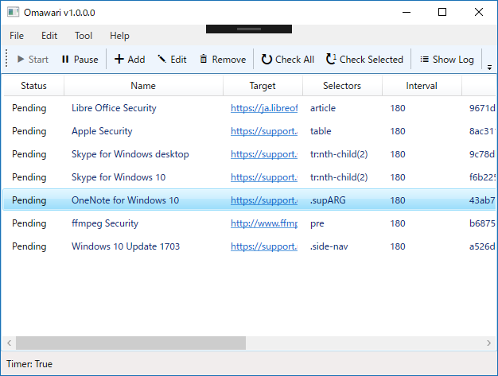
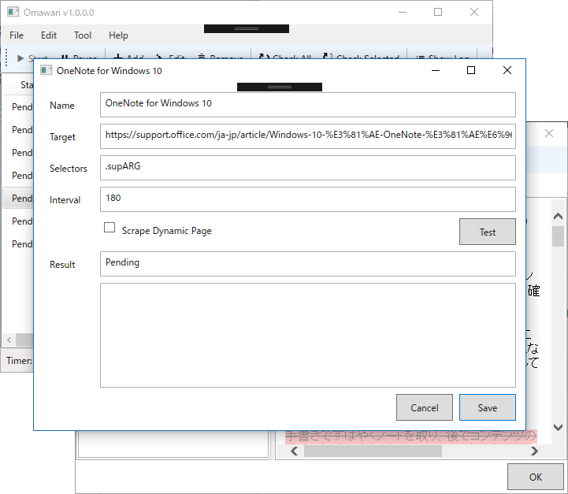
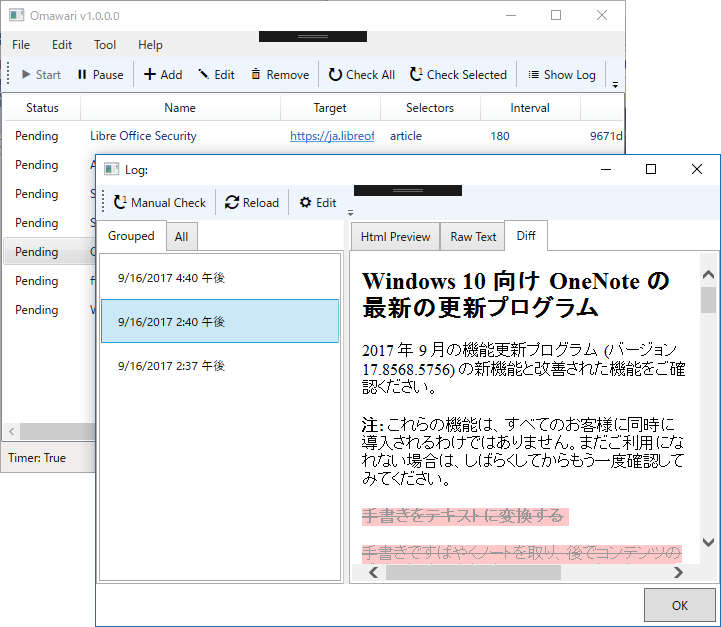

この前作ったスクレイピングサービスを Microsoft Azure Web Apps に載せたのですが……

<iframe src="https://hatenablog-parts.com/embed?url=http%3A%2F%2Fblog.daruyanagi.jp%2Fentry%2F2017%2F09%2F09%2F171921" title="Razor Pages：PhantomJS で動的サイトをスクレイピングする（2） - だるろぐ" class="embed-card embed-blogcard" scrolling="no" frameborder="0" style="display: block; width: 100%; height: 190px; max-width: 500px; margin: 10px 0px;"></iframe><cite class="hatena-citation"><a href="http://blog.daruyanagi.jp/entry/2017/09/09/171921">blog.daruyanagi.jp</a></cite>

動かなかったので（そりゃそうか？）、WPF アプリケーションにしました。

ターゲットとなる URI を登録すると、定期的にスクレイピングしてくれます。CSS セレクターが使えるので、ページの一部分だけ保存することが可能です<a href="#f-9629f3c9" name="fn-9629f3c9" title="全部を保存するときは“document”とか“body”とかしておけばいいと思う。そういえば試してないけど">*1</a>。あと、シングルページアプリケーションのために、動的サイトをスクレイピングする機能を追加しました。

ローカルに保存したログは、Diff をとってみることができます<a href="#f-8c2c52ba" name="fn-8c2c52ba" title="文字化けする……右クリックメニューからエンコーディングを UTF-8 にすると治せます">*2</a>。データフォルダーをオンラインストレージに指定しておくと（初回利用時に選択できます）、複数環境でデータを同期できて便利かもしれない。

<iframe src="https://hatenablog-parts.com/embed?url=https%3A%2F%2Fgithub.com%2Fdaruyanagi%2FOmawari%2Freleases%2Ftag%2Fv1.0.0.0" title="daruyanagi/Omawari" class="embed-card embed-webcard" scrolling="no" frameborder="0" style="display: block; width: 100%; height: 155px; max-width: 500px; margin: 10px 0px;"></iframe><cite class="hatena-citation"><a href="https://github.com/daruyanagi/Omawari/releases/tag/v1.0.0.0">github.com</a></cite>

コードが汚いのをなんとかしたいのと、更新を検出したときにデスクトップ通知を出すだけだと見逃しちゃうかもなので、なんかいい方法を考えようかなと思います。

<a href="#fn-9629f3c9" name="f-9629f3c9" class="footnote-number">*1</a>:全部を保存するときは“document”とか“body”とかしておけばいいと思う。そういえば試してないけど

<a href="#fn-8c2c52ba" name="f-8c2c52ba" class="footnote-number">*2</a>:文字化けする……右クリックメニューからエンコーディングを UTF-8 にすると治せます

