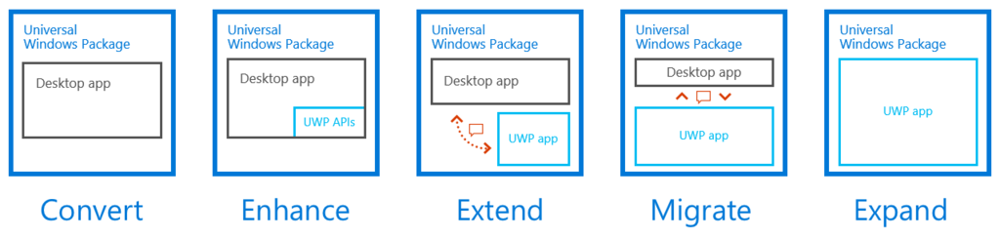

だいぶサマになってきた気がする。あっちこっちにぬるぽエラーがあって、潰すのに難儀した。Swift とか羨ましいかもね？（よく知らんけど）

<ul>
<li>デバッグビルドとリリースビルドの共存（開発の都合）</li>
<li>通知アイコンの改善</li>
<li>（タイマーの通算稼働時間のカウント）</li>
<li>Updated を Pending に変えるまでの時間をグローバル設定から読み込むように</li>
<li>ステータス色分けの改善</li>
<li>内部で保持している UTC を Local Time にちゃんと直して表示</li>
<li>コードの整理</li>
<li><b>静的スクレイピング機能の追加</b></li>
<li><b>プレビューの文字化けを修正</b></li>
<li><b>更新ログウィンドウの追加</b></li>
<li>スクレイピングルールのダブルクリックでログを表示（編集画面の方がよかったか？）</li>
</ul>
<iframe src="https://hatenablog-parts.com/embed?url=https%3A%2F%2Fgithub.com%2Fdaruyanagi%2FOmawari%2Freleases%2Ftag%2Fv1.1" title="daruyanagi/Omawari" class="embed-card embed-webcard" scrolling="no" frameborder="0" style="display: block; width: 100%; height: 155px; max-width: 500px; margin: 10px 0px;"></iframe><cite class="hatena-citation"><a href="https://github.com/daruyanagi/Omawari/releases/tag/v1.1">github.com</a></cite> 

<h3>静的スクレイピング機能の追加</h3>

PhantomJS は遅いので、AngleSharp を使った静的スクレイピングをデフォルトにしました。下手したら3分ぐらいかかっていた処理が、たった数秒に。

<iframe src="https://hatenablog-parts.com/embed?url=http%3A%2F%2Fqiita.com%2Fmatarillo%2Fitems%2Fa92e7efbfd2fdec62595" title="C#でモダンにスクレイピングするならAngleSharp - Qiita" class="embed-card embed-webcard" scrolling="no" frameborder="0" style="display: block; width: 100%; height: 155px; max-width: 500px; margin: 10px 0px;"></iframe><cite class="hatena-citation"><a href="http://qiita.com/matarillo/items/a92e7efbfd2fdec62595">qiita.com</a></cite>

AngleSharp は HtmlAgilityPack より断然使いやすいので、今後はこっちをメインに使おうと思います。

<h3>プレビューの文字化けを修正</h3>

WebBrowser.NavigateToString() を使うとたまに文字化けする問題。HTML で UTF-8 エンコードを指定すればよかったのですが、Diff の方だけやって、プレビューの方には適用されてなかった（爆死

<pre class="code lang-cs" data-lang="cs" data-unlink>public class WebBrowserExtension
{
public static readonly DependencyProperty HtmlProperty = DependencyProperty.RegisterAttached(
&quot;Html&quot;, typeof(string), typeof(WebBrowserExtension),
new UIPropertyMetadata(null, HtmlPropertyChanged));

public static string GetHtml(DependencyObject obj)
{
return (string)obj.GetValue(HtmlProperty);
}

public static void SetHtml(DependencyObject obj, string value)
{
obj.SetValue(HtmlProperty, value);
}

public static void HtmlPropertyChanged(DependencyObject o, DependencyPropertyChangedEventArgs e)
{
WebBrowser browser = o as WebBrowser;
if (browser == null) return;
string html = e.NewValue as string;
if (html == null) return;
html = $@&quot;
&lt;html&gt;
&lt;head&gt;
    &lt;meta http-equiv='Content-Type' content='text/html;charset=UTF-8'&gt;
    &lt;style&gt;
        ins.diffins {{ background-color: #cfc; text-decoration: none; }} 
        del.diffdel {{ color: #999; background-color:#FEC8C8; }}
    &lt;/style&gt;
&lt;/head&gt;
&lt;body&gt;
    {html}
&lt;/body&gt;
&lt;/html&gt;&quot;;
browser.NavigateToString(html);
}
}
</pre>
バインディング拡張の方でやるように処理を統一。

<pre class="code lang-html" data-lang="html" data-unlink>&lt;WebBrowser u:WebBrowserExtension.Html=&quot;{Binding ViewModel.SelectedResult.Text}&quot; /&gt;
</pre>

<h3>更新ログウィンドウの追加</h3>

更新を検知したら ObservableCollection にログを追加してウィンドウに表示……っていうのをやってたのだけど、NotSupportedException が出て死んだ。異なるスレッドから書き込んだらダメみたい。

結局こっちの解決 AsyncObservableCollection を拝借した。

<iframe src="https://hatenablog-parts.com/embed?url=https%3A%2F%2Fwww.thomaslevesque.com%2F2009%2F04%2F17%2Fwpf-binding-to-an-asynchronous-collection%2F" title="[WPF] Binding to an asynchronous collection" class="embed-card embed-webcard" scrolling="no" frameborder="0" style="display: block; width: 100%; height: 155px; max-width: 500px; margin: 10px 0px;"></iframe><cite class="hatena-citation"><a href="https://www.thomaslevesque.com/2009/04/17/wpf-binding-to-an-asynchronous-collection/">www.thomaslevesque.com</a></cite>

要するに、コンストラクターでディスパッチャーを保存しておいて、コレクション操作でエラーが出たら保存しておいたディスパッチャーにお願いする感じみたい。便利だなー（小並感

<h3>今後の予定</h3>

<ul>
<li>Diff 周りが混乱していて、何と何を比較しているのかわかんないから UI を見直す</li>
<li>よくわかんなくなってきたので、コードの整理する</li>
<li>スタートアップ登録・解除機能</li>
<li>5,000円ぐらいでアイコン作ってもらおうかな？</li>
<li>Desktop Bridge に挑戦するときがきた！！</li>
</ul>

Desktop Bridge を利用した WPF → UWP の移植は理想的にはこうなるらしいけど、やってるアプリ見たことないので、ちょっと挑戦してみようと思う。cmd とのやり取りは排除できないけど、それ以外の要素は UWP にできんことはない気がする。まぁ、早くても来年やね。

