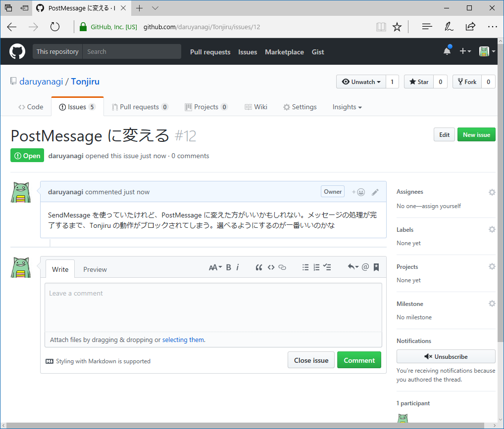

<iframe src="https://hatenablog-parts.com/embed?url=http%3A%2F%2Fforest.watch.impress.co.jp%2Fdocs%2Fnews%2F1081627.html" title="GitHub、Windows/Mac両対応の新しい「GitHub Desktop」アプリを正式リリース／「Electron」でプラットフォーム共通のUIに。イメージの差分を表示する機能なども追加" class="embed-card embed-webcard" scrolling="no" frameborder="0" style="display: block; width: 100%; height: 155px; max-width: 500px; margin: 10px 0px;"></iframe><cite class="hatena-citation"><a href="http://forest.watch.impress.co.jp/docs/news/1081627.html">forest.watch.impress.co.jp</a></cite>

ちょうど先週あたりから新しい「GitHub Desktop」を使う練習をしていたのだけど、この前、正式リリースされた（ベータ期間、意外に短かったな！）。古いアプリ（Windows版）に比べると楽しさに欠ける気がするが（ブランチツリーーがない！　プルリクエストをマージしたときのみょいーんというアニメーションがない！！）、これからはこちらがメインになるだろうので、早めに慣れておくにしくはない。というわけで、新しい「GitHub Desktop」の使い方をメモしておく（GitHub Flow の真似事）。

<iframe src="https://hatenablog-parts.com/embed?url=http%3A%2F%2Fblog.daruyanagi.jp%2Fentry%2F2017%2F06%2F07%2F191844" title="Tonjiru v1.1.0 ＋ GitHub Flow × GitHub for Windows - だるろぐ" class="embed-card embed-blogcard" scrolling="no" frameborder="0" style="display: block; width: 100%; height: 190px; max-width: 500px; margin: 10px 0px;"></iframe><cite class="hatena-citation"><a href="http://blog.daruyanagi.jp/entry/2017/06/07/191844">blog.daruyanagi.jp</a></cite> 

<h3>日頃から issue を付けておく</h3>

 

<h3>ブランチを作成する</h3>

機能を実装するためのブランチを作成する。その前に

<ul>
<li>ブランチが master になっているか</li>
<li>Sync してるかをチェックする（GUI だと push/pull/fetch の違いを気にしなくていい）</li>
</ul>
をチェックしておく。ブランチの名前は“これからやること（issue）”を適当な英語でつけるのが基本だけど、軽いリファクタリングとかだったら日時にしたりもしてる。どうせ触るのは自分だけだし気にしない。

<h3>機能を実装する</h3>

頑張る。まめに Sync しておくと、気分でデスクトップとノートパソコンを使い分けられてよろしい。GitHub 経由でコードを共有できる。

ちゃんと issue を作ってると「closed #***」とコミットすれば issue をクローズできる。fixes でもなんでもいいんだけど、solve はダメだった。――あれ？　昔はこれでイケてたような。記憶間違いかな……でも、マージのコメントで「closed」って付ければ大丈夫だったので問題ない。

<h3>プルリクエストを作成する</h3>

無事に機能を実装できたら、プルリクエストを作成する。

Sync し忘れてたら、ブランチを publish するかどうか聞いてくれるみたい。まぁ、日頃から適当に Sync、Sync しとけば問題ないね。GUI は頭の悪いユーザーの味方だ！

ほんとはここで誰かにレビューしてもらうんだけど、そんな友達はいないので勝手にマージして終わり。よく頑張った！

自分は本職のプログラマーではないし、ましてやおしゃれ開発現場にいるわけでもなし。独りでこういうことをやっても「ソースコードを失くさない」程度のメリットしかないんだけど、漫然と開発に取り掛かるのではなく、ちょっとだけ「今から何をするのか」を明確にしてから取り掛かるようになったのがメリットと言えばメリットと言える。また、そういうポジションの人間にとっては、扱いにちょっと神経を使うコマンドよりもGUI の方が圧倒的に気楽でよろしい。基本的な操作しかしないから、柔軟性に欠けるというデメリットよりも、要らないことをしてぶっ壊す危険を排除できるメリットの方が圧倒的に大きい。

<h3>感想</h3>

前の Windows 版の方が好き。

