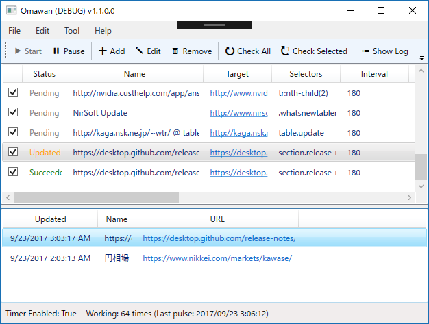
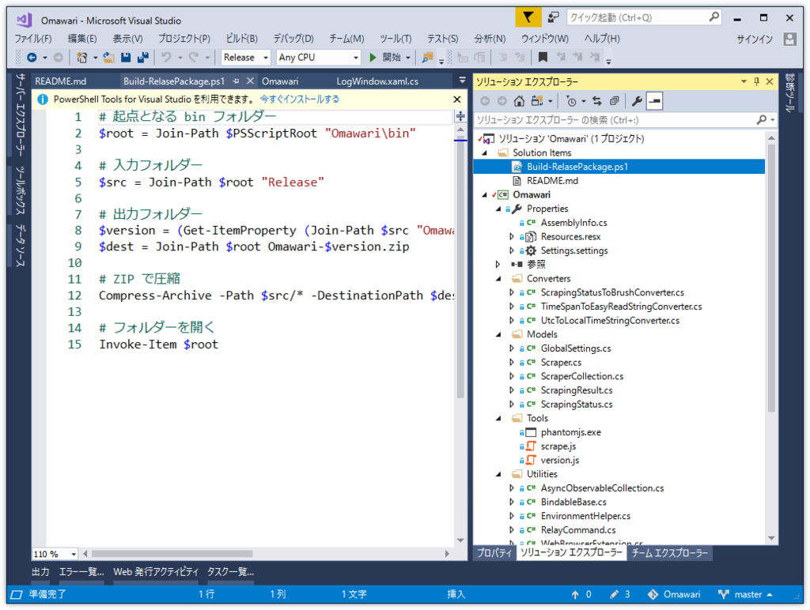

 

<ul>
<li>メインリストビューに Last Update 欄を設ける
<ul>
<li>それに伴うコード整理</li>
<li>Refresh ボタンは不要になったので廃止</li>
</ul></li>
<li>通知トレイで DEBUG モードなのがわかるように</li>
<li>ファイル操作の非同期化 （メイン画面を初期表示＆スクロールする際のカクツキを抑えた）
<ul>
<li>それに伴うリグレッションの修正</li>
<li>ついでにステータスバーに総稼働時間を表示するように</li>
</ul></li>
<li>リファクタリング</li>
<li>Click Once がめんどいのでやめた（ごめんなさい！）</li>
</ul>
<iframe src="https://hatenablog-parts.com/embed?url=https%3A%2F%2Fgithub.com%2Fdaruyanagi%2FOmawari%2Freleases" title="daruyanagi/Omawari" class="embed-card embed-webcard" scrolling="no" frameborder="0" style="display: block; width: 100%; height: 155px; max-width: 500px; margin: 10px 0px;"></iframe><cite class="hatena-citation"><a href="https://github.com/daruyanagi/Omawari/releases">github.com</a></cite> 

<h3>リリースアーカイブを毎回手で作るの面倒くさくなったので PowerShell にした</h3>

ClickOnce って Web サーバーでホストしない場合、更新するのにいちいち古いバージョンのアンインストールが必要になって大変面倒くさいので、単に ZIP アーカイブでまとめて配布するようにした。そのパッケージを毎回手で作るのは面倒なので、PowerShell でアーカイブを作るスクリプトを描いた。

<pre class="code lang-ps1" data-lang="ps1" data-unlink># 起点となる bin フォルダー
$root = Join-Path $PSScriptRoot &quot;Omawari\bin&quot;

# 入力フォルダー
$src = Join-Path $root &quot;Release&quot;

# 出力フォルダー
$version = (Get-ItemProperty (Join-Path $src &quot;Omawari.exe&quot;)).VersionInfo.FileVersion
$dest = Join-Path $root Omawari-$version.zip

# ZIP で圧縮
Compress-Archive -Path $src/* -DestinationPath $dest

# フォルダーを開く
Invoke-Item $root
</pre>
リリースビルドの実行ファイルのバージョンを読んで Omawari-*.*.*.*.zip という名前の ZIP アーカイブに圧縮するだけ。この程度の 
PowerShell なら割と書けるようになってきた！（バージョンの取得の仕方はググったけど……）

コレでもアップデートは面倒なので、Chocolatey パッケージにすることも画策してる。

<blockquote class="twitter-tweet" data-lang="ja">
Chocolatey パッケージリジェクトされました……
&mdash; だるたにゃん (@daruyanagi) <a href="https://twitter.com/daruyanagi/status/911375028125556736">2017年9月22日</a></blockquote>

