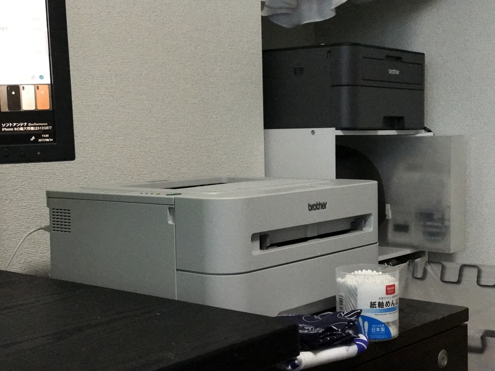
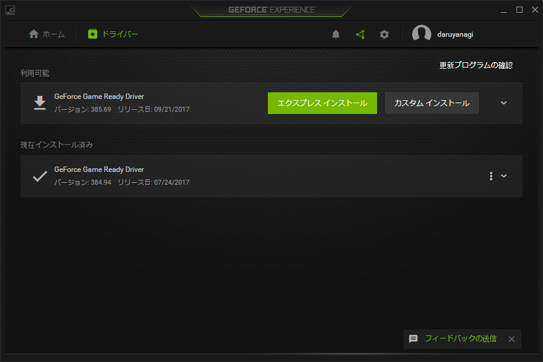
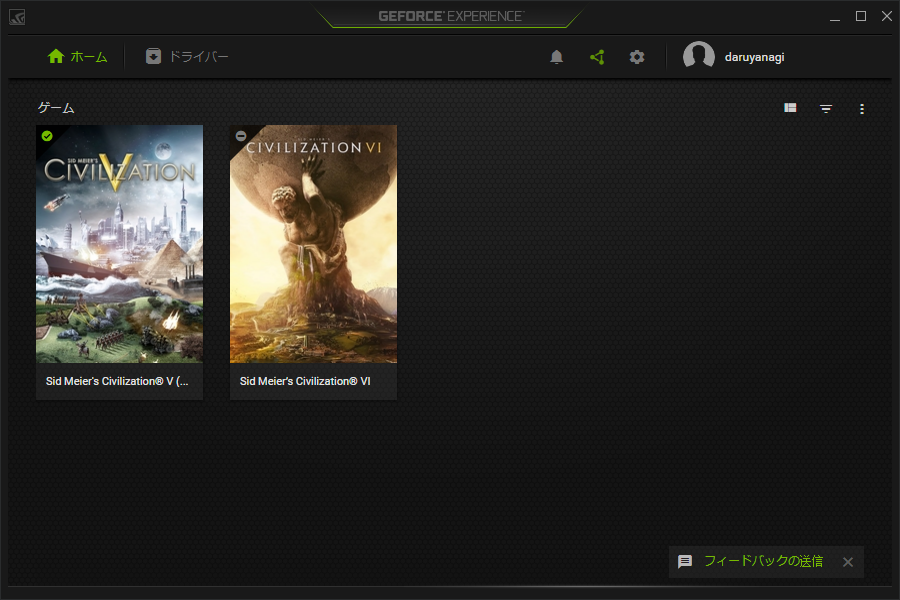
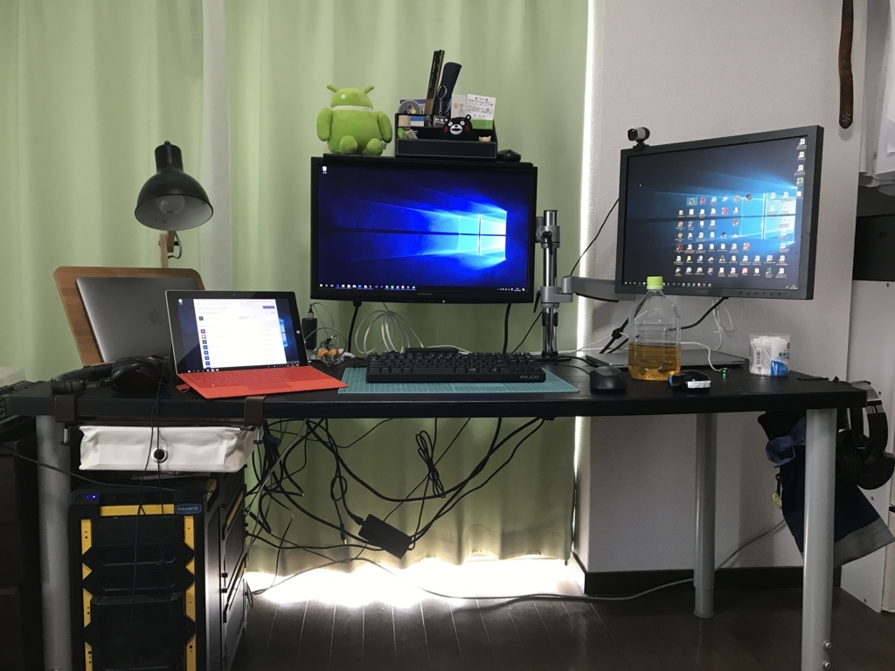

この前、Surface Laptop でトリプルディスプレイ環境を作ってみたりした。お仕事部屋をアップデートしたのは引っ越し以来初めてだったけど、ついでにいろいろ便利にしてみようとここ1カ月頑張っていました。

<iframe src="https://hatenablog-parts.com/embed?url=http%3A%2F%2Fblog.daruyanagi.jp%2Fentry%2F2017%2F08%2F26%2F202931" title="Surface Laptop ＋デュアルディスプレイ環境のための AHK スクリプトを書いた - だるろぐ" class="embed-card embed-blogcard" scrolling="no" frameborder="0" style="display: block; width: 100%; height: 190px; max-width: 500px; margin: 10px 0px;"></iframe><cite class="hatena-citation"><a href="http://blog.daruyanagi.jp/entry/2017/08/26/202931">blog.daruyanagi.jp</a></cite> 

<h3>プリンターをワイヤレス化</h3>

おカネのない時期に買ったので、ウチのレーザープリンターは有線接続のみ。USB ケーブルが届く範囲にしか置くことができないし、デスクトップ PC 以外から利用するのが大変不便でした。というわけで、ネットワーク対応のものに買い替えてみました。

<a href="http://www.amazon.co.jp/exec/obidos/ASIN/B00NSFP1FS/bestylesnet-22/">brother レーザープリンター A4 モノクロ JUSTIO HL-L2365DW</a>
<ul><li>出版社/メーカー: ブラザー工業</li><li>発売日: 2014/10/09</li><li>メディア: Personal Computers</li><li><a href="http://d.hatena.ne.jp/asin/B00NSFP1FS/bestylesnet-22" target="_blank">この商品を含むブログ (2件) を見る</a></li></ul>

以前使っていたブラザー製のものがリーズナブルながらキッチリ働いてくれて気に入っていたので、新しい機種はそれにネットワーク機能がついているものを選択。サイズもほぼ同じで、色が灰色から黒色になっただけです。

設置場所も机からは少し離れたところに置いてあるカラーボックスの上に逃がして、机周りが広くなりました。

<h3>引き出しを追加する</h3>

おカネのない時期に買ったので、ウチの机は脚四本に天板一枚のシンプルなものなのです。これはこれで大変気に入っているのですが、収納が少ないのはちょっと困りものですね。そこで Amazon を散歩していて見つけた便利グッズを導入してみました。

<a href="http://d.hatena.ne.jp/asin/B011DYCVWG/bestylesnet-22">ASIN:B011DYCVWG</a>:B011DYCVWG

これで打ちの机に引き出しが生えました！

あんまり重いものは入れられないので、領収証の仮置き場に使っています。ついでにデスクトップオーガナイザー（まぁ、タダのペン立て）も買いました。

<a href="http://www.amazon.co.jp/exec/obidos/ASIN/B01LXZ1EJD/bestylesnet-22/">[OneStepAdvance] デスクオーガナイザー ペン立て・卓上収納・文具ケース 五角 (ブラック)</a>
<ul><li>出版社/メーカー: OneStepAdvance</li><li>メディア: オフィス用品</li><li><a href="http://d.hatena.ne.jp/asin/B01LXZ1EJD/bestylesnet-22" target="_blank">この商品を含むブログを見る</a></li></ul>

ちょっと大きめのものが欲しかったので満足。モニターの上に置いていますが、これは地震に弱そうやな……なんかいい方法考えないと。

<iframe src="https://hatenablog-parts.com/embed?url=http%3A%2F%2Fblog.daruyanagi.jp%2Fentry%2F2017%2F01%2F09%2F230154" title="PC周りの改善計画：ディスプレイアームを買った - だるろぐ" class="embed-card embed-blogcard" scrolling="no" frameborder="0" style="display: block; width: 100%; height: 190px; max-width: 500px; margin: 10px 0px;"></iframe><cite class="hatena-citation"><a href="http://blog.daruyanagi.jp/entry/2017/01/09/230154">blog.daruyanagi.jp</a></cite>

ちなみに、モニターの上に収納を追加するキングジムの便利グッズもおすすめです。

<h3>グラフィックスカードを追加</h3>

あと、ご厚意でいただいていたグラフィックスカードも組み込んでみました。GW 前にもらったのに、組み込んだのはお盆になってからだという……。まぁ、電源の容量が足りるかどうかがちょっと心配だったんですよね。メインのお仕事環境壊したらあとあと面倒だし。結果的には杞憂で、さっさと導入しちゃえばよかったなーって感じです。冷却ファンも静か目で、気にならないといえばウソになるけど、まぁ、許容範囲内かな。

グラフィックカードは GeForce GTX 680 という5年前ぐらいに出たヤツだったのですが、Civilization 6 の動きがちょっとぬるぬるになりました。内蔵グラフィックでは一部エフェクトが省略されていたのかな？　ウチの斥候が敵蛮族の槍兵に殺されるアニメーションが割とえげつなくて（槍で串刺しにして突き上げてポイや！）、ちょっと悲しかったです。
 

ドライバーの管理やゲームの個別最適化を行うユーティリティー「GeForce Experience」のいれてバッチリです。

油断したらすぐ本や缶ビールだらけでぐちゃぐちゃになったりしますが、なるべく今の状態を保つというか、もう少し人間らしい部屋にしたいなと思います。裏のケーブル、何とかせんとなー。

