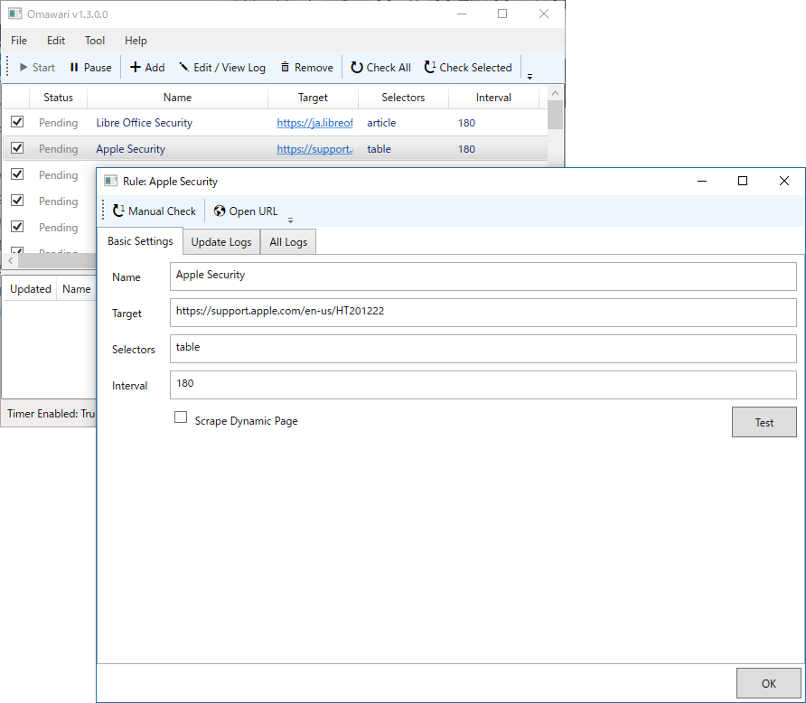
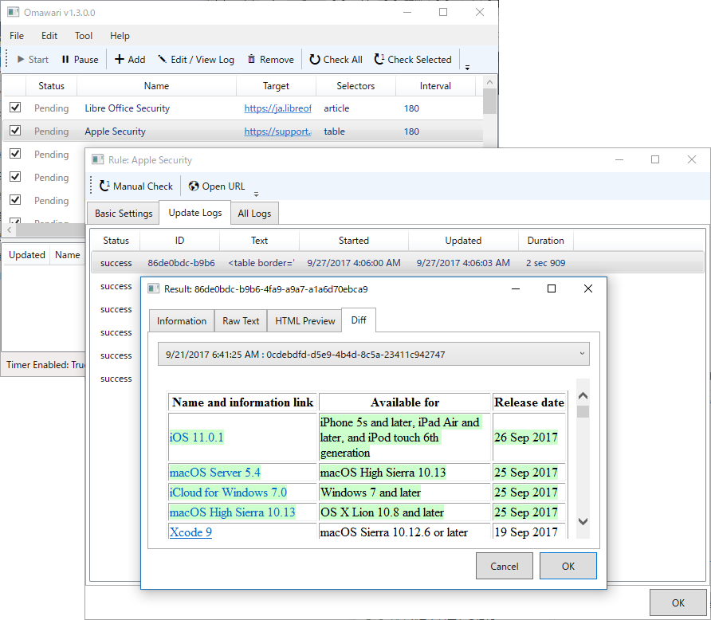

画面構成をわかりやすくしてみました。

<ul>
<li>メイン画面（チェックルールの一覧）
<ul>
<li>チェックルールの詳細画面（ログの一覧）
<ul>
<li>ログの詳細画面</li>
</ul></li>
</ul></li>
</ul>
ひたすら XAML を書き換える作業は辛かったぴょん……でも、ログの詳細画面ではどのログと Diff をとってるのかわかりやすくなったと思う。これまでは作った自分でさえよくわかっていないかった。

あとは削除確認ダイアログ（＋データも同時に消すか確認）を作ったり、内部的なエラーハンドリングを改善したり、いろいろ。

<iframe src="https://hatenablog-parts.com/embed?url=https%3A%2F%2Fgithub.com%2Fdaruyanagi%2FOmawari%2Freleases%2Ftag%2Fv1.3" title="daruyanagi/Omawari" class="embed-card embed-webcard" scrolling="no" frameborder="0" style="display: block; width: 100%; height: 155px; max-width: 500px; margin: 10px 0px;"></iframe><cite class="hatena-citation"><a href="https://github.com/daruyanagi/Omawari/releases/tag/v1.3">github.com</a></cite>

また、今回から ClickOnce を Azure に置くことにしました（<a href="https://yanagi.blob.core.windows.net/clickonce-omawari/Omawari.application">https://yanagi.blob.core.windows.net/clickonce-omawari/Omawari.application</a>）。次回リリースしたときにうまくアップデートされるといいなぁ。できたら、これを Chocoraley パッケージにするつもりです。

