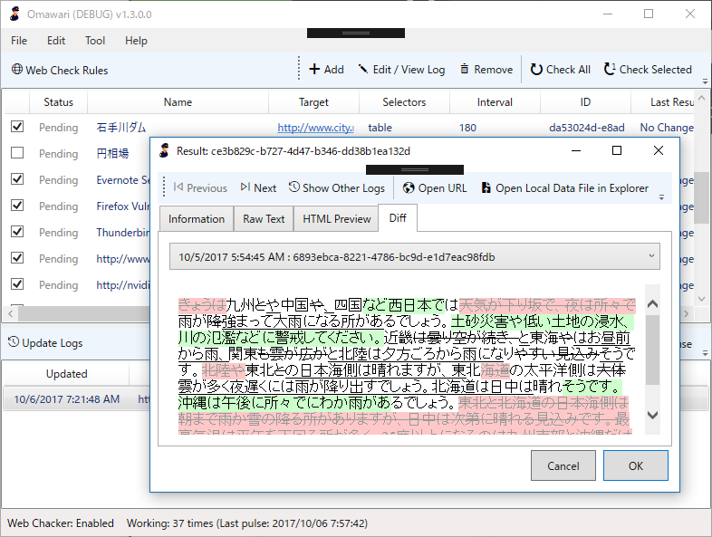

内部的なところはあまりいじらず、今まで放置してたユーザーインターフェイスの改善（？）を行いました。あと、ぬるぽエラーをちまちま殺したり。

<ul>
<li>複数環境での起動を考慮する</li>
<li>各部の名称を整理・わかりやすくする</li>
<li>ローカルフォルダーや親ルールにアクセスするボタンを追加</li>
<li>ログウィンドウに前後移動機能を追加</li>
<li>既存のウィンドウがあれば新規に開かずアクティブにする</li>
<li>New/No Changed ステータスの新設</li>
<li>アプリケーションアイコンの追加</li>
<li>データフォルダーを開くコマンドを新設</li>
<li>ウィンドウを開く位置をオーナーの真ん中に設定（不完全、動いてないかも</li>
</ul>
日ごろ使っていて不便なところから、互換性をとりながら少しずつ、ね。“個人的にはログの前後移動”や“既存のウィンドウがあれば新規に開かずアクティブにする”なんかの実装に達成感を感じています。たかだか数行ちょろっと書くだけでだいぶ便利になった。でも、そろそろコードの整理しないといろいろあかんなぁ。

ついでにアプリケーションアイコンを付けたけど、なんとこれ Office の丸パクリ。あんまりよくないので、時間があるときにクラウドワークスあたりでお願いしようかなって思ってます。

あと、ウチの環境はだんだんデータが肥大化してきていてパフォーマンスが顕著に落ちているので、次はクリーニング機能を付けつつ、データベースへの移行とかも考えようかなーみたな。データ構造ももっとシンプルにできたのなぁー……最初はもっと使い捨てのつもりで作ってたから、あんまり考えてなくてね。

<iframe src="https://hatenablog-parts.com/embed?url=https%3A%2F%2Fgithub.com%2Fdaruyanagi%2FOmawari%2Freleases%2Ftag%2Fv1.4.0.0" title="daruyanagi/Omawari" class="embed-card embed-webcard" scrolling="no" frameborder="0" style="display: block; width: 100%; height: 155px; max-width: 500px; margin: 10px 0px;"></iframe><cite class="hatena-citation"><a href="https://github.com/daruyanagi/Omawari/releases/tag/v1.4.0.0">github.com</a></cite> 

<h3>Chocolatey パッケージ化の準備</h3>

実は Chocolatey から簡単にインストールできるようにといろいろ準備をしています。Chocolatey ってのは yum とか apt-get みたいにアプリを入れられるヤツの 
Windows 版ですね。Chocolatey のパッケージは、

<ul>
<li>パッケージに全部ファイルを入れちゃう</li>
<li>リモートに置いてあるインストーラーを叩く</li>
</ul>
という2パターンで作れるので、最初は ZIP 版をベースに前者のパッケージを作っていたのですが、いろいろお約束事をクリアするのが面倒……ライセンスファイルとかいろいろもろもろ。後者はそういうのが要らないっぽいので、前バージョンから ClickOnce を用意しています。次回辺りはちゃんと申請を通したい。

<a href="https://yanagi.blob.core.windows.net/clickonce-omawari/setup.exe">https://yanagi.blob.core.windows.net/clickonce-omawari/setup.exe</a>

ついでにスクリプトでリリースパッケージ（ZIP）と Azure Blob へのアップロードも PowerShell で行うようにしてみました。毎回手でやんの鬱陶しくなってきたしね。

<pre class="code lang-ps1" data-lang="ps1" data-unlink># Add-AzureAccount

$StorageAccountName = &quot;yanagi&quot;
$StorageAccountKey = &quot;***&quot;
$ContainerName = &quot;clickonce-omawari&quot;

$binRootDirectory     = &quot;C:\Users\Hideto\GitHub\Omawari\Omawari\bin&quot;
$publishRootDirectory = &quot;C:\Users\Hideto\GitHub\Omawari\Omawari\Publish&quot;

function New-ReleaseArchive {
[cmdletbinding()]
param(
$rootDirectory,
$Force
)

$releaseDirectory = Join-Path $rootDirectory &quot;Release&quot;
$version = (Get-ItemProperty (Join-Path $releaseDirectory &quot;Omawari.exe&quot;)).VersionInfo.FileVersion
$destinationPath = Join-Path $rootDirectory Omawari-$version.zip
Compress-Archive -Path $releaseDirectory/* -DestinationPath $destinationPath -Force:$Force
Invoke-Item $rootDirectory
}

function Upload-FileToAzureStorageContainer {
[cmdletbinding()]
param(
$StorageAccountName,
$StorageAccountKey,
$ContainerName,
$rootDirectory,
$Force
)

$context = New-AzureStorageContext -StorageAccountName $StorageAccountName -StorageAccountKey $StorageAccountKey
$container = Get-AzureStorageContainer -Name $ContainerName -Context $context

$container.CloudBlobContainer.Uri.AbsoluteUri
if ($container) {
$filesToUpload = Get-ChildItem $rootDirectory -Recurse -File

foreach ($x in $filesToUpload) {
$targetPath = ($x.fullname.Substring($rootDirectory.Length + 1)).Replace(&quot;\&quot;, &quot;/&quot;)

Write-Verbose &quot;Uploading $(&quot;\&quot; + $x.fullname.Substring($rootDirectory.Length + 1)) to $($container.CloudBlobContainer.Uri.AbsoluteUri + &quot;/&quot; + $targetPath)&quot;
Set-AzureStorageBlobContent -File $x.fullname -Container $container.Name -Blob $targetPath -Context $context -Force:$Force | Out-Null
}
}
}

New-ReleaseArchive `
-rootDirectory $binRootDirectory `
-Force $true

Upload-FileToAzureStorageContainer `
-StorageAccountName $StorageAccountName `
-StorageAccountKey $StorageAccountKey `
-ContainerName $ContainerName `
-rootDirectory $publishRootDirectory `
-Verbose
</pre>
リリースビルドや ClickOnce の発行も自動化すればいいのかもだけど、途中でコケたときにいろいろぐちゃぐちゃになるのが嫌だったので、もう少しいろいろわかってから挑戦しようかなって感じです。msbuild とかイマイチようわからんしね……（← いろいろエラーが出て困っている顔

