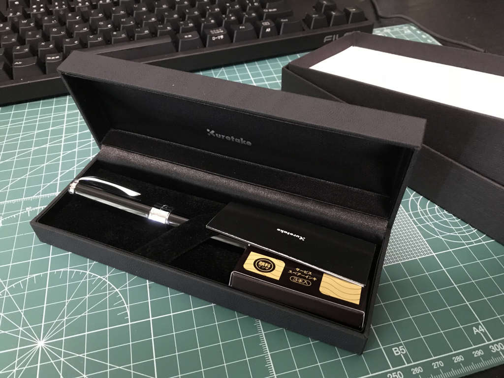

最近 @nakaji が万年筆を買い漁ってて、なんというか、わいもそういうのやってみたいなぁ、などと思っていたのですが――

<iframe src="https://hatenablog-parts.com/embed?url=http%3A%2F%2Fblog.nakajix.jp%2Fentry%2F2017%2F09%2F09%2F005042" title="納得の1本！6本目にして最後の万年筆はパイロットのカスタム74（極細字(EF)） - なか日記" class="embed-card embed-blogcard" scrolling="no" frameborder="0" style="display: block; width: 100%; height: 190px; max-width: 500px; margin: 10px 0px;"></iframe><cite class="hatena-citation"><a href="http://blog.nakajix.jp/entry/2017/09/09/005042">blog.nakajix.jp</a></cite>

ぶっちゃけそのまんまマネするのもちょっと癪だったので（？）、万年筆ならぬ“万年筆ペン”というものを買ってみました。ちょっとした変化球やな。

正直、この界隈の知識はまったくないのでなにがよいのかサッパリなのですが、書道界隈ではよく耳にする（というか、書道道具を Amazon でググるとやたら出てくるだけで、本当にメジャーなのかはよく知らない）呉竹さんの“スターリーナイト”というものをチョイスしてみました。

<a href="http://www.amazon.co.jp/exec/obidos/ASIN/B001C3CJC6/bestylesnet-22/">呉竹 筆ペン 万年筆 万年毛筆 くれ竹 スターリーナイト ブラック DAY141-1</a>
<ul><li>出版社/メーカー: 呉竹</li><li>メディア: オフィス用品</li><li><a href="http://d.hatena.ne.jp/asin/B001C3CJC6/bestylesnet-22" target="_blank">この商品を含むブログを見る</a></li></ul>

5,000円ぐらいで買ったけど、定価は10,000円なので、俺的にはかなり高価なのだ！　100円均一以外で文房具かったのだいぶ久しぶりだよ……けど、今見たらなかじ先生のペンに値段で負けてたな！　もうちょいワンランク上を狙ってもよかった（ぇ？

ちょっと墨が薄いのは、たぶん自分のやり方があまりよくなくて、新品のときに充填されていた透明インクがちゃんと抜けきってないからだと思う。最近はもうちょい黒く、しっかりと墨が出ている。

自分は書道をちゃんと習ったことない（授業でもさぼってた／(^o^)＼）ので毛筆はかなり下手なのだけど、この子で書いてみたら割といい雰囲気の字になったからちょっとびっくりした。これは結構楽しいかもね……。ボールペンを使うときよりは筆を立てて、圧にメリハリをつけるのを心がけながら、スゥッスッと書くといい感じらしい。ひらがなの「き」あたりがなんかうまく書けないけど、コツとかないんですかね。真面目に教科書の一冊でも買おうか知らん。

とにかく、これは自分にとっては新しい世界だわ。ちゃんと毛筆をやる人にとっては邪道なのかもしれんけど、自分は面倒くさがりだからああいう手入れが面倒そうなことはしたくないんだけど、年相応にちょっとカッコよく字を書けるようになりたいっていう欲はちょっとある。そういうお調子者には、これがピッタリだな。

なんか写経でもやってみるか。それとも、今年はこれで年賀状書いてみるかな？

