
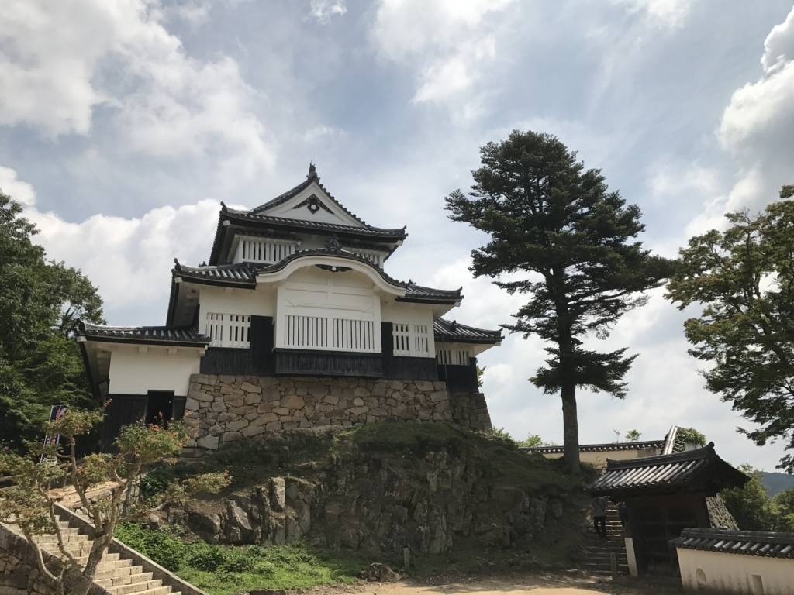

7月の話になりますが、バイクで倉敷に行ったついでに現存十二天守のうちの一つ<b>備中松山城</b>へ寄ってきました。“伊予”松山城ではなく、“備中”松山城だよ！

<iframe src="https://hatenablog-parts.com/embed?url=http%3A%2F%2Fblog.daruyanagi.jp%2Fentry%2F2017%2F07%2F25%2F191201" title="バイク：松山 → 倉敷・岡山 → 高梁 → 鞆の浦 → 松山 - だるろぐ" class="embed-card embed-blogcard" scrolling="no" frameborder="0" style="display: block; width: 100%; height: 190px; max-width: 500px; margin: 10px 0px;"></iframe><cite class="hatena-citation"><a href="http://blog.daruyanagi.jp/entry/2017/07/25/191201">blog.daruyanagi.jp</a></cite>

“備中松山”ってどこやねん……っていくまでは思っていたのですが、要するに<b>高梁市</b>のことなんですね（それだったら知ってるがな！）。

<h3>吉備路</h3>

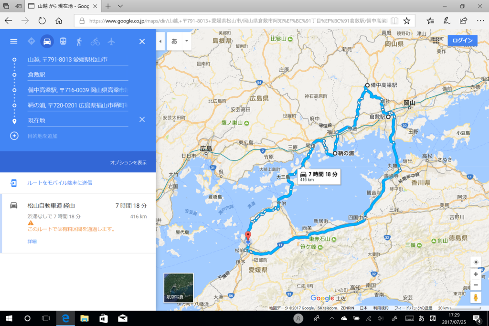

倉敷からは総社を抜けて高梁川沿いを北上。山と川のコントラストが気持ちいいルートでした。こういう道は割と好き。Google マップさんがちょっとマニアックな道をナビゲートするのには閉口しましたが、まぁ、ちゃんと目的地につけたから問題ない。

<h3>駐車場 → バス</h3>

伯備線の踏切を超えて、ちょっと細い道をどんどこ登っていくと、お城の駐車場に出ます。ここからはバスに乗り換えなきゃいけないのだそう。<i>クルマならいざ知らず、バイクなんだから上まで行かせてくれてもいいのにな</i>などと最初は思っていたのですが、実際にバスに乗ってみると……これはちゃんとバスに乗った方がいいね。

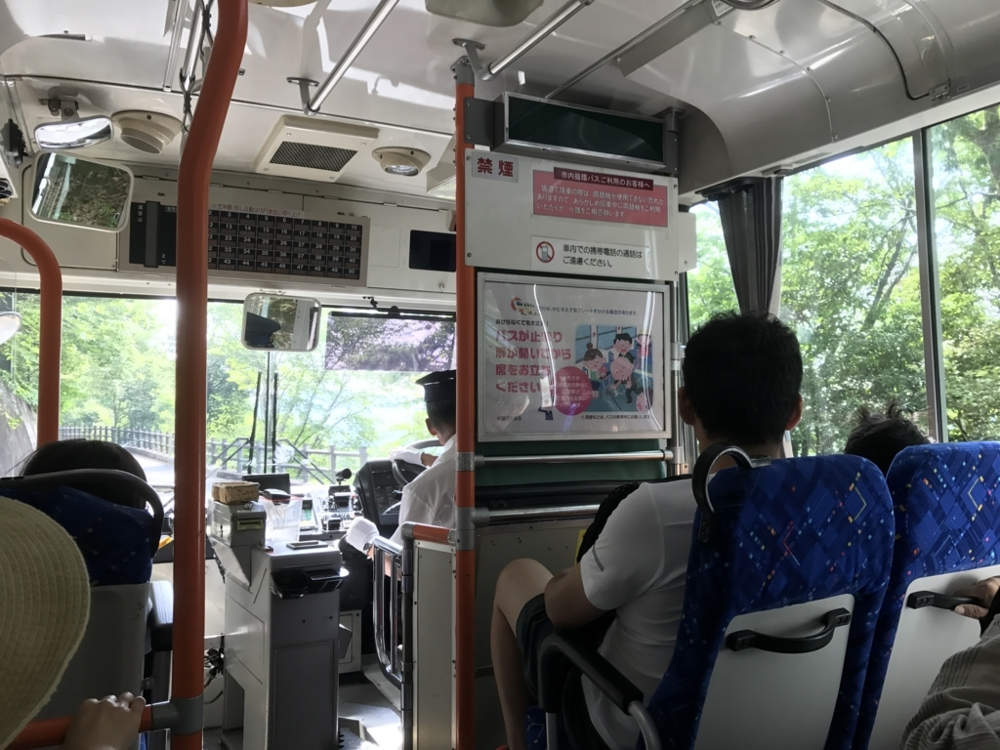

バスが走ると、バイク一台分がすれ違う余地すらない。上と下に係員がいて無線で連絡を取っているらしく、ときおりタクシーを通しているみたいでしたが（きっと体が不自由などの理由なのでしょう）、基本的にはバス専用道路になっているみたいです。別に天守内覧のおカネと二重に通行料をガメてやろうという意図ではないと思う（たぶん

<h3>まさかの登山</h3>

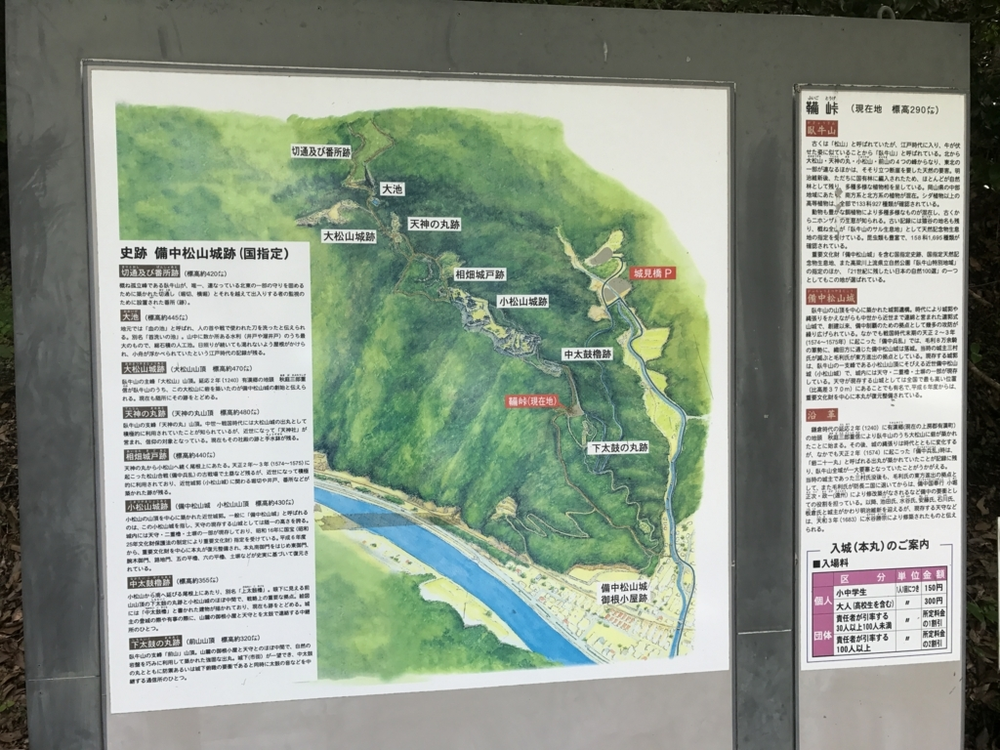

さて、10分ほどバスに揺られて上まで来たのですが、実はここからの山登りが長い。事前リサーチしとくんだった……ライディングブーツのままきてしまったゼ。しかも当時は（今も）運動不足で、体力が全然ない。周りのおじさんおばさんがサクサク登っていくのを見上げながら、息も絶え絶えにひたすら足を前へ運ぶことだけを考えながら少しずつ登っていきました。

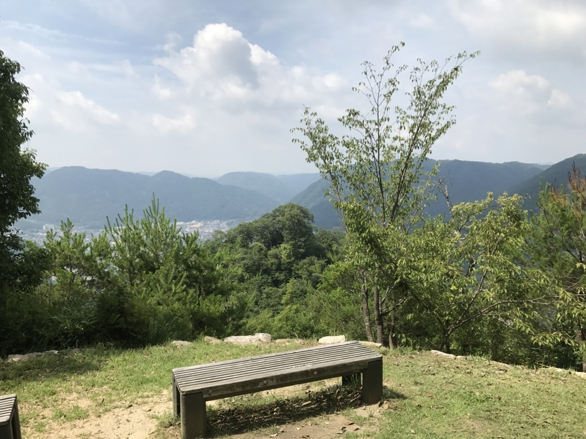

まぁ、でも、景色はよくて楽しかったですけどね（これは標高355mのところにある中太鼓櫓跡に設けられたベンチ。高梁市が一望できる）。

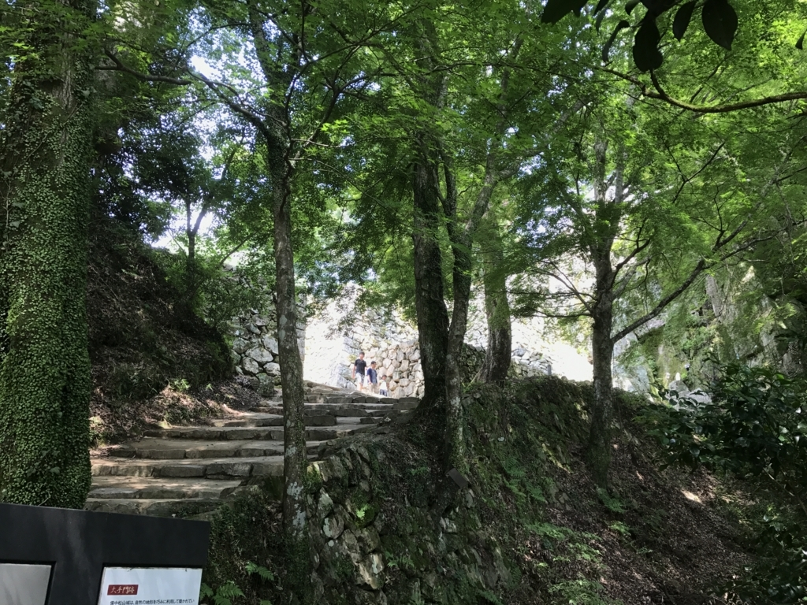

またしばらく歩くと、やっと城の石垣が見えてきました。

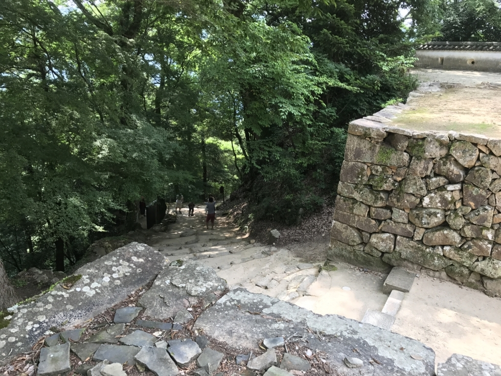

山の中からいきなり整然とした石垣が現れるの、ちょっとマチュピチュ感ある。これ、どうやって上まで持っていったんだろうな。想像するだけで気が遠くなる！

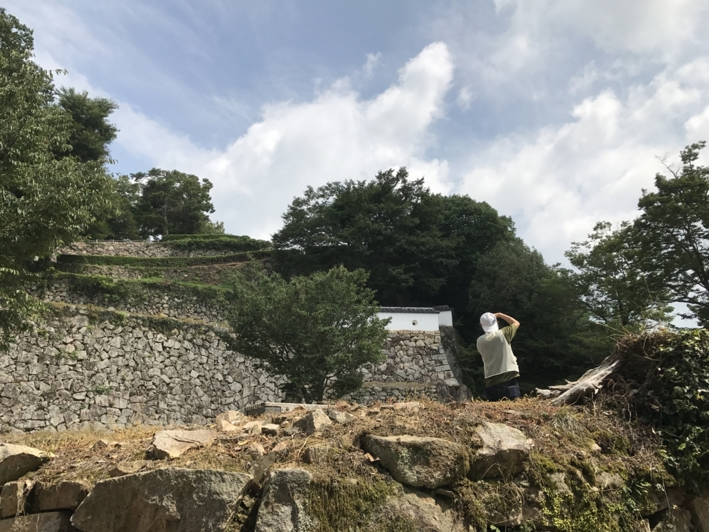

備中松山城は、“高梁盆地”とでも呼ぶべき高梁市街を見下ろす臥牛山（標高470m）に築かれた城です。鎌倉時代に地頭・秋葉三郎重信によって、山頂に“大松山城”が築かれましたが、今回目指す近世城郭“備中松山城≒小松山城”は中腹（標高430m）のところにあります。当時の人も、“大松山城”はあまりにも高すぎて登るのがだるかったんだろうね。

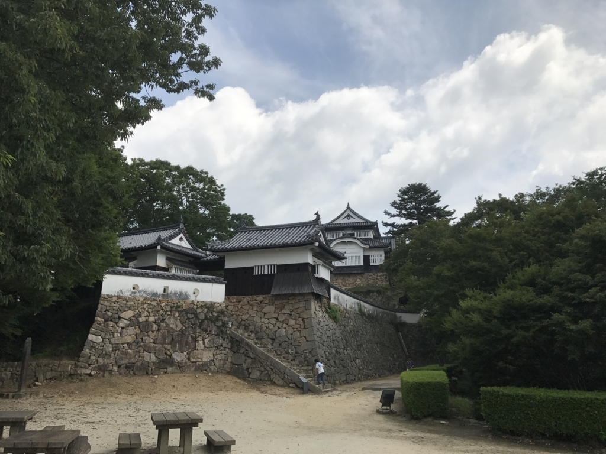

城郭そのものは割とこじんまりしていますが、風格は十分ですね。

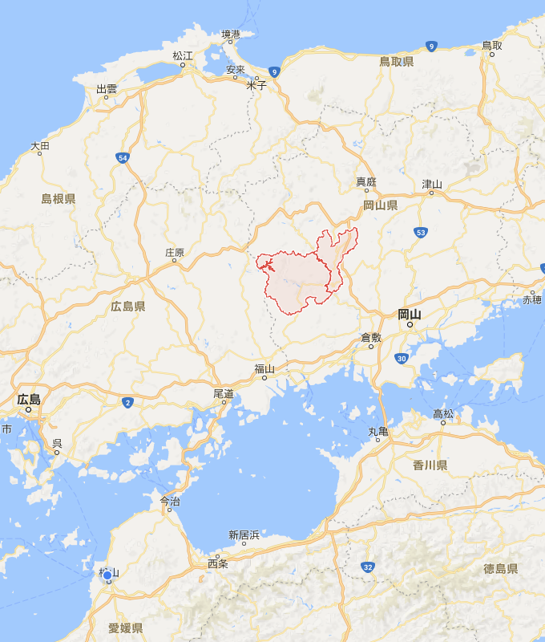

このあたりは古来、吉備国・備中国の中心地として古くより栄えた地域です（国衙は総社にあったそうな）。戦国時代には小領主が入り乱れ、大内氏や尼子氏が地元の土豪を抱き込んで勢力を拡大を図っていました。

たとえば、備中松山城を根拠にしていた上野頼氏を破ってこの地方を手中にした庄為資は尼子氏と結んでいました。これを追放した三村家親は、新興の毛利氏と結んでいます。そして三村家親を暗殺した<b>宇喜多直家</b>は、備前・浦上宗景の被官でした。そんななか、暗殺された父・家親の復讐を果たそうと立ち上がった<b>三村元親</b>を中心に争われたのが<b>備中兵乱</b>です。

事の発端は、毛利家で山陽道を担当する小早川隆景が山陰担当の吉川元春らの反対を押し切って宇喜多秀家と同盟を結んだことです。宇喜多秀家といえば三村家の天敵。先代を暗殺されたばかりか、2万の兵で挑んだ明善寺合戦（1567年）では小狡いやり方で5千の寡兵に敗れています。そのためもあって、当主・三村元親は秀家絶対殺すマンとして、いわば備中における毛利の走狗として懸命に働いていました。それを裏切られたのだから、怒髪が成層圏に達しても仕方がない。当時畿内で勢力を拡大していた遠く織田氏と結び、21の出丸でハリネズミのように要塞化した備中松山城に籠って毛利・宇喜多両氏を相手取る無謀な多戦いに突入します（このあとすぐ宇喜多は織田と結んでるし、みむーは我慢が足りなかったなーというか、うっきーの面従腹背っぷりすげーって感じ）。

要塞になるべく手を触れず、支城を次々と落としていく毛利軍8万（あれ？　いつの間にか宇喜多より毛利とガチで戦ってんぞ）。頼みとする織田軍は一向に来る気配がない（遠いもんね！）。十重二十重に囲まれた備中松山城は結局内応者を出して陥落、三村家親は城を落ち延びた後、松連寺で自害しました。

三村元親は細川藤孝とも親交があり、和歌などに通じた教養人でもあったのだそう（ただの宇喜多絶対殺すマシ―ンではなかったんだなー）。母は畿内にも進出していた讃岐の<b>三好氏</b>出身だそうで、意外に都とのつながりも深かったようですね。

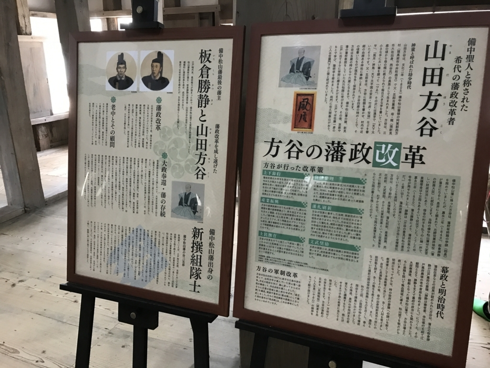

――とまぁ、歴史的にはこの備中兵乱がクライマックスなのですが、実は自分はこの辺のことは全然知らず（お城に設置されていたテレビ、面白かった！）。むしろ、藩政改革を成功させたことで有名な<b>山田方谷</b>の方が親しみあったり。

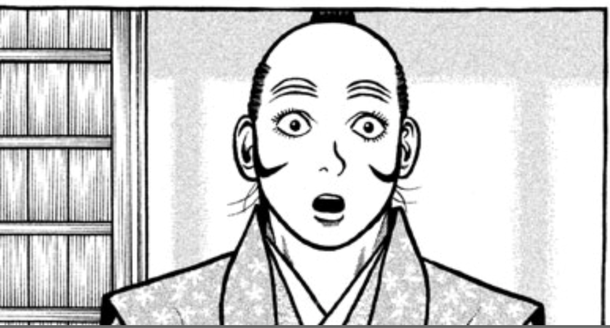

「へうげもの」が好きな人であれば、<b>小堀遠州</b>などがゆかりの人になるみたい。

<a href="http://www.amazon.co.jp/exec/obidos/ASIN/B009KYBZPG/bestylesnet-22/">へうげもの（１） (モーニングコミックス)</a>
<ul><li>作者: 山田芳裕</li><li>出版社/メーカー: 講談社</li><li>発売日: 2012/09/28</li><li>メディア: Kindle版</li><li>購入: 2人 クリック: 2回</li><li><a href="http://d.hatena.ne.jp/asin/B009KYBZPG/bestylesnet-22" target="_blank">この商品を含むブログ (1件) を見る</a></li></ul>

あとは、当時の武家屋敷などを見物してきました。備中松山藩の政務は山の下で行われていて（今は高校があるところ）、その近所に景観保護された一角があります。割と風情があって気に入りました。

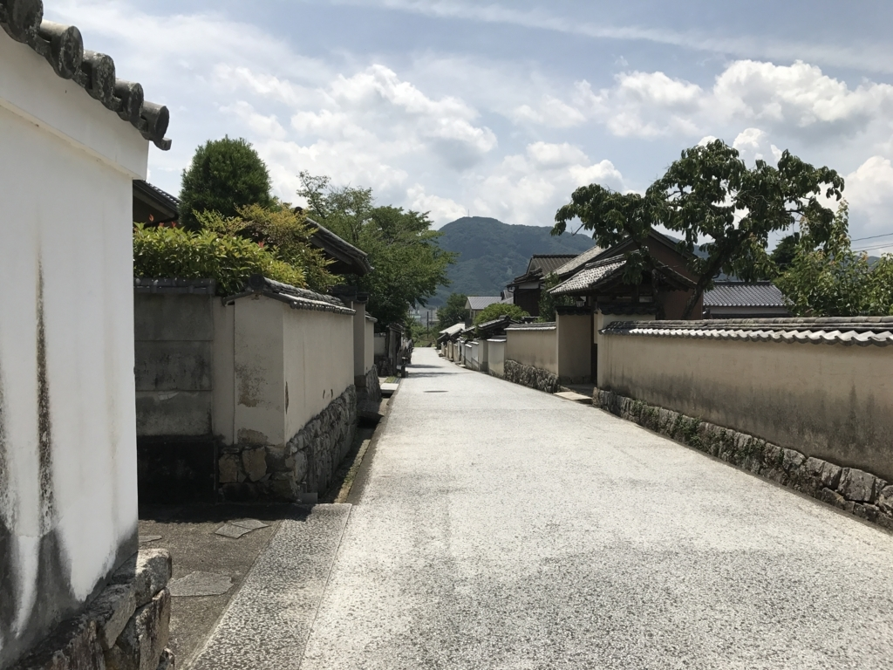

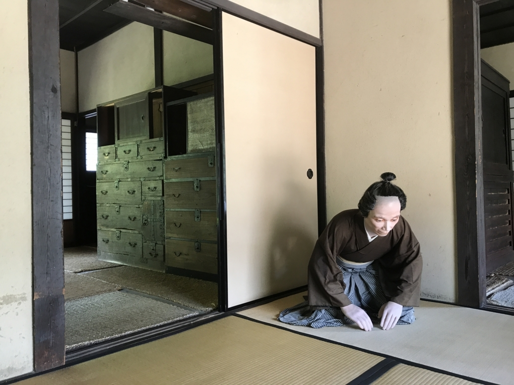

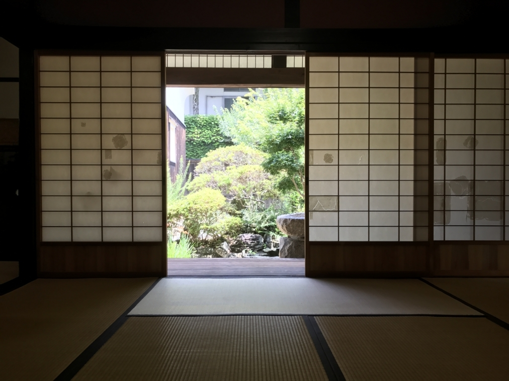

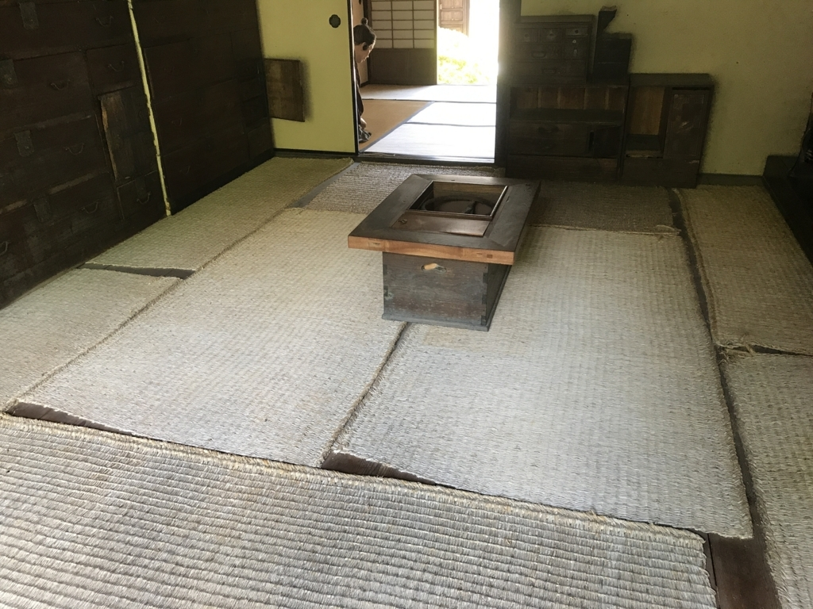

結構えらい人の家らしいんだけど、メインとなるところ以外は畳敷きではなく筵敷きになっていて案外質素。でもそういう家に住みたいなーって感じはしますね。緑も豊かで、松山を知る前にこっちを知っていたら、ここに来るのもありだったかなって思います。次に行くときはちゃんと準備を整えて、“大松山城”にも挑戦したいです。

