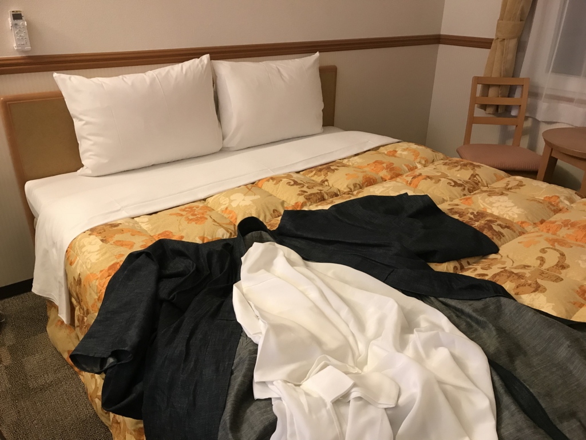

<b>「行けたら行くわ（≒行かない」</b>というノリで参加登録したんですけど、<b>.NET Standard 2.0 is なにそれ？</b>　みたいな不勉強が目立ってきたので、ちゃんと参加することにしました。フェリーで行こうかなって思ってたのに予約忘れて JR で行く羽目になった＆ホテルがギリギリまで取れなくて冷や冷やしましたが、まぁまぁ、楽しかったです。

<iframe src="https://hatenablog-parts.com/embed?url=https%3A%2F%2Fconnpass.com%2Fevent%2F65543%2F" title="dotnetConf関西 2017 (2017/10/14 12:30〜)" class="embed-card embed-webcard" scrolling="no" frameborder="0" style="display: block; width: 100%; height: 155px; max-width: 500px; margin: 10px 0px;"></iframe><cite class="hatena-citation"><a href="https://connpass.com/event/65543/">connpass.com</a></cite> 

<h3>当日の朝</h3>

4時ぐらいに起きて荷造りをして、朝7時の特急しおかぜに乗りました。

<blockquote class="twitter-tweet" data-lang="ja">
明日来阪（dotnetConf関西）気をつけていらしてください。サイフ忘れないでください。
&mdash; 🍓つばみ🍑 (@283cks) <a href="https://twitter.com/283cks/status/918762117573967873?ref_src=twsrc%5Etfw">2017年10月13日</a></blockquote>

まだブログには書いてないんだけど、この前財布をおいて旅に出るという一歩間違えたら遭難不可避なミスをしていたので、がんばってお荷物を点検。それでもパンツを入れ忘れて、土曜日と日曜日、同じパンツをはいて帰る羽目になりました。

朝ごはんは、ホームで売ってるいつもの松山鮨弁当。最近は JR 松山駅も多少近代化して、コンビニが併設されたりするようになっているのだけど、ウチはこっちで買う方が好きなんや。

いい加減座ってんのも飽きてきた11時ごろ、新大阪到着。倉敷で買ったデニム着物に草履でスタスタと環状線に乗って、福島駅で降りました。

<h3>お勉強会</h3>

今回は LT もせず、隅で真面目に聞いてました。内容はえらい人におまかせ。

個人的には、セッション聞いてるうちに de:code で聞いた内容を思い出して、なんとなくシナプスが繋がった気分になれたのはよかったのかもしれない（あー、あれのことかー！　みたいな）。「Visual Studio Code」で .NET Core アプリをコンパイル＆デバッグできるようにして、手元で動かしながらへーとか、ほーとかやってた。

関係ないけど、前に座ってる人がノーパソ 3 台ぐらいひらげていて、コワかったです。あと、つもりんが来年はどんな XAML 条件分岐ネタを用意してくれるのか楽しみです。

<h3>懇親会</h3>

会場の下の階にある食べ放題の中華屋さんで飲みました。アレだけいっぱい皿が並んだ飲み会は大学以来かもしれません。なんか大阪っぽくていいな、やっぱたまにはこないとなーなんて思いました。

……なのに、そんなに食べずに飲んで＆しゃべってばかりだったような。途中で声が枯れた（大阪行くと声の音量デカくなるしね

二次会は4人ぐらいで、ちょいオシャレなお酒飲むところでやりました。途中、僕のたっての希望で新しくできた梅田の<b>“ヨドバシ橋”</b>を見学。ほんとに“ヨドバシ橋”はあったんだ！！　確かにこれは便利かもっていうか、今までなかったのが頭おかしいと思う。

ケーキが美味しかったです。あと、「驕ったる！」などといって半ば強引につもりんを誘ったのに、よっぱらってちゃんとお会計したのか覚えてない……もしアレやったら今度償うわ。

ちなみに、お宿は南森町の東横インでした。いつもは“じゃらん”で探してたんですけど、大阪なんかだとこっそりスーパー銭湯が混ざってるのがウザいし、東横インならお値段そこそこ、嫌な目に遭うことはない、今回は宿なしになりそうなところを救っていただいた（ダブルしか空いてなかったけどｗｗｗ）ということで、会員カードも作ってもらいました。これからは東横インでまず宿を探すぞい！

でも、酔っぱらった顔で会員証の写真を撮られたのだけは誤算だった……。

まぁ、今回はこんな感じ。帰りのアンパン列車でたべた駅弁“下津井旅情”が割かし美味しかったのが収穫ですかね。来週からは東京じゃ……

