
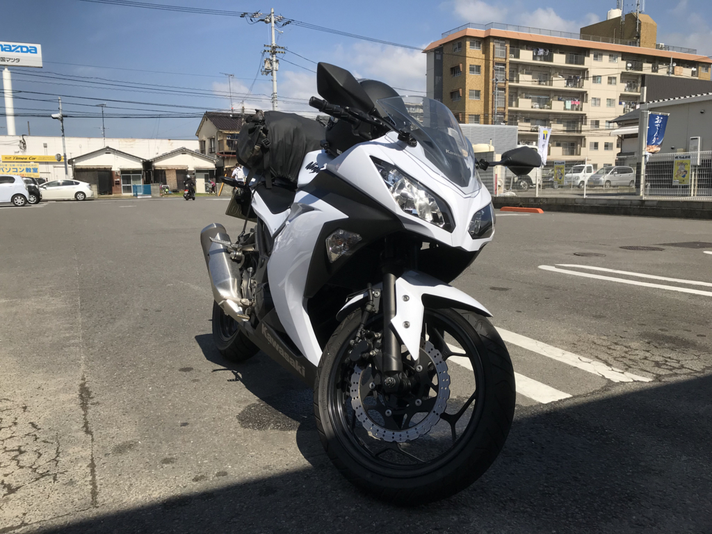

月初めの3連休は（自分は4連休だったんですけど）、バイクで阿波一之宮・大麻比古神社へ詣でることにしました。最近は御朱印集めするのがブームなんや。

宿がなかなかなくて、連休中日となる日曜日の宿泊になってしまったのですが、土曜日は雨だったので、かえって都合がよかったかもしれない。御神徳の賜物やな。松山道は煽られても法定速度（＋とちょっとだけ！）で走行車線をキープ。誰もいない徳島道は、ヘルメットのなかで歌を歌いながら快調に飛ばしていました。

――が、それも吉野川 SA まででした。

<blockquote class="twitter-tweet" data-lang="ja">
悲報: ここまできて財布忘れたことに気がついた <a href="https://t.co/AurQzOdqiz">https://t.co/AurQzOdqiz</a>
&mdash; だるたにゃん (@daruyanagi) <a href="https://twitter.com/daruyanagi/status/916894941393035264?ref_src=twsrc%5Etfw">2017年10月8日</a></blockquote>

SA でうどんを食べようと思ったんですよ、うどん。なのに財布がない！！

とうやら荷造りのとき、微妙にカバンのサイズが足りなくて、荷物を詰め替えたのが敗因だったみたい。財布だけ、前のカバンの奥底に入れたままだった。

幸い、免許証はキーホルダーに入れているし、スマートフォンのケースに緊急用のクレジットカードを一枚仕込んである（万が一財布を落としたり忘れたりしても、ガソリンの給油だけはできるように分散してある）。iPhone の Apple Pay（Suica）を使って自動販売機でペットボトルのお茶は買えましたが、ジーパン（最近はデニムパンツというそうですね）のポッケを漁っても 500 円ちょっとしかない。流石にこれでは引き返すしかないかなぁ……宿も泊まれないだろうしなぁ、と思ったのですが、ダメもとで電話をしてみるとクレジットカードで支払いができるとの由。その場のノリで、引き返さず、宿に向かう決意をしました。なに、なんとかなる。なんせ神さまに詣でる旅だしな。

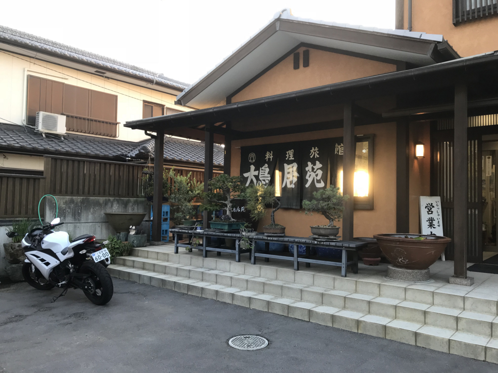

吉野川 SA でちょっとグダグダしていたせいでちょっと遅れたけど、4時前に宿に到着。今回は大麻比古神社に一番近い宿、大鳥居苑さんです。神社の大鳥居の近くにあるんですな（じゃらんでは予約取れなかったのだけど、近ツーではとれた……）。部屋で着物に着替えて（なんとなく、ね！）宿をでると、大将が「20分弱ぐらいかかるよ」「5時ぐらいで閉まるよ」と教えてくれました。ちょっと急がないとね。

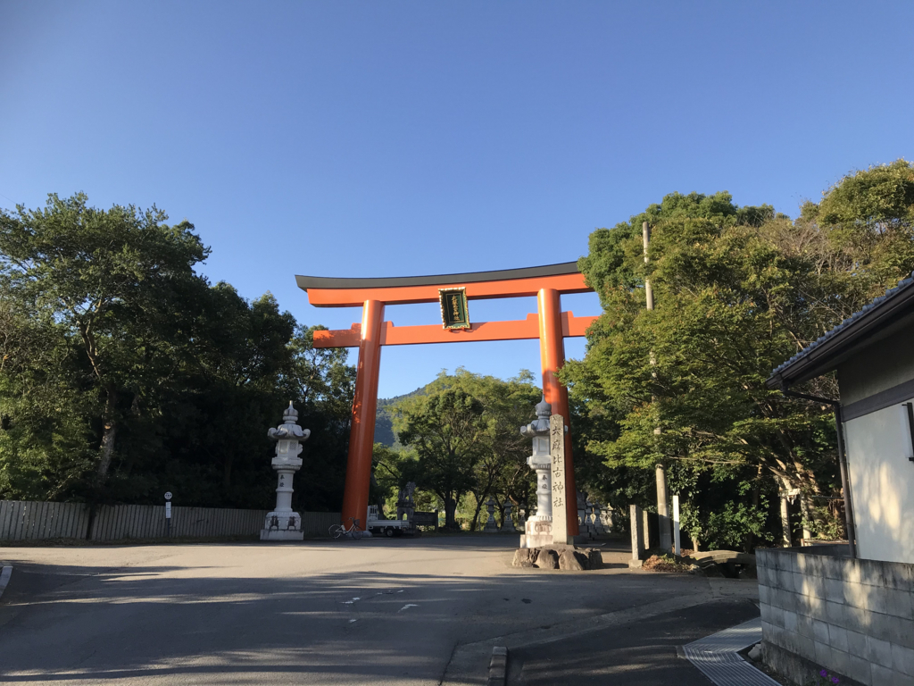

教えてもらった通り、大鳥居まではものの数分でしたが――

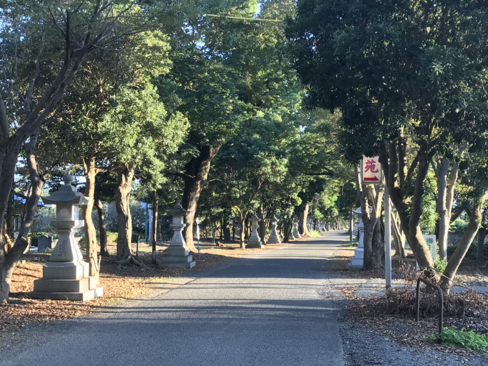

そこから先の参道は割と長かったです。

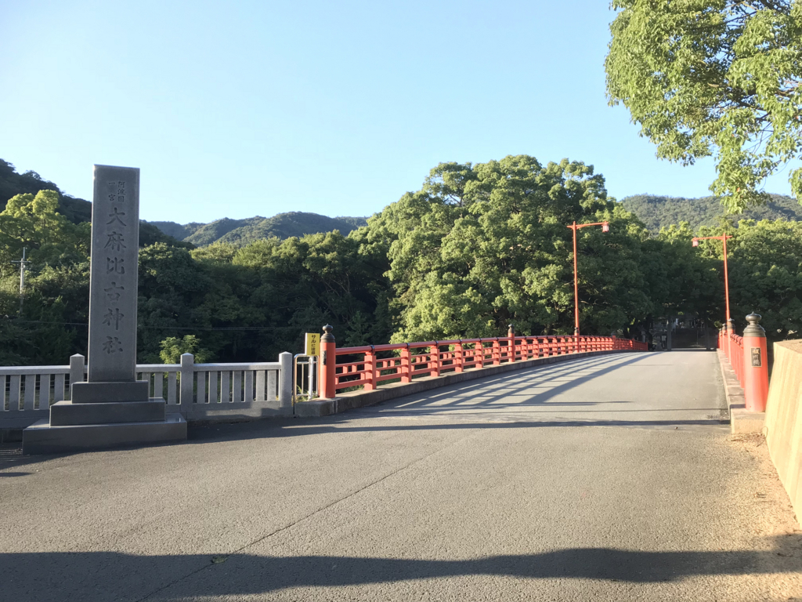

500m ほど歩いて赤い橋を渡ると、

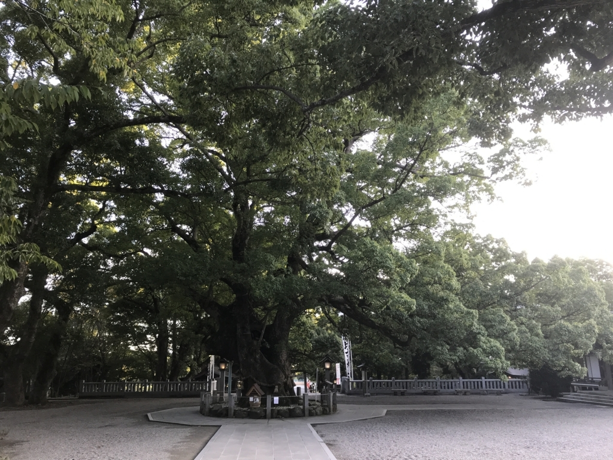

立派なご神木がお迎えしてくれました。ハチに注意という看板が立ってましたが、ぼーっと上を眺めてるとマジでおでこにハチがご来襲されたので、わりとガチで気を付けた方がいいかもしれません。手で払うのもめんどくさかったのでそのままジーっとしていたら、そのまま去りましたけど。

ちなみにこの大麻比古神社は、かつて阿波の国を興した忌部氏（いんべし）の祖神・天太玉命（あめのふとたまのみこと）≒大麻さんと、よくわかんないけど猿田彦を一緒にお祭りしているのだそうな。方除、厄除、交通安全に加護があるのだとか。

<blockquote cite="http://www.ooasahikojinja.jp/yuisho/">

神武天皇の御代、天太玉命の御孫　天富命　勅命を奉じて　洽く肥沃の地を求め　阿波国に到りまして、麻楮の種を播殖し、麻布木綿を製して　殖産興業の基を開き　国利民福を進め給ひ、その守護神として、太祖天太玉命を此の地に斎き祀る。 
猿田彦大神は、昔大麻山の峯に鎮まり坐しが後世に至り本社に合せ祀ると伝えられる。 
延喜の制名神大社に列し、阿波国一宮と称え阿波、淡路両国の総産土神として崇め奉る。 
清和天皇貞観元年従五位上を授け奉り、順次進階して中御門天皇享保四年正一位に進み給ふ。斯く朝廷の崇敬厚く、又代々の国司領主の尊崇深く、神田山林を寄進、藩費を以って、社殿の造営を行ひ、年々祭費を奉らる。明治六年国幣中社に列す。 
明治十三年国費を以って本殿以下の造営が行はれた。現在の祝詞殿、内拝殿、外拝殿は昭和四十五年氏子崇敬者の寄進によって造営せられた。

<cite><a href="http://www.ooasahikojinja.jp/yuisho/">&#x7531;&#x7DD2;&#x66F8; - &#x5927;&#x9EBB;&#x6BD4;&#x53E4;&#x795E;&#x793E;</a></cite>
</blockquote>

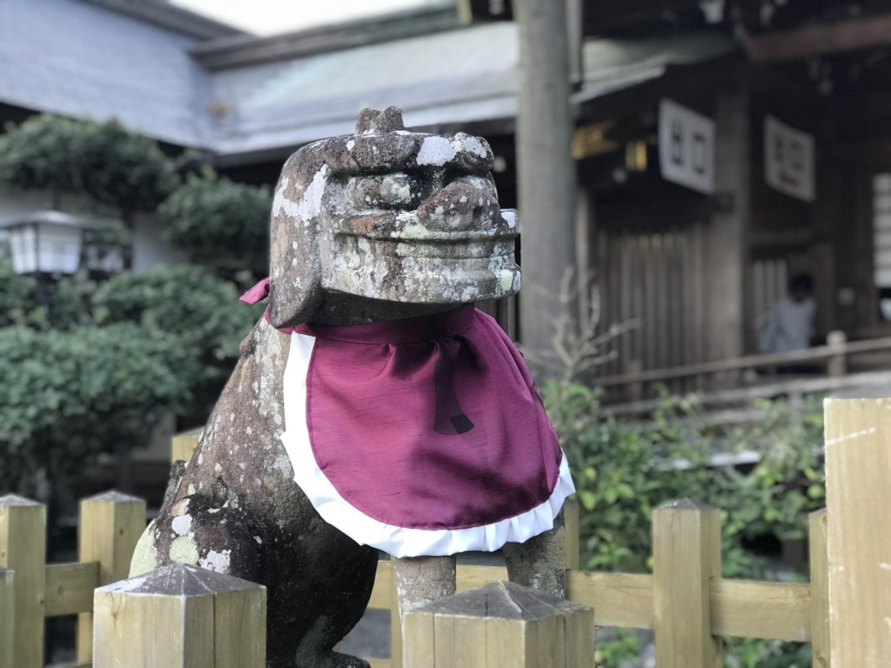

御朱印が 500 円で足りるかめっちゃ心配だったのですが、300 円でした。大変ありがたい神社です。うれしかったので、残りのおカネは全部お賽銭箱に入れてきました。変に 200 円残すぐらいだったら、全部神さまに預けちゃった方がなんかいいことありそう。

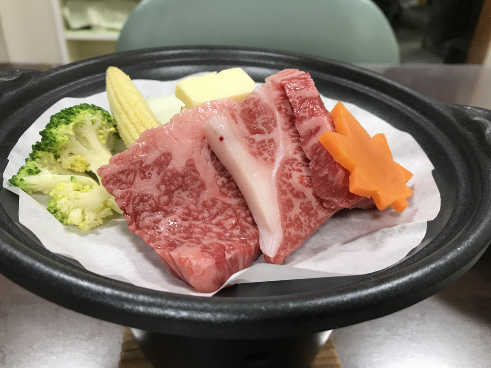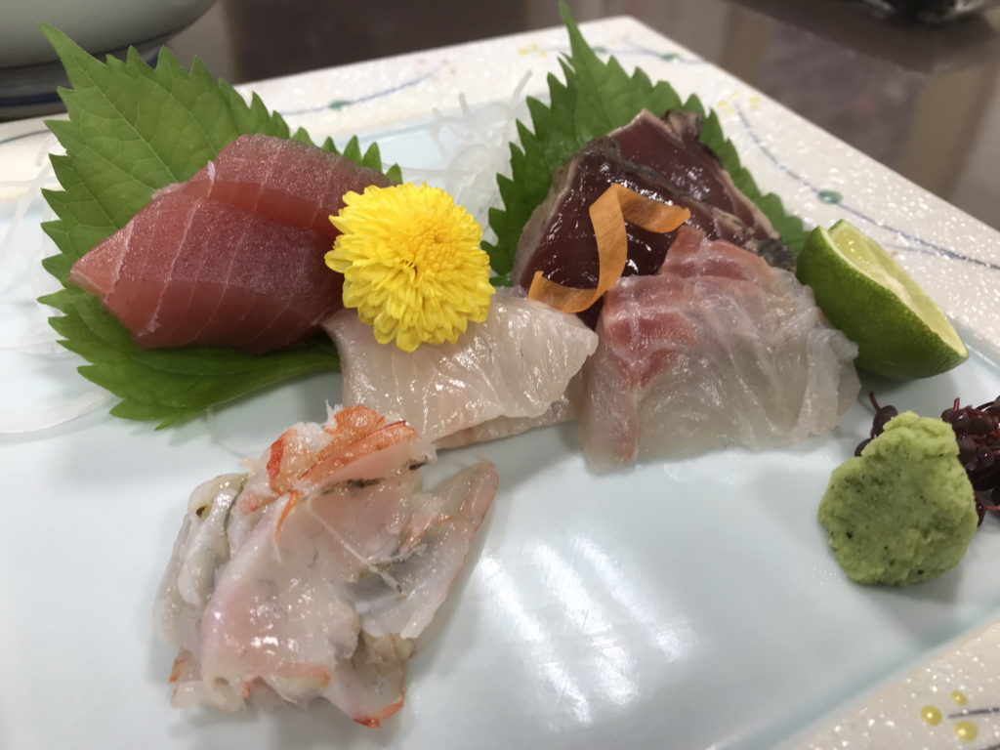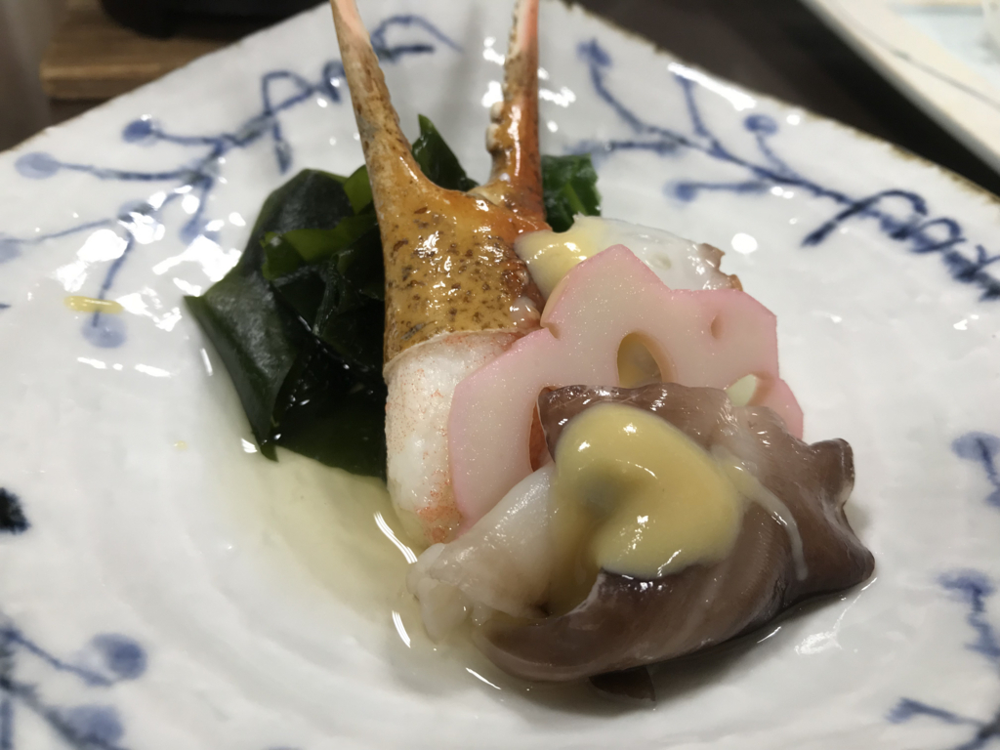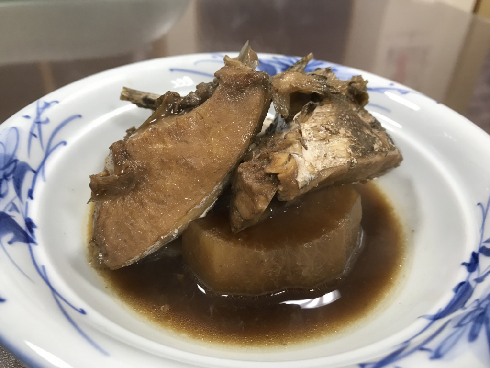

適度に運動したせいか、宿の夕ご飯も大変美味しかったです。これで8,000円台はお得だなーと思ったので、ビールを多めに注文しました。8畳間を一人で占有するのも快適～。網戸にすると風が入ってきて心地よく、本を読みながらそのままガッツリ朝まで寝てしまいました。

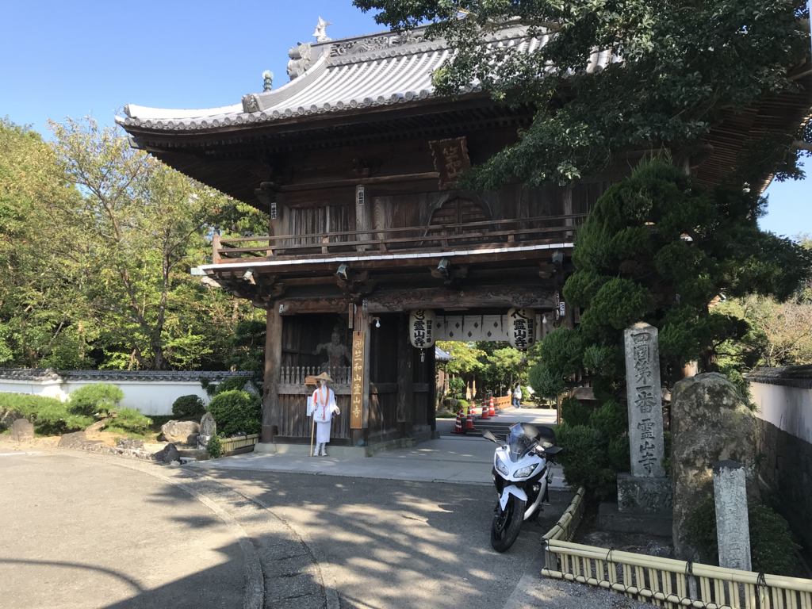

翌朝は、四国遍路の第一札所・霊山寺によって帰りました。いや、何も知らずに宿を出たらすぐそばにお寺があったので寄ってみただけなのですが……ここが一番なんだな。そういえばアニメ『おへんろ』で見た覚えがある（今度2期が始まるってよ！）。大麻さんで旅の無事を祈願して、この霊山寺からお遍路を始めるというのが黄金パターンなんだな。

いつかお遍路をすることがあれば、同じ宿に泊まって、大麻さんにお参りして、ここから始めようかなって思います。

<h3>追伸</h3>

お財布がなかったので、基本どこにも寄らず、すきっ腹抱えて松山まで帰りました。ほんとは途中で温泉とか入りたかった……緊急用のクレジットカードにキャッシング機能でもつけておこうかなぁ。

