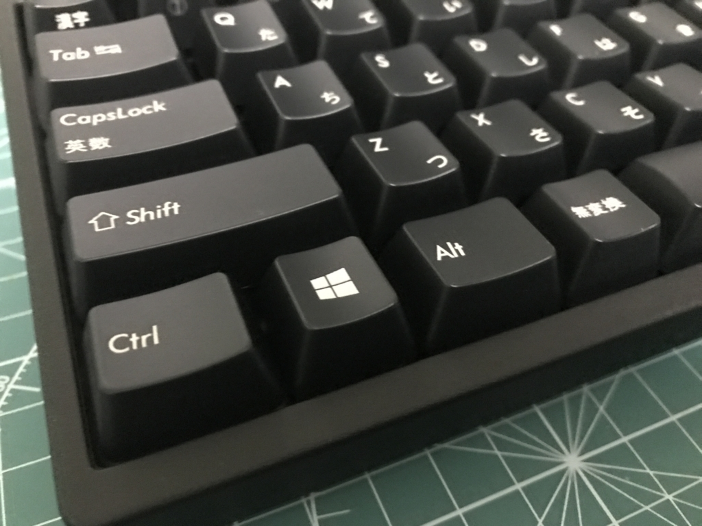
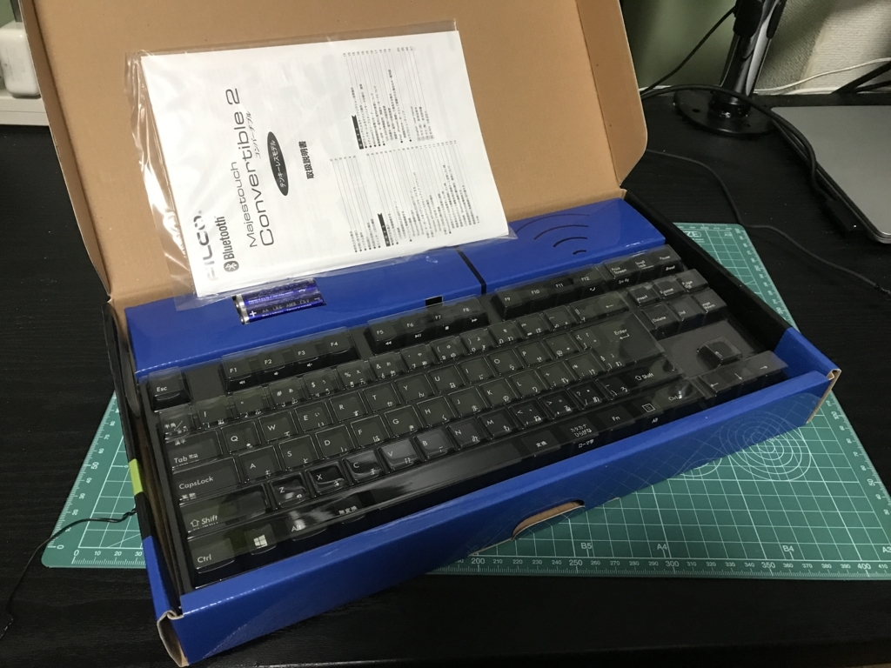
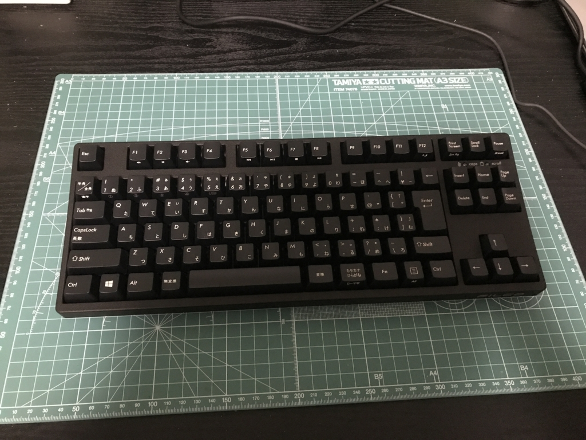
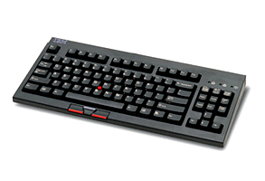

デスクトップ周りをスッキリしよう計画の一環として、キーボードを買い換えました。

<iframe src="https://hatenablog-parts.com/embed?url=http%3A%2F%2Fblog.daruyanagi.jp%2Fentry%2F2017%2F10%2F01%2F090000" title="お仕事部屋の改造計画を進めている - だるろぐ" class="embed-card embed-blogcard" scrolling="no" frameborder="0" style="display: block; width: 100%; height: 190px; max-width: 500px; margin: 10px 0px;"></iframe><cite class="hatena-citation"><a href="http://blog.daruyanagi.jp/entry/2017/10/01/090000">blog.daruyanagi.jp</a></cite>

これまで使っていたのは、FILCO のメカニカルキーボード。Amazon のリンクは「日本語キーボード」になってるけど、実際に購入・使用していたのは英語配列のものでした。

<a href="http://www.amazon.co.jp/exec/obidos/ASIN/B0007TXT4S/bestylesnet-22/">FILCO Majestouch「マジェスタッチ」 メカニカルキーボードUSB&PS2両対応 日本語108キー・かな印字なし 独CherryMX茶軸スイッチ ブラック FKB108M/NB</a>
<ul><li>出版社/メーカー: ダイヤテック</li><li>発売日: 2004/12/08</li><li>メディア: Personal Computers</li><li>購入: 2人 クリック: 63回</li><li><a href="http://d.hatena.ne.jp/asin/B0007TXT4S/bestylesnet-22" target="_blank">この商品を含むブログ (38件) を見る</a></li></ul>

記録によると <b>2008/5/7</b> 購入となっていたので、実に<b>9年間</b>利用していたことになります。まだまだ使おうと思えば使えるけど、さすがに引退させてもいいよね……。

新しいキーボードを買うにあたって、まず要求スペックを策定してみました。9年間の地味な不満をこの際解決しておきたい！

<ul>
<li><b>省スペース</b>：フルキーボード → テンキーレスにして取り回しを向上させたい（テンキーって外付けの方がいいよね？　FPS でテンキーを左手で使うの好き。最近やらないけど</li>
<li><b>無線</b>：取り回し向上の一環。でも、いざというときに有線接続できることも必須</li>
<li><b>日本語配列</b>：英語配列の方が好きなんだけど、ノーパソが日本語配列になってきているのでそろそろ統一しようかなと</li>
<li><b>メカニカルキーボード</b>：とくにメカニカルキーボードじゃないと嫌だということもないのだけど、今まで使っていたので変えることもないかな。カチャカチャ、ターン！　ってできるのはやっぱり気持ちいいし。</li>
<li><b>Windows キー</b>：Windows キーがある、割と素直なキー配列のヤツがいい……（要するに HHKB みたいなのは要らない</li>
<li><b>FILCO</b>：ほかのメーカーも試してみたいけど、やっぱり9年間もってくれたという実績で。あー、でも、気に入ったのがなければ裏切ってもいいや（ぁ</li>
<li><b>予算は1万円ぐらいまで</b>：東プレいいらしいんだけどねー、2万はちょっと出せないかな</li>
</ul>
いろいろ悩んだのだけど、結局これにしました。

<a href="http://www.amazon.co.jp/exec/obidos/ASIN/B01LLFOZ1C/bestylesnet-22/">FILCO Majestouch Convertible2 Tenkeyless CherryMX黒軸 日本語カナあり 無線/有線両対応 マルチペアリング4台対応 ブラック FKBC91ML/JB2</a>
<ul><li>出版社/メーカー: FILCO</li><li>発売日: 2016/09/16</li><li>メディア: Personal Computers</li><li><a href="http://d.hatena.ne.jp/asin/B01LLFOZ1C/bestylesnet-22" target="_blank">この商品を含むブログを見る</a></li></ul>

少しだけ予算オーバー。メカニカルキーボードはいろいろ軸の色があってうち心地が違うらしいのだけど、そういうのはよく知らないし、あまり興味もなかったので、「CHERRY MX黒軸」というのを選んでみました。一番安かった……

8月末に到着して、数カ月間使ってみたのですが……まず、<b>キーが重い！</b>　打ち間違いも頻発で、最初は「なんだこれ！　無理だ！！」と思いました。Macbook や Surface のペタペタキーボードとの落差が大きすぎて、ちょっと苦痛でした。後で調べたら以前は「茶軸」だったようで、それに合わせればよかった。

でも、3日ぐらいたつと慣れるもので。底まで打鍵しなくても入力されるんだなーと要領を得ると、割とすんなり以前の入力速度を取り戻すことができました。スピードは測ってないけど。なんか、ガチガチとしっかり打たなくても、でろでろっと適当に打ち込んで大丈夫な感じが、ルーズな自分には向いているのかもしれない。

サイズもコンパクトでよろしい。いつもは机にカッティングシートを敷いて、そのうえでキーボードを置いているのですが、以前のキーボードはシートと横幅がほぼ同じだったのに対し、今のキーボードは若干余裕があります。

無線機能は今のところ使っていないのですが、まぁ、いずれ使うことになると思う。

とりあえず、ノーパソとの打ち心地の落差以外は、可もなく不可もなく、まったく不満なく使えているかな？　あんまりこだわりなさ過ぎて、そこそこの品質のキーボードであればちゃんと満足できる人間であることが再確認できた。下手したら万単位で文字を入力するから、さすがに数千円のメンブレンとかはイヤだけど。

<h3>追伸</h3>

人生で一番好きだったキーボードは IBM の SpaceSaver2 っていうキーボードだった。復刻してくれたら喜んで買うと思う。

