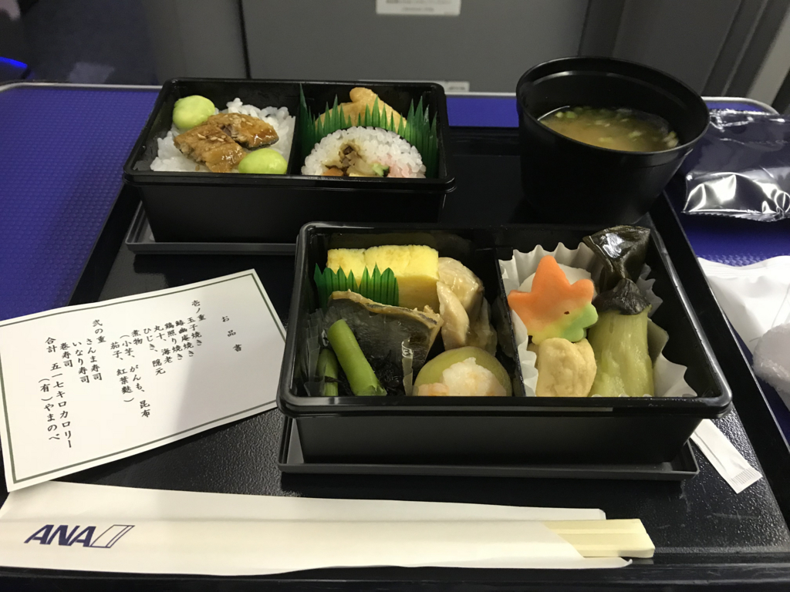
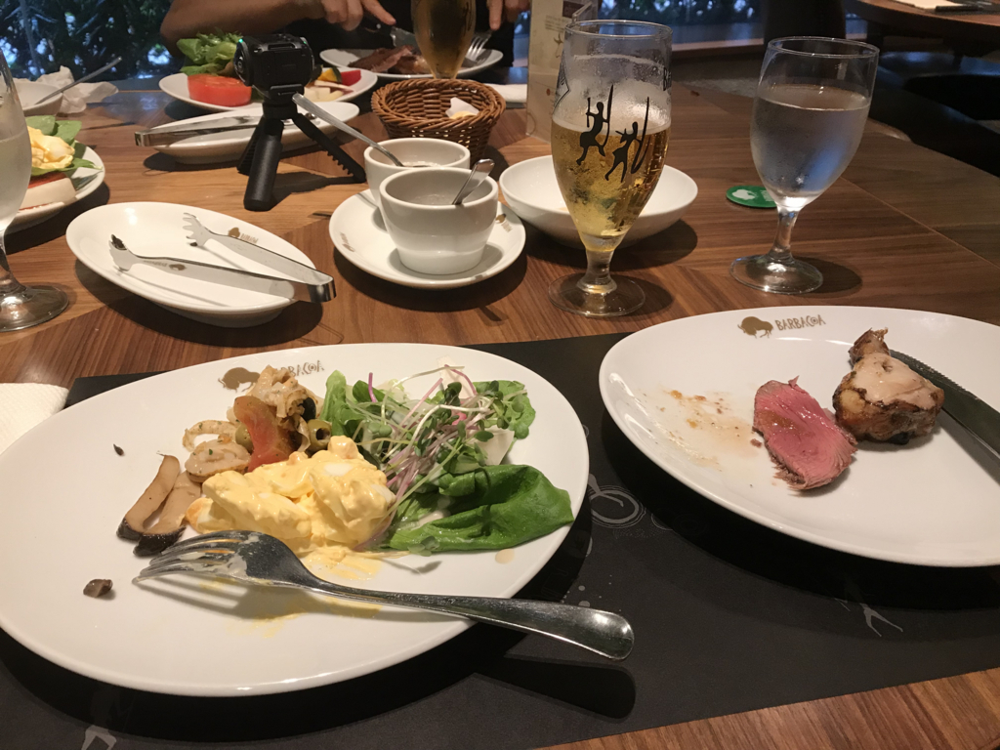
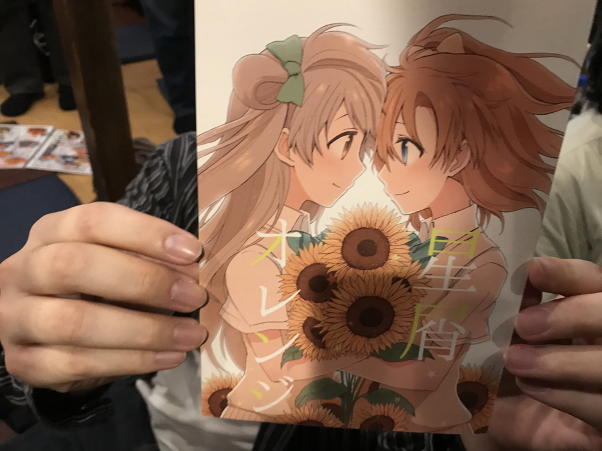
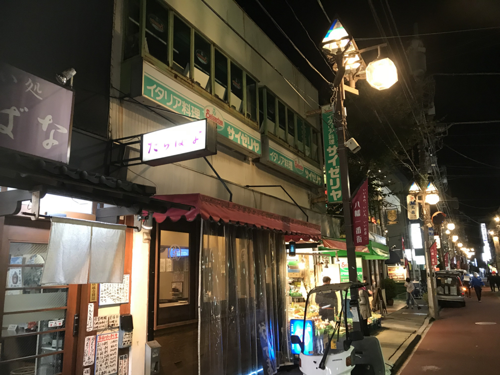
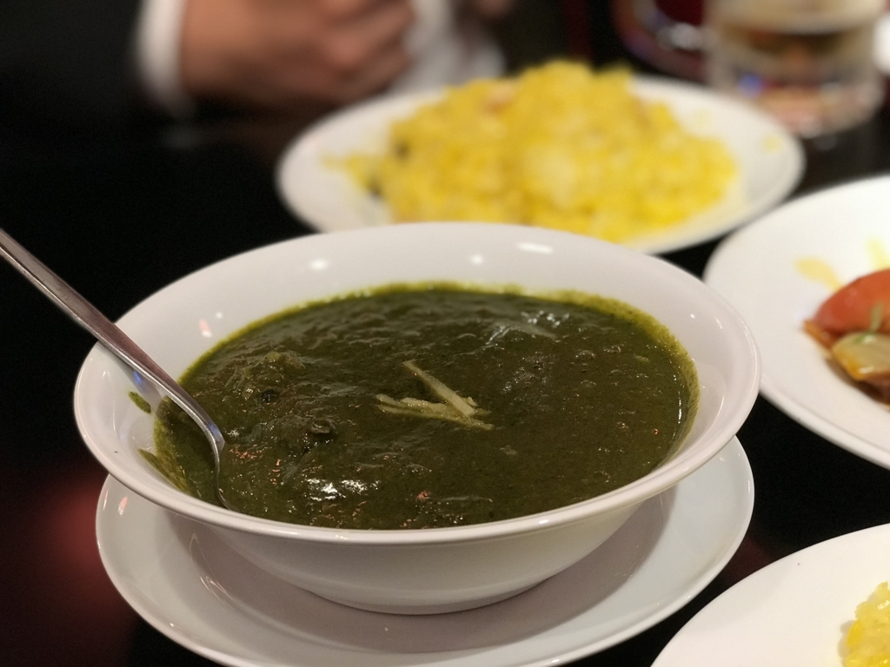
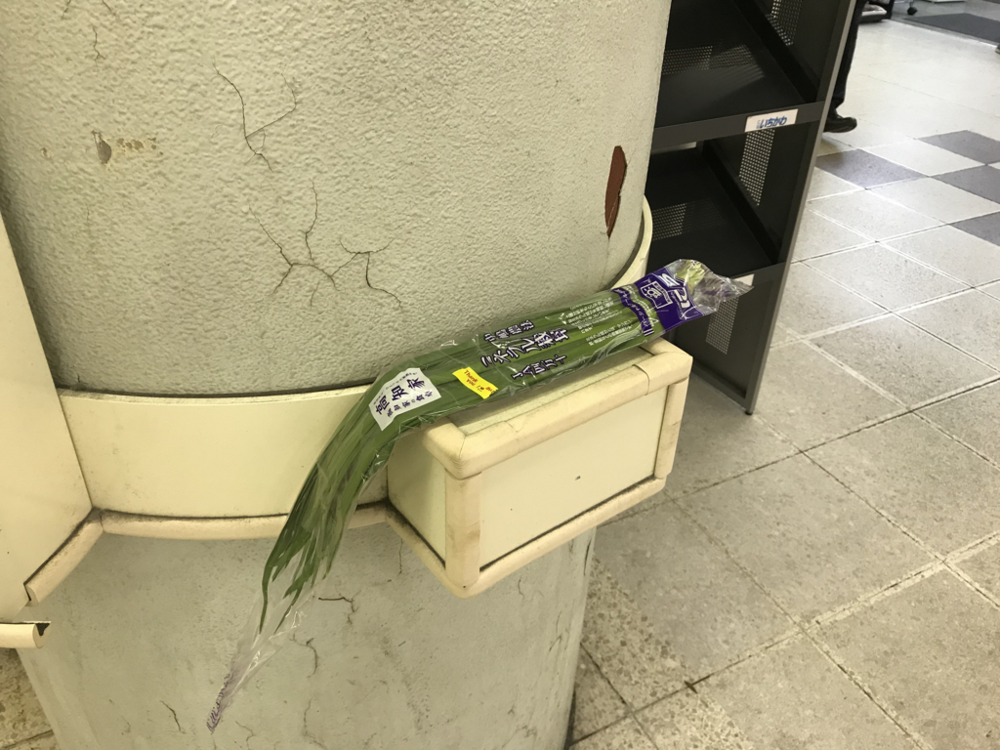
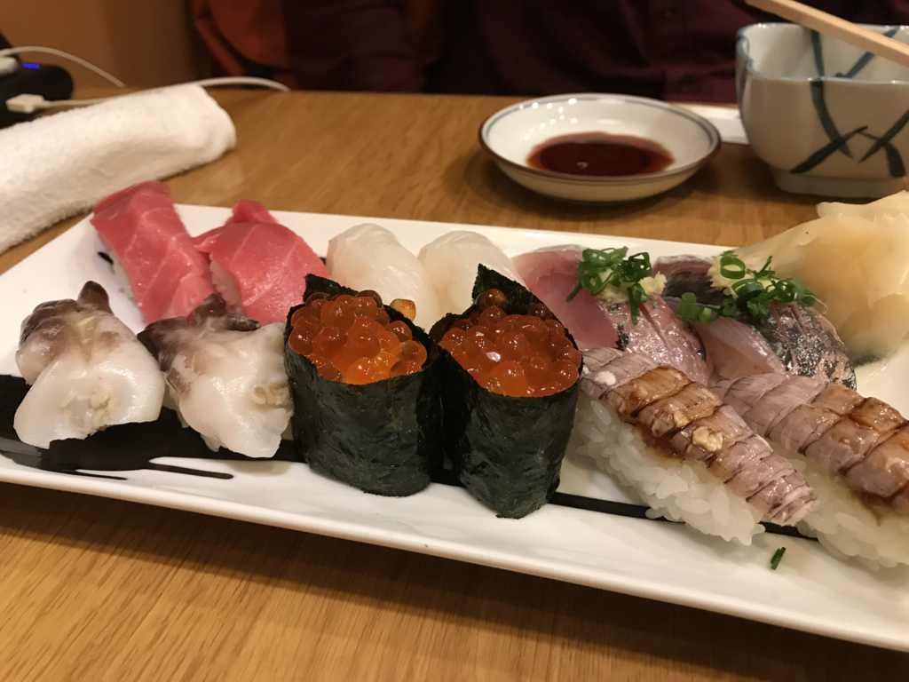
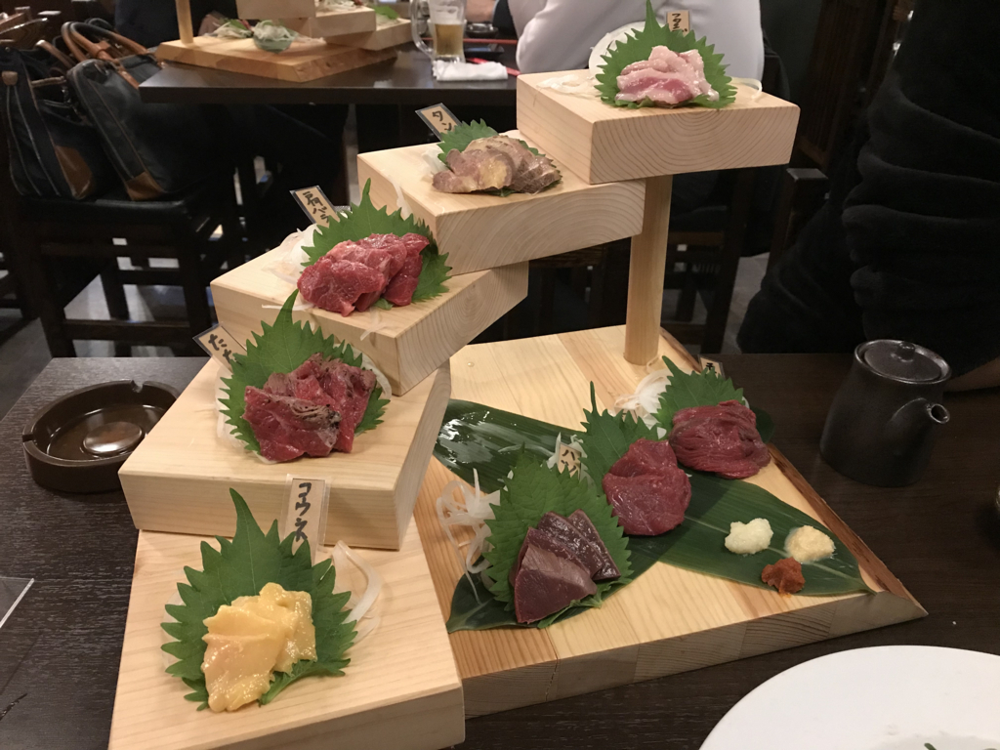

今年2回目の東京。何人かに「なんできたの？」って聞かれたんだけど（理由がないときちゃダメか！）、とくに理由などはなくて、単に甥っ子の誕生日があるだとか、たまには顔つなぎしておかないとお仕事まわしてもらえる優先度が下がるとか、旧友と飯食いたいとか、おかんが寂しがってる感じがあるだとか、まぁ、そんなこんなでそろそろ行っておくかって感じ。

今回は期限切れかけの株主優待券が2枚あったので、行きも帰りもプレミアクラスにした（次回からは身分相応にジェットスター乗ろう……）。行きしなの機内食で出たサンマ寿司、美味しかったです。

東京で最初のイベントは、友人とのご飯とおおば会でした（おおば会というのは、おおばさんをアテに昼間から秋葉原で飲みまくって、みんなで磯丸水産のレシートを長くする会です）。

品川でシュラスコ食べたり……（肉が無限に出てくる！！）

某氏に“ことほの”の良さを学んだりしていました。A 氏夫妻が登場して、娘さんを抱っこさせてもらったりも。また、呉で遊びたいなぁ。ってか、わいも結婚して子どもほしいですね。

平日は実家で仕事をしながら、母の愚痴を聞いたり、パソコン直したり、弟夫妻や妹夫妻の訪問を受けたりなどなど。N 氏とサイゼリア一号店（本八幡にあるんだねぇ）のそばにあるインドカレー屋さんに出かけたりもしました。

マトンとかサーグ（ほうれん草）とかのカレーは大好きなので、地味にうれしかった。ただ、いつも言ってる小岩の居酒屋さんの大将が調子悪いみたいで、飲みに行けず残念。歳も歳だから復活は難しそうだけど、また行けたらいいなぁ。

あんまり関係ないけど、JR 市川駅にネギが置いてあった。

あと、@shibayan がしつこく誘うので、万世の地下でローストビーフ食べてきた。パコリタン（パーコーがはいったナポリタン）はたまに食べると大変美味しい。会計のときにうまく立ち回って、全額奢らせたのでなおさら美味しかった。

――と思ってたんだが、仕返しに @shibayan が姉を召還。浅草橋で寿司食べたのを奢らされた。金額はちょうど同じぐらいだったので、まぁ、引き分けかなって感じだけど、金持ちの方が奢るべきだと思う。肝心のお寿司の方は……回る寿司と比べるのは申し訳ないが、回らないだけあってまぐろがだいぶ美味しかった気がする。またゆっくり食べに行きたいと思う。

それ以外は、Microsoft MR ヘッドセットを動かすのに四苦八苦したり……

<iframe src="https://hatenablog-parts.com/embed?url=http%3A%2F%2Fblog.daruyanagi.jp%2Fentry%2F2017%2F10%2F29%2F193849" title="Surface Laptop で  Acer の MR ヘッドセットを動かすまでの苦労（物理 - だるろぐ" class="embed-card embed-blogcard" scrolling="no" frameborder="0" style="display: block; width: 100%; height: 190px; max-width: 500px; margin: 10px 0px;"></iframe><cite class="hatena-citation"><a href="http://blog.daruyanagi.jp/entry/2017/10/29/193849">blog.daruyanagi.jp</a></cite>

甥っ子と遊んで死にかけたりしてた。

っていうか、最近のお子さま向けの施設は楽しくていいな。自分も小さいころにこういうところで遊びたかったわ。

残りの数日は、母＋兄弟で馬肉屋さん行ったり、妹の家族連れて回転寿司行ったりしてた。馬肉屋さんで母が酔っぱらって、雨の中背負って帰る羽目になったのには難儀したけど、まぁまぁ美味しかったし、楽しかった気がする。

割と長めに時間をとったつもりだったけど、断ってしまった約束もあってちょっと申し訳なかった。また東京行くときは、皆様もよろしゅう。

<h3>追伸</h3>

東京寒くてめっちゃ風邪ひいた。松山帰ってからも引きずってて、割とつらい……。

