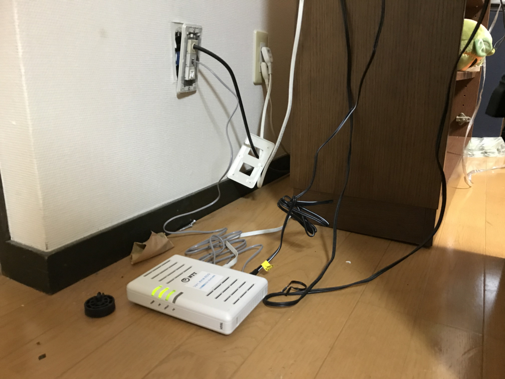
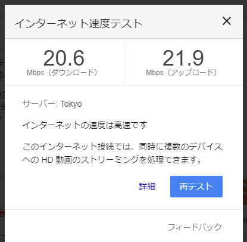
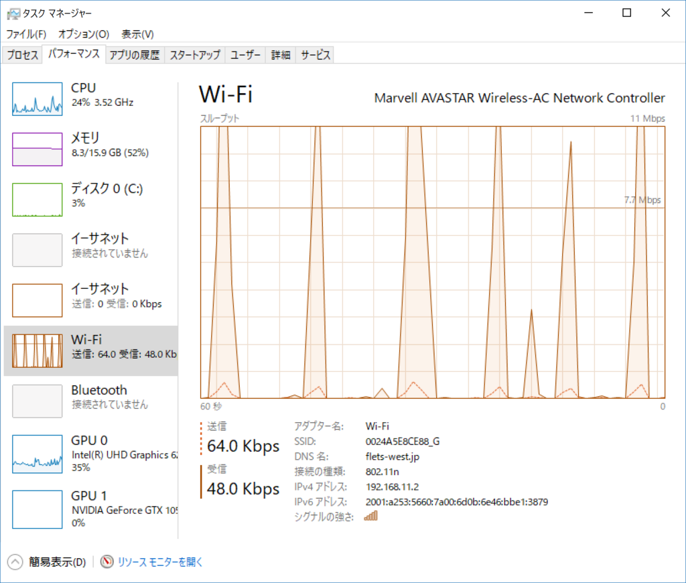
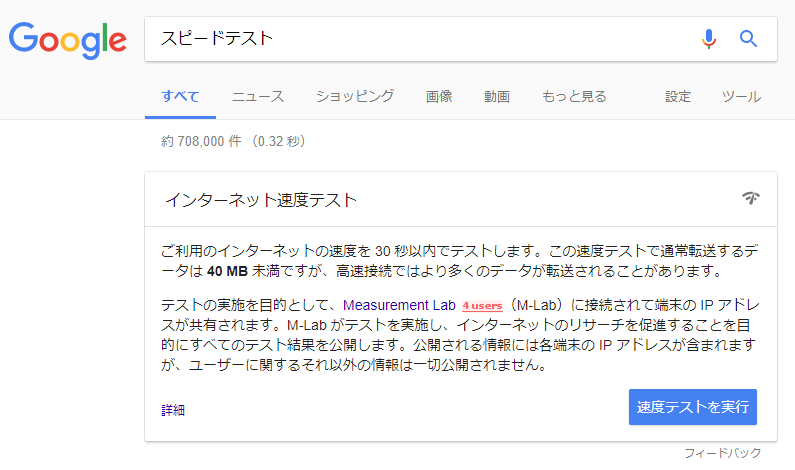

うちのマンションは「まどんなネット」というタダのインターネット回線が引かれているのでそれを使っていたんだけど、ここ何か月か、ロクな速度が出ずに辛いことがあった。WiMAX ももっているので繋ぎ変えをすれば凌げるのだけど、Wi-MAX は Wi-MAX で通信制限がしんどい。最近ブログをサボっているのも、これが理由の一つだったりする。

というわけで、タダのものに文句をつけるのは大変心苦しいのだけど、インターネットがタダってのは賃貸のときの“売り文句”でもあるし、いい加減対処してもらおうかと連絡先を調べたら――

<blockquote cite="http://www.infomadonna.ne.jp/info/service/teishi_20170112.htm">

さて、このたび弊社は2018年3月31日をもちましてインターネット接続による全てのサービスのご提供を終了させていただくこととなりましたのでお知らせいたします。

<cite><a href="http://www.infomadonna.ne.jp/info/service/teishi_20170112.htm">InfoMadonna</a></cite>
</blockquote>

終わるっぽい（よくわからんのだが

というわけで、普通のプロバイダーと契約することにした。So-net にした理由は、とくにない。たぶん、価格比較サイトで月額料金が下から2番目だったからだと思う。月額4,000円だが、長期契約とキャンペーンで結構安くなるみたいで、キャッシュバックも2万円ぐらいある。30か月契約しなきゃいけないのはネックだけど、当面、引っ越しの予定はないしいいかな。

固定回線を引くとなると業者がきて、なんかいろいろ工事をしていくものと思ってたのだけど、今回はなんか VDSL の終端装置が一つ、ポンと送られてきて、SMSで「明日から使えるから自分で繋げよ」って言われただけだった。拍子抜けだ……。ただ、「まどんなネット」をつなぐときにいろいろしてもらった関係で、うちの家には電話回線の口がない、というか使えなくされていたので、いろいろ全部引き出して、ぐちゃぐちゃつないだり引っこ抜いたりして試行錯誤するのが面倒だった。自分でも途中からなにをどうしてるのかさっぱりだったが、とりあえずつながった。こんなことする羽目になるんなら、1万円だか2万円だかで専門業者にやってもらったほうがよかったな。

さっそく回線速度を計ってみたが、そんなに速くない（VDSL ってこんなものなのかね）。自分の工事（？）がダメだったのか、ルーターが古いせいか。

ネットワークのパフォーマンス見ても、こんなんでええんかなーみたいな感じだが、いかんせん、専門家じゃないからよくわかんないな。

まぁ、とりあえず混雑した時間でも 20Mbps でるから不満はない。AbemaTV で将棋番組しながら他のことできる。

ちなみに最近は「スピードテスト」でググると、検索結果画面で回線速度が測れるそうな。大変便利なので覚えておくといいと思う。

