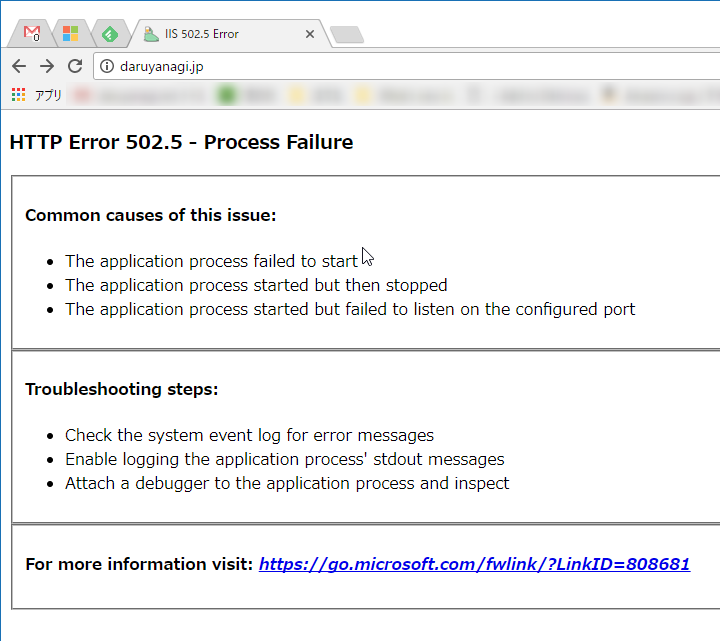
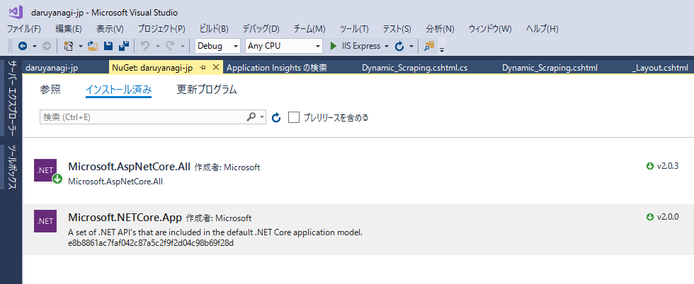

今日見たら daruyanagi.jp が死んでた。

<blockquote>

HTTP Error 502.5 - Process Failure  
Common causes of this issue: 

<ul>
<li>The application process failed to start </li>
<li>The application process started but then stopped </li>
<li>The application process started but failed to listen on the configured port </li>
</ul>
Troubleshooting steps: 

<ul>
<li>Check the system event log for error messages </li>
<li>Enable logging the application process' stdout messages </li>
<li>Attach a debugger to the application process and inspect </li>
</ul>
</blockquote>

昨日あたりまでは生きていた気がするんだが……彼に何が起こったのか。

<blockquote class="twitter-tweet" data-lang="ja">
せやな
&mdash; しばやん (@shibayan) <a href="https://twitter.com/shibayan/status/933664170150473728?ref_src=twsrc%5Etfw">2017年11月23日</a></blockquote>

赤い帽子のヤツは助けてくれないし（役立たずめ！）、とりあえずソースコードを探して Visual Studio で開いて実行してみたけど、とくに問題はないみたい。念のため、NuGet を確認してみたら ASP.NET Core 2.0.0 のプレビュー版みたいなやつが入っていたのでアップデート（→ 2.0.3）して再ビルド、発行。

そしたら普通に動いた。ﾌｧｯｷﾝ！

<blockquote class="twitter-tweet" data-lang="ja">
(・д・)ﾁｯ ばれたか
&mdash; しばやん (@shibayan) <a href="https://twitter.com/shibayan/status/933702935313244160?ref_src=twsrc%5Etfw">2017年11月23日</a></blockquote>

知ってるなら教えろ、ﾌｧｯｷﾝ！

<h3>追記</h3>

<blockquote class="twitter-tweet" data-lang="ja">
<a href="https://t.co/N11NqxSBkC">https://t.co/N11NqxSBkC</a> / “<a href="https://t.co/9vTmtCukjr">https://t.co/9vTmtCukjr</a> Core 2.0 なサイトを放置してたら死んでた → 復旧 - だるろぐ” <a href="https://t.co/Vy42aMkqxu">https://t.co/Vy42aMkqxu</a>
&mdash; しばやん (@shibayan) <a href="https://twitter.com/shibayan/status/933706351582232577?ref_src=twsrc%5Etfw">2017年11月23日</a></blockquote> 

<blockquote cite="https://github.com/Azure/app-service-announcements/issues/35">

Now that Core 2.0 has been release, App Service will remove support for 2.0 preview runtimes and SDK. This will happen starting in early October 2017.

Action item: make sure that you upgrade all your 2.0 Preview apps to the official 2.0 bits.

See also #27 for a similar announcement relating to prerelease Core 1.x bits.

Please use Azure/app-service-announcements-discussions#12 for discussions about this change.

<cite><a href="https://github.com/Azure/app-service-announcements/issues/35">Deprecation of Prerelease .NET Core 2.0 runtimes and SDK from App Service &middot; Issue #35 &middot; Azure/app-service-announcements &middot; GitHub</a></cite>
</blockquote>

