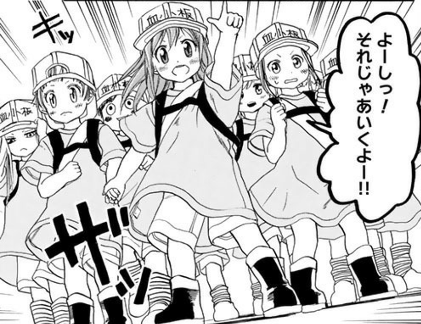

<h3>『はたらく細胞』</h3>

<blockquote class="twitter-tweet" data-lang="ja">
弟1号とあったんだけど、戦う細胞 みたいな名前の漫画が面白いって言う貴重な情報を得た
&mdash; だるたにゃん (@daruyanagi) <a href="https://twitter.com/daruyanagi/status/923545104161185792?ref_src=twsrc%5Etfw">2017年10月26日</a></blockquote>

この前東京に行ったとき、弟1号から情報を入手。でも、酔っぱらってたから仕方ないところもあるけど、まったく間違ってタイトルを覚えてしまっていた。@evian 氏が正しい題名をツッコミんでくれなかったら、Amazon を無限に彷徨っていたと思う。

<a href="http://www.amazon.co.jp/exec/obidos/ASIN/B012EODH18/bestylesnet-22/">はたらく細胞（１） (シリウスコミックス)</a>
<ul><li>作者: 清水茜</li><li>出版社/メーカー: 講談社</li><li>発売日: 2015/08/07</li><li>メディア: Kindle版</li><li><a href="http://d.hatena.ne.jp/asin/B012EODH18/bestylesnet-22" target="_blank">この商品を含むブログ (1件) を見る</a></li></ul>

むかーしむかーし、小学校の頃あたりに、図書室で『からだのふしぎ』みたいな感じの名前の学習マンガを読んだ気がするのだけど、それをもう少し大人向けにした感じ。正直なところ、もうちょい世界観を練った方がいいんじゃないかって思ったけど、血小板ちゃんが可愛いので全力で許せる。

 

<h3>『ヴィンランド・サガ』19巻</h3>

今一番、続編が出るのが楽しみなマンガ（双璧は『ヒストリエ』だけど、こっちはどうせ遅筆だろうから気長に待ってる）。

<a href="http://www.amazon.co.jp/exec/obidos/ASIN/B07793K5JV/bestylesnet-22/">ヴィンランド・サガ（２０） (アフタヌーンコミックス)</a>
<ul><li>作者: 幸村誠</li><li>出版社/メーカー: 講談社</li><li>発売日: 2017/11/22</li><li>メディア: Kindle版</li><li><a href="http://d.hatena.ne.jp/asin/B07793K5JV/bestylesnet-22" target="_blank">この商品を含むブログ (2件) を見る</a></li></ul>

<blockquote>

北海最強の武力集団ヨーム戦士団の跡目争いにはイングランド・デンマーク統一王のクヌートの思惑も絡んでいた。だが闘争心に火が付いたトルケルはクヌートの目論見から逸脱し、もはや誰にも止めることができない。最凶の槍使い・ガルムは人質をとりトルフィンをヨムスボルグに誘い出す。最強の戦士達がヨムスボルグに集結。大きな戦いが幕を開けた！

</blockquote>

正直、ガルムはどうでもいい（トルケル、ぶちかましてほしかった！）。自分の中ではシグやんが割とお気に入りのキャラになりつつあって、トルフィン一行に加わらないかなーなんて思い始めてる。でも、史実ではトルフィンとグズリーズが結婚するんだよね。それを考えると、シグやんは単なる賑やかしキャラで終わってしまうのかもしれん……。

それはともかく、『ヴィンランド・サガ』を読むまではレイフ・エリクソンぐらいしか知らなかったんだよね。クヌートすら知らなかったぐらい。この時期の北欧の歴史ってあんまりよく知らんから、なんかいい本あったら教えてほしい。

<h3>『キングダム』48巻</h3>

王翦の策は読めていたので、「だよねー」って感じ。

<a href="http://www.amazon.co.jp/exec/obidos/ASIN/B075SWSZ1Z/bestylesnet-22/">キングダム 48 (ヤングジャンプコミックスDIGITAL)</a>
<ul><li>作者: 原泰久</li><li>出版社/メーカー: 集英社</li><li>発売日: 2017/11/17</li><li>メディア: Kindle版</li><li><a href="http://d.hatena.ne.jp/asin/B075SWSZ1Z/bestylesnet-22" target="_blank">この商品を含むブログを見る</a></li></ul>

<h3>『大家さんは思春期』</h3>

今月末は仕事のモチベーションが上がりきらなくて大変つらかったので、全部終わらせたらこれを全巻まとめ買いしていい、ということにして頑張った。

<a href="http://www.amazon.co.jp/exec/obidos/ASIN/B00XXPYIZ2/bestylesnet-22/">大家さんは思春期！　１巻 (まんがタイムコミックス)</a>
<ul><li>作者: 水瀬るるう</li><li>出版社/メーカー: 芳文社</li><li>発売日: 2015/05/29</li><li>メディア: Kindle版</li><li><a href="http://d.hatena.ne.jp/asin/B00XXPYIZ2/bestylesnet-22" target="_blank">この商品を含むブログを見る</a></li></ul>

確かちょっと前に3分アニメでやってたのがきっかけで知ったんだけど……原作もチエちゃんかわいいな……こんな子おったら、全力で遠巻きに見守るしかないやろ。

最近、緊張感のあるシナリオとか、ビックリなどんでん返しとか、全然要らないんだよ……もう、単にかわいい女の子が幸せそうに平凡な毎日を送っているマンガが一番読んでてうれしい……尊い……。もし自分がいなくなれば世界がこんな感じになるというのなら、即座に腹を切る。

