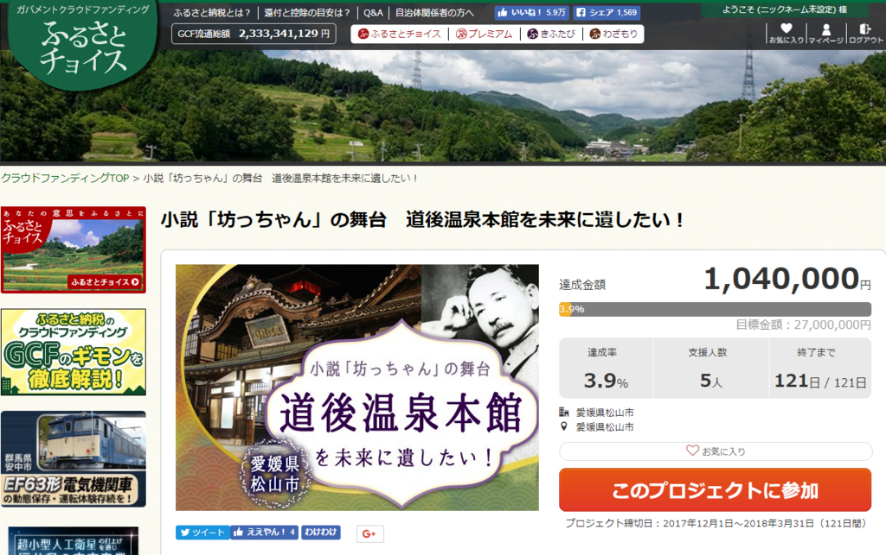
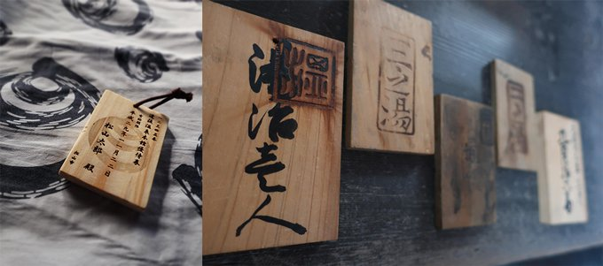

やるやるといっておきながら、いつまで経っても始まらない（というイメージしかない）道後温泉本館の改修工事ですが、とうとう始まるようで。昨日からクラウドファンディングが始まりました。クラウドファンディングというのは、要するにネット募金です（ぇ

僕も一口ですがのっておきました。

<ul>
<li><a href="https://www.furusato-tax.jp/gcf/229">&#x5C0F;&#x8AAC;&#x300C;&#x574A;&#x3063;&#x3061;&#x3083;&#x3093;&#x300D;&#x306E;&#x821E;&#x53F0; &#x9053;&#x5F8C;&#x6E29;&#x6CC9;&#x672C;&#x9928;&#x3092;&#x672A;&#x6765;&#x306B;&#x907A;&#x3057;&#x305F;&#x3044;&#xFF01; | &#x3075;&#x308B;&#x3055;&#x3068;&#x7D0D;&#x7A0E;&#x306E;&#x30AF;&#x30E9;&#x30A6;&#x30C9;&#x30D5;&#x30A1;&#x30F3;&#x30C7;&#x30A3;&#x30F3;&#x30B0;&#x306F;&#x300C;&#x3075;&#x308B;&#x3055;&#x3068;&#x30C1;&#x30E7;&#x30A4;&#x30B9;&#x300D;</a></li>
</ul>
個人的には「ふるさと納税」という制度には反対なのですが、県外からの寄付だとなかなかお得みたい。応援したいっていう方がいればぜひ寄付してあげてください。

中でも注目の特典は、この木札のフリーパス。道後温泉に入り放題になるらしいぞ！（5万円以上の寄付で1年、最大10年）

うぅぅ……松山市外在住者じゃないともらえないのか……ほしいぞ。ちなみに、市内在住者はカネを突く権利を「抽選で」もらえるそうな（当たる気がしねえ！

ちなみに、僕が寄付した時は 5 人で 104 万円が集まっていました。4人が一万円ずつ寄付したとすると、残り1人は太っ腹にも100万円寄付したのか……しゅごい……僕も「これは！」と思ったところにこれぐらいツッコめる身分になりたいものです。

