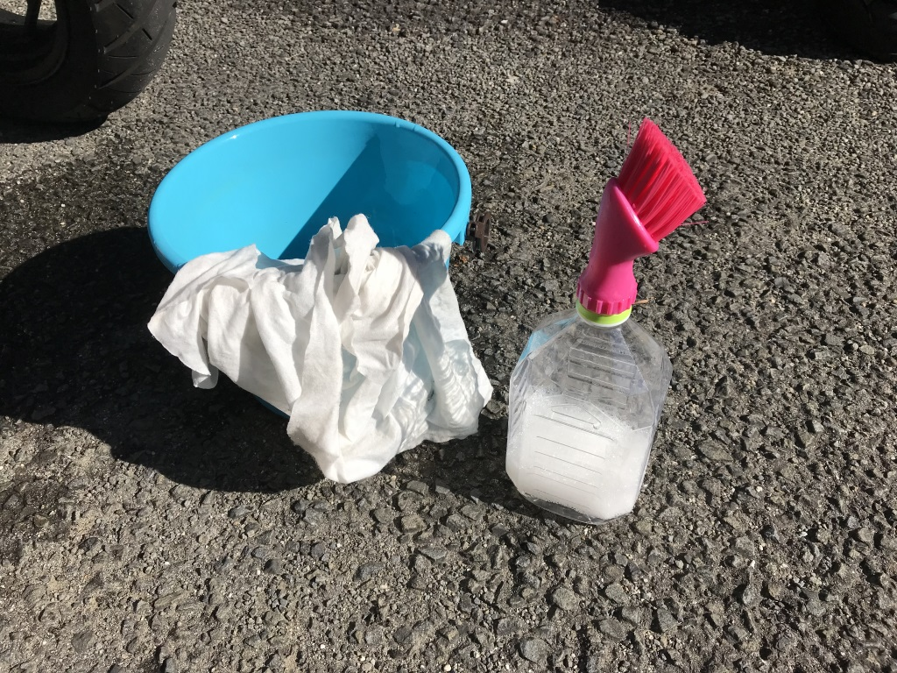

<blockquote class="twitter-tweet" data-lang="ja">
あらった <a href="https://t.co/u66VxI9lfZ">pic.twitter.com/u66VxI9lfZ</a>
&mdash; だるたにゃん (@daruyanagi) <a href="https://twitter.com/daruyanagi/status/936794384116228096?ref_src=twsrc%5Etfw">2017年12月2日</a></blockquote>

今日は天気が良かったので、久しぶりにバイクでジムへ行ったんだが（東京に行ってたりで最近はご無沙汰してた）、バイクカバーをかけるのをさぼってたせいか、汚れがひどかった。スクリーンに鳥の糞もついてたし、さすがにこのままではかわいそうなので洗ってあげることにする。クイックルワイパーみたいなヤツで拭いたりはするけど（バイク用のな）、何気にちゃんと洗うのは買って以来、初めてかもしれぬ（← おいこら

まぁ、それはともかく。

実家の頃は水道ホースを引っ張ってじゃぶじゃぶ洗ってたんだけど、マンションだと場所がなかったりでいろいろしんどいよね。みんなどうやって洗ってるんだろうな。

うちはお察しの通り、掃除・洗濯が好きじゃないので割と適当なんだけど、小さめのバケツ×1＋雑巾×2枚（洗う用・仕上げ用）＋1リッターのペットボトル（バイクシャンプー希釈＋ブラシ付き）を用意して洗ってる。っていうか、これ＋クイックルワイパーみたいなヤツ以外にお掃除道具もってへんし……。

<a href="http://www.amazon.co.jp/exec/obidos/ASIN/B00TRWL3AS/bestylesnet-22/">ナンカイ(NANKAI) SPオートバイシャンプー 250ml 12回洗える超濃縮タイプ 2001S</a>
<ul><li>出版社/メーカー: NANKAI(ナンカイ)</li><li>メディア: </li><li><a href="http://d.hatena.ne.jp/asin/B00TRWL3AS/bestylesnet-22" target="_blank">この商品を含むブログを見る</a></li></ul>

このナンカイのバイクシャンプーは1カップを1リッターの水で割るといい感じ。ウチはいつも1リッターの「お～いお茶」を12本セットでアマゾンで頼んでいて、日常的に飲んでるから、1リッターのペットボトルは腐るほどある。それにシャンプー水を詰める。

<a href="http://www.amazon.co.jp/exec/obidos/ASIN/B0088B7PX8/bestylesnet-22/">小久保 隙間掃除ブラシ ペットボトル ブラシ 3223</a>
<ul><li>出版社/メーカー: 小久保工業所</li><li>メディア: ホーム&キッチン</li><li><a href="http://d.hatena.ne.jp/asin/B0088B7PX8/bestylesnet-22" target="_blank">この商品を含むブログを見る</a></li></ul>

んで、口にはこういうブラシを付けとく。うちのは近所の100円均一で買ったちゃちいやつ。シャンプー水をブシュブシュだしながら、ゴシゴシできていい。穴が一つだと吸気ができないので、ペットボトルにちょっと穴をあけておくとよいかもしれない。

あと、このブラシはしょぼいので、これでカウルの表をゴシゴシしちゃいけない。カウルの裏とか、フェンダーとか、そういうところをゴシゴシする感じ。使い古した歯ブラシを用意しておくと、ちょっと便利だったりする。Ninja 250 のスクリーンの裏とか、手が届かん……（← そこに虫の死骸がはさまってた／(^o^)＼

シャンプー水も含めて2～3リッターぐらい用意することになるんだけど、ウチはだいたいこれで事足りてる。あとはチェーンに油指したり、まぁ、そんな感じ。

頑張ってワックス掛けたり、サビを落としたり……までは面倒なのでしない。まぁ、そんなにサビサビしたりし、別にさびてもいいかなと。

<blockquote class="twitter-tweet" data-conversation="none" data-lang="ja">
フットブレーキってゴムついてなかったっけ。シフトペダルにサビ <a href="https://t.co/AxZ3DPiWr1">pic.twitter.com/AxZ3DPiWr1</a>
&mdash; だるたにゃん (@daruyanagi) <a href="https://twitter.com/daruyanagi/status/936795988022329345?ref_src=twsrc%5Etfw">2017年12月2日</a></blockquote>

なんとなれば、サビサビポイントは次回のカスタムポイントになるのだ（ぉぃ

そういえばオイル交換してないから、年内にやっておかんとな。

<h3>追伸</h3>

<blockquote class="twitter-tweet" data-lang="ja">
おいなりさん残ってた (@ 踊るうどん 永木 in 松山市, 愛媛県) <a href="https://t.co/DoXvzJwXZd">https://t.co/DoXvzJwXZd</a> <a href="https://t.co/AANFOFRtxy">pic.twitter.com/AANFOFRtxy</a>
&mdash; だるたにゃん (@daruyanagi) <a href="https://twitter.com/daruyanagi/status/936801917845454848?ref_src=twsrc%5Etfw">2017年12月2日</a></blockquote>

キレイになったバイクでさっそくおうどんを食べに行きました。お稲荷さんをゲット！

