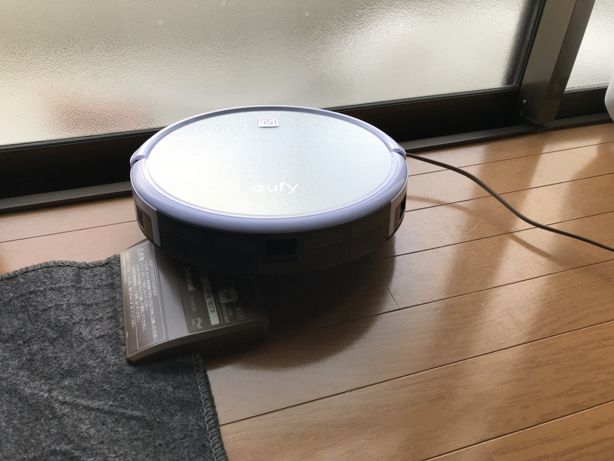

<a href="http://www.amazon.co.jp/exec/obidos/ASIN/B01M3PV96T/bestylesnet-22/">eufy RoboVac 11 (ロボット掃除機)【静音&強力吸引 / 3つの清掃モード / 自動充電 / リモコン & 充電ステーション付属】（ホワイト）</a>
<ul><li>出版社/メーカー: Anker</li><li>メディア: </li><li><a href="http://d.hatena.ne.jp/asin/B01M3PV96T/bestylesnet-22" target="_blank">この商品を含むブログを見る</a></li></ul>

Amazon のサイバーマンデーセールは最初あまり興味なかったのだけど、一度覗くとなんやかんやとほしくなってしまうもので。いつの間にかいろいろ買い込んでしまった。そのなかでもロボット掃除機は結構アタリだったと思う。

<h3>ロボット掃除機は便利！</h3>

ロボット掃除機というとルンバが有名だけど、ウチが買ったのはスマホのバッテリーなんかで知られる Anker のヤツ。基本的な機能しかないみたいだけど、最初だしこれで十分かなって思う。お値段はセールで15,000円（現在の価格は22,000円ぐらい）。

さっそく開梱してブラシなどを装着、バッテリーの充電もせずにスイッチを入れてみたけど……結構きれいになる――まぁ、元が汚かったというのも大きいけど、リビングや仕事部屋、廊下がすっきり、チリ一つない状態になるのはちょっと感動的でもある。

心配していた音は結構静かで、自分がもともと集中してしまえばあまり騒音が気にならなくなる性質なのもあるけど、仕事中に稼働させておいてもそんなに気にならなかった。ウチのダイソンのの掃除機の半分以下って感じかなぁ……ただ、敷居をまたぐとき（ゴトゴトッ！）や、仕事机・椅子に突進してくるとき（ゴツッゴツッ）はちょっとウザい。

メンテナンス性もいい。フィルターやらの交換にも工具はいらないみたい。ねじで止めてある四角いフタが気になって開けてみたけど、そこはバッテリーだった。つまり、バッテリーもねじ二本外すだけで交換できるわけだな。使い捨て感覚で3年も持てば十分かと思ってたけど、バッテリーがへたっても簡単に変えられるなら長くお付き合いできそう。

<h3>ロボット掃除機はドジっ子かわいい！</h3>

あと、これは実際に使ってみるまでわかんなかったんだけど、ロボット掃除機って結構かわいい。

たとえば、リビングで動かしながらキッチンで昼飯の準備を始めたんだけど、気づくと掃除機がいない。気を利かした……わけではないんだけど、どうやら飯の準備にならないように廊下の掃除にでかけていたらしい。かわいい。

人間、不思議なもので、一度そういう目でみちゃうと、どうでもいいことがなんでも可愛く見えてきてしまうんだな。

何度も同じところ掃除してんのが、アホかわいい。

軽い絨毯を巻き込んで遭難してんのが、ドジっ子かわいい。

電源コードに絡まってにっちもさっちもいかなくなっているのも、クソかわいい。

いや、普通にアホなだけなんだけど、アホなりに頑張ってる感じが健気で、むしろこっちが申し訳なくなってくる。 
「気づいてあげられなくてごめんな（ぎゅっ」 
「事前に片づけておけばよかったな、すまん（しゅん」 
「この部屋は掃除せんでええから、戸を閉めとくで（にっこり」 
みたいな。アラフォーにもなってキモいが……。

うちの家の場合、電源コードをちゃんとまとめていないのと、電気カーペットの絨毯が軽すぎるのと、玄関マットの毛が長すぎるのがダメみたい。とりあえずは撤去したけど、恒久的な対策も考えないといけない。

なんかこのこのためにいろいろ部屋を片付ける羽目になって今日は疲れたけど、すごく達成感がある。部屋もきれいになったし、買ってよかった。

