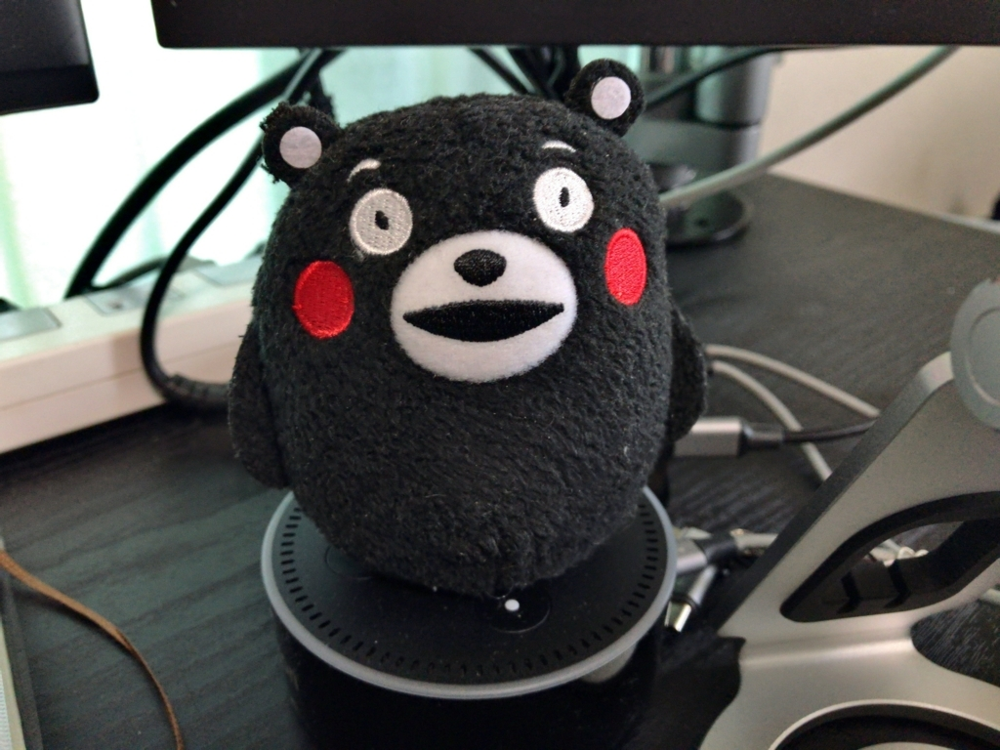
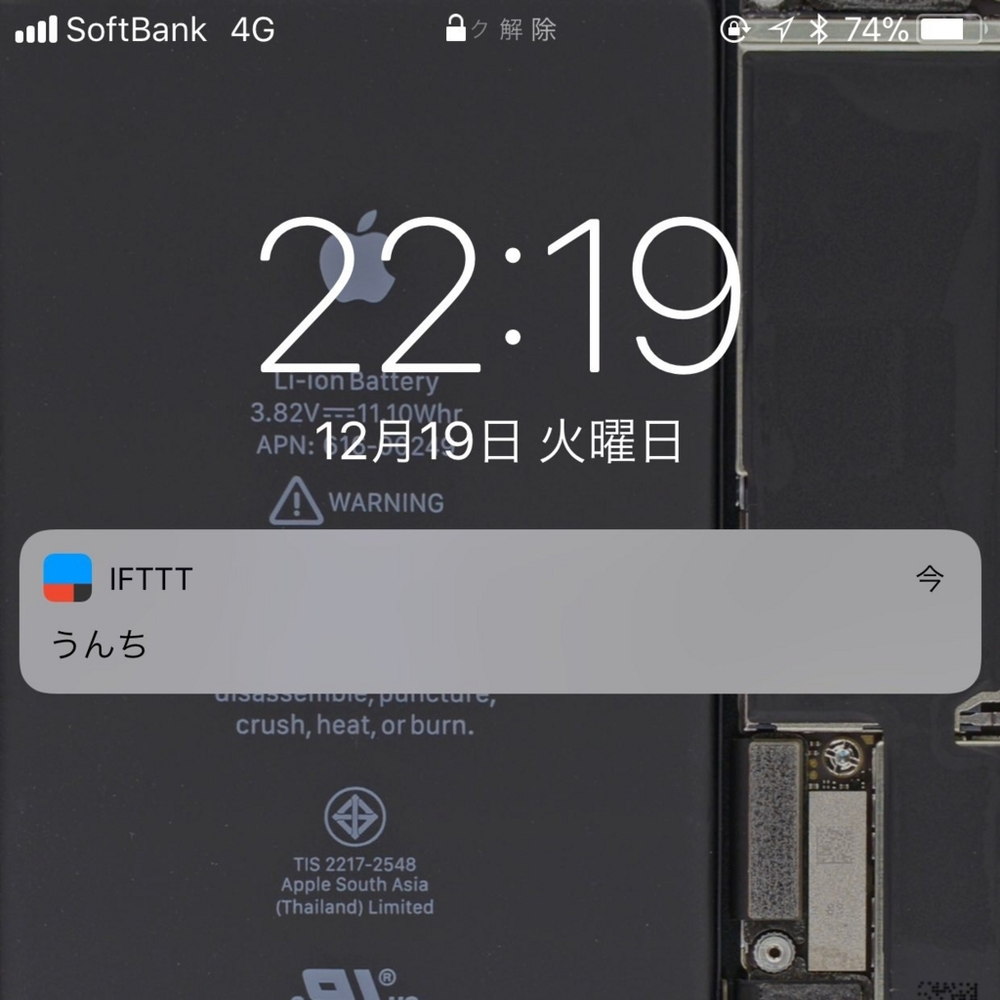
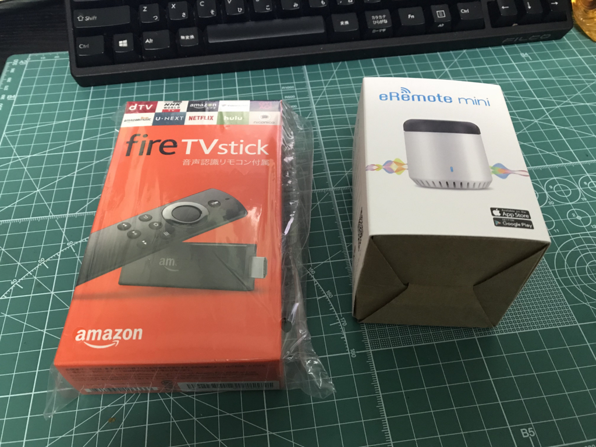

先日、スマートスピーカー「Amazon Echo Dot」の抽選が当たったので早速購入。2週間ほど使ってみた。

<a href="http://www.amazon.co.jp/exec/obidos/ASIN/B072B5BTLK/bestylesnet-22/">Amazon Echo Dot (Newモデル)、ブラック</a>
<ul><li>出版社/メーカー: Amazon</li><li>発売日: 2017/11/15</li><li>メディア: エレクトロニクス</li><li><a href="http://d.hatena.ne.jp/asin/B072B5BTLK/bestylesnet-22" target="_blank">この商品を含むブログ (2件) を見る</a></li></ul>

お値段は約 6,000 円との由。大人のおもちゃとしては高くないけど、現状、それほど有用なものではないので微妙な価格帯ではある。

<h3>セットアップ</h3>

忘れたけど、たいして難しくはなかったと思う。電源入れて、iPhone に専用アプリを入れて、ごにょごにょするだけ。

<h3>最初の1週間</h3>

とりあえず、「アレクサ、ニュース」と呼び掛けてニュースをしゃべらせてみた（"アレクサ"という呼びかけはスマホアプリでカスタマイズすることもできる。好きな名前を付けることはできないみたいだけど）。初期設定では NHK ニュースを流す仕組みになっているみたい。合成音声ではなく、ちゃんとしたアナウンサーの録音になっているので、ラジオのニュースを聞いてる感覚。ニュースの最後に近所の天気を教えてくれるが、これは合成音声。品質は「Siri」などと変わらない印象を受けた。

これだけではあまり面白くないので、「Impress Watch」の“スキル”を有効化して IT 系のニュースも流すようにしてみた。これも合成音声になるが、文章が長くなると抑揚のない合成音声では聞きづらく感じる。固有名詞を読み間違えたりといったミスもしばしばで、数日後にはオフにして NHK ニュースだけを聞くようになってしまった。

次に起床のアラームを Amazon Echo Dot に任せてみた。「アレクサ、8時に起こして」「はい、8時ですね。午前ですか、午後ですか」。最初は楽しかったけれど、毎回「午前ですか、午後ですか」と聞いてくるのがだんだんウザくなってきたので、これも結局 Siri に任せることにした。

あとは Radiko を流したり、音楽をかけたりしてみたけれど、自分にはあまりわないようで、結局使わなくなった。音声注文もイマイチ。音声だけのやり取りでは注文するのが不安だし、そもそも Amazon Prime に商品がないなどの理由で発送まで行えなかったりする。いつも買ってるお茶ぐらい音声だけで注文できたらいいのだけど、買ったことのない商品が提示される。これでは使う気になれない。

結局、ときどきキッチンタイマーの代わりに使う程度で、それすら Siri に任せることが少なくない。Alexa は IFTTT にも対応しているので「アレクサ、うんちをトリガー！」で iPhone に「うんち」とプッシュされるようにしてみたりもしたけど、面白いのは最初の数回だけ。熱狂が去ると、絵も言えぬむなしさだけがそこに残る。

それでも「アレクサ、買い物リストに***を登録」で Wunderlist のタスクに登録できるようにしてみたりしてなんとか活用しようと試みたが、結局この手のことは Siri にでもできるわけで、だんだん Alexa を呼ぶ機会が減っていった。

<h3>テコ入れ</h3>

このままではせっかくの Amazon Echo Dot  が無駄になってしまう――というわけで、Fire TV Stick と eRemote mini（スマホで各種家電を操作できるようにするデバイス）を買ってみた。

<a href="http://www.amazon.co.jp/exec/obidos/ASIN/B01ETRGGYI/bestylesnet-22/">Fire TV Stick (New モデル)</a>
<ul><li>出版社/メーカー: Amazon</li><li>発売日: 2017/04/06</li><li>メディア: エレクトロニクス</li><li><a href="http://d.hatena.ne.jp/asin/B01ETRGGYI/bestylesnet-22" target="_blank">この商品を含むブログ (11件) を見る</a></li></ul>

<a href="http://www.amazon.co.jp/exec/obidos/ASIN/B01MA4W1YD/bestylesnet-22/">LinkJapan eRemote mini IoTリモコン 家でも外からでもいつでもスマホで自宅の家電を操作 【AmazonAlexa対応製品】 MINI</a>
<ul><li>出版社/メーカー: LinkJapan</li><li>メディア: エレクトロニクス</li><li><a href="http://d.hatena.ne.jp/asin/B01MA4W1YD/bestylesnet-22" target="_blank">この商品を含むブログを見る</a></li></ul>

結論から言うと、Fire TV Stick はまだ Echo には対応していないようでムダ金となった（まぁ、そのうち対応しそうなのでのんびり待つとしよう）。一方、eRemote mini は今年のベストバイにしてもいいと思った。今のところは照明だけだけど、「アレクサ、照明を消して」で灯りを消してくれる。うちの照明は LED で、リモコンで操作する。けれど、眠気がきたときにリモコンを探して……というのはかなり面倒。これは音声で操作できるにしくはないと感じる。

eRemote mini は Alexa 対応以外の部分がすばらしかったので、詳しくはまたの機会に。

<h3>個人的な結論</h3>

Echo は部屋に据え置きなので、「部屋を便利にする」ために使うのがいい気がする。それ以外はスマホの音声アシスタントの方が使い勝手がいい（単純な機能的な優劣ではなく、個人的な慣れと環境の熟成度の問題かな？）。「部屋を便利にする」にはスマートホーム的なアプローチが一番しっくりくる。今のところ照明の ON/OFF ぐらいしかできてないけれど、それで Alexa を使うことが習慣化してしまえば、ほかのことも Alexa で済ませてしまいたくなる。自分は今このフェイズで、最初の一週間より格段に Echo の利用頻度が向上した。

なるほど、なにするにしてもキッカケというものが大事らしい。

