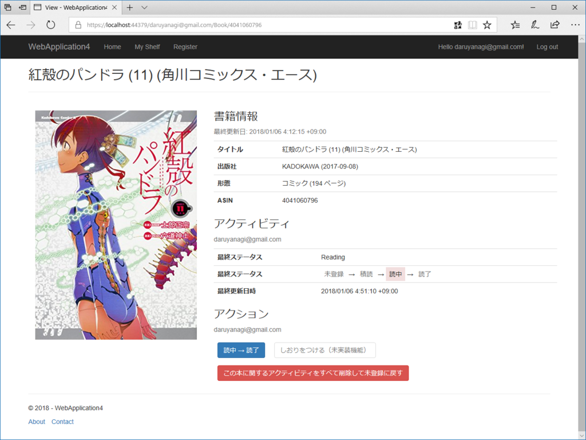
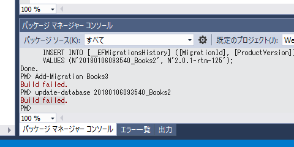
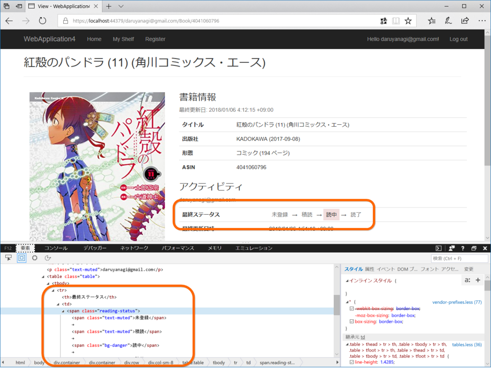

お正月は ASP.NET Core MVC で読書管理アプリを作って遊んでいた。最初は Razor Page で作っていたのだけど、CRUD 処理やるんだったら MVC の方がスキャフォールド使えて楽かなーと。

<h3>Entity Framework Core</h3>

モデルは Entity Framework Core の Code First で作ったけど、相変わらず簡単だった。基本的には

<ul>
<li>モデルクラスを作り、</li>
<li>Add-Migration {Migration Name} して、（なぜか NuGet パッケージコンソールで！）</li>
<li>Update-Database する</li>
</ul>
だけで、モデルクラス通りにデータベーススキーマを作ってくれる。はるか昔、Rails 2.0 を触ってた時に rake db:migrate とかやってた気がするけど、あの時代からあまり変わってない感じがする。

けれど、ちょっと困ったのがコレ。モデルクラスを変更したときにたまに Build failed. と言われて詰まってしまう。カラムを消したときとかによくなるんだけど、どうやって解消すればいいのかな。エラーメッセージがシンプル過ぎて、とっかかりがない感じがつらい。

おかげで、エラーで詰まるたびに新規プロジェクトを作る感じで、ちょっとげんなりしてる。まぁ、趣味で遊んでるだけなのでそれでもいいんだけど……Include() の使い方とかはネットをうろうろしてるうちに身につけられたけど、ちゃんと Entity Framework Core の本を一冊（日本語で）読んで系統だって理解したいなって思った。

<h3>Tag Helper</h3>

enum で表したデータをそのまま表示すると味気ない（上の表示）ので、少しリッチにしたい（下の表示）のだけど、Razor でごてごて分岐を書くのは面倒だし管理が大変だ。

そこで今回は Tag Helper というのを使ってみた。これが超便利……。たとえば、こんな感じに

<pre class="code lang-html" data-lang="html" data-unlink>&lt;reading-status&gt;@Mode.Status&lt;/reading-status&gt;
</pre>
独自定義したタグを、

<pre class="code lang-html" data-lang="html" data-unlink>&lt;span class=&quot;reading-status&quot;&gt;{日本語表記}&lt;/span&gt;
</pre>
みたいに展開できる（スクリーンショットの部分は、もともと <reading-status>@Mode.Status</reading-status> という簡素な記述だった）。Web Components みたいなのをサーバーサイドで処理できるイメージかな？

公式ドキュメントに &lt;email&gt; を &lt;a&gt; に書き換えるサンプルがあるので、それを見ながら作るといい感じ。

<iframe src="https://hatenablog-parts.com/embed?url=https%3A%2F%2Fdocs.microsoft.com%2Fja-jp%2Faspnet%2Fcore%2Fmvc%2Fviews%2Ftag-helpers%2Fintro" title="ASP.NET Core のタグ ヘルパー" class="embed-card embed-webcard" scrolling="no" frameborder="0" style="display: block; width: 100%; height: 155px; max-width: 500px; margin: 10px 0px;"></iframe><cite class="hatena-citation"><a href="https://docs.microsoft.com/ja-jp/aspnet/core/mvc/views/tag-helpers/intro">docs.microsoft.com</a></cite>

ただ、独自定義したタグを閉じて書く（&lt;foo /&gt;）と、SetContent() でタグの中身を設定できなくてちょっとハマった。開いて書く（&lt;foo&gt;&lt;/foo&gt;）と期待通りに動く。

<h3>Tag Helper と Select</h3>

あと Tag Helper 関連で――enum を含むデータをスキャフォールドすると slect タグが出力されるんだけど、そのアイテムが空なので少し困った。

これは Html.GetEnumSelectList<***>()" で解決できる。

<pre class="code lang-html" data-lang="html" data-unlink>&lt;select asp-for=&quot;***&quot; asp-items=&quot;Html.GetEnumSelectList&lt;***&gt;()&quot;&gt;&lt;/select&gt;
</pre>
まぁ、このアプリは完成しないと思うけど、たまに目標決めていろいろ組んでみるのは楽しい。楽しみでやっているから、バックエンドを作るのが面倒になったらインターフェイスを、インターフェイスで不都合が出たらバックエンドを、みたいな感じでちょろちょろ齧って、最終的には訳が分からなくなって、また最初から作り直す――というのを繰り返しているだけだから、たいして技術力はつかないんだけどね。“楽しくないこと（≒めんどうくさいこと、むずかしくてわかんないこと）”を乗り越えていかないから、その下でウロウロしてるだけ。お仕事でやる人と趣味でやる人の差って、こういうのでつくんだろうな。趣味は趣味でも、謎のモチベーションで困難を乗り越えてしまうタイプも、前者に属するんだろうと思う。ウチは下手の横好きなので、底辺でちょろちょろして遊んでるだけだけど、すごい人の言うことがなんとなくわかるレベルは保っていきたい。

