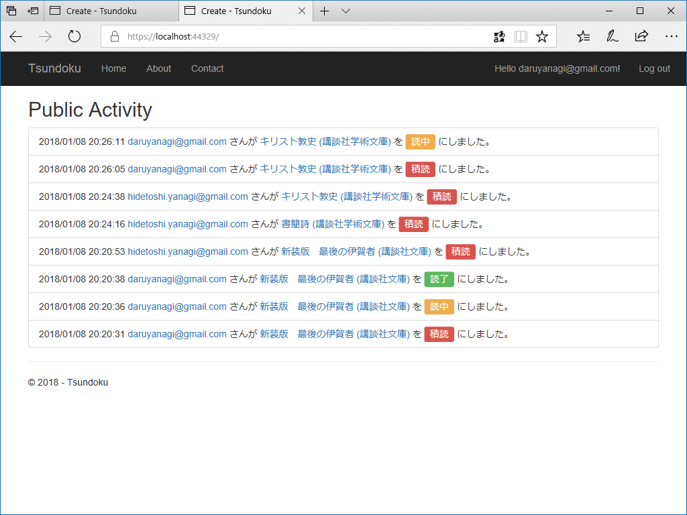
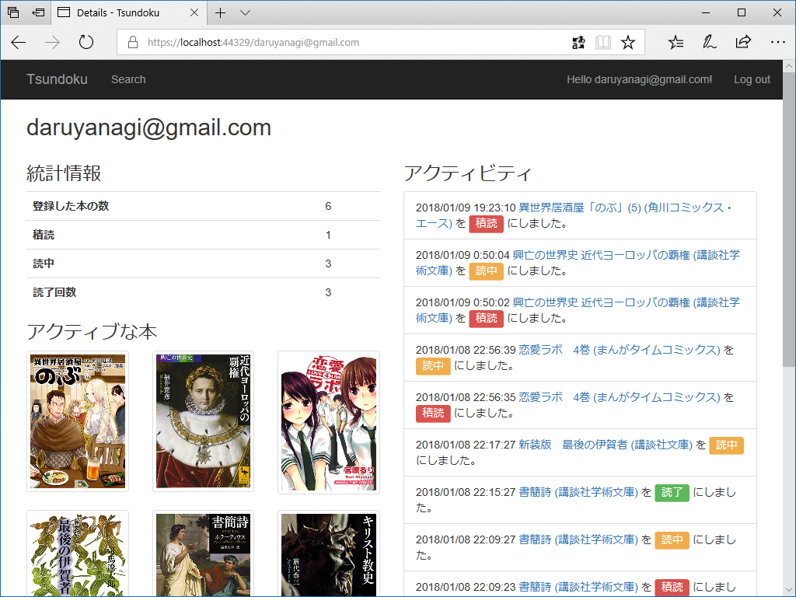

狂風、窓を叩き、昼間っから近所のババアがマンションのベランダから向かいのサンドウィッチ屋さんをヒステリックにディスるカオスな日だった。どんな事情があるのかは知らんが、サンドイッチ屋のおばさんはオマケにパンの耳を恵んでくれる天使だ。大方、猿叫喧しいババアが精神でも病んでるんだろう。お節介かもしれんが、これが続くなら警察でも呼ぼうかと思った。

関係ないけど、ワサビ入りサンドイッチ食べたくなったので、明日のお昼はサンドイッチを買いに行こうかと思う。

Web アプリケーション（仮称：Tsundoku。ヘボン式だとこの綴りでいいのだけど、個人的には Tshu<b>m</b>doku の方がしっくりくる？）の方は、パブリックタイムライン、書籍の検索画面、書籍の個別ページ、ユーザーページが完成した。

パブリックタイムライン。画面はこれだけあるけど、データベースのテーブルは（ユーザー管理と書籍情報のキャッシュ代わりに使っているテーブルを除けば）ユーザーアクティビティを管理するのが1つあるだけで、これは単にそれを引っ張ってきてる。Entity Framework のリレーションシップ回りも慣れてきて、Include()、IncludeThen() が使えるようになってきた。

書籍の検索画面。ちなみに Amazon 関連は Nager.AmazonProductAdvertising というのを使わせてもらっている。

<iframe src="https://hatenablog-parts.com/embed?url=https%3A%2F%2Fgithub.com%2Ftinohager%2FNager.AmazonProductAdvertising" title="tinohager/Nager.AmazonProductAdvertising" class="embed-card embed-webcard" scrolling="no" frameborder="0" style="display: block; width: 100%; height: 155px; max-width: 500px; margin: 10px 0px;"></iframe><cite class="hatena-citation"><a href="https://github.com/tinohager/Nager.AmazonProductAdvertising">github.com</a></cite> 

<pre class="code lang-cs" data-lang="cs" data-unlink>var authentication = new AmazonAuthentication();
authentication.AccessKey = &quot;accesskey&quot;;
authentication.SecretKey = &quot;secretkey&quot;;

var wrapper = new AmazonWrapper(authentication, AmazonEndpoint.US, &quot;nager-20&quot;);
var result = wrapper.Lookup(&quot;B00BYPW00I&quot;);
</pre>
あまり自由度はないけれど、シンプルですごくいいと思った。Amazon アソシエイトのキーも久しぶりにもらったけど、UI がシンプルになってて昔よりハードルがだいぶ下がってる感じがある。

書籍の個別画面。書籍情報と本に紐づいたアクティビティをタイムラインで表示。

読書ステータスの更新もここから可能で、積読 → 読中 → 読了（→ 再読）のサイクルをボタンでぷちぷち変更できる。コメントをつけたり、進捗管理もできるようにするつもり。

ユーザーページ。Twitter みたいにフォローできるようにするつもり。フォロー・フォロワーの表現だけならいいけど、フォロワーのタイムラインとか作るの割と大変そうな感じする？

このアプリは作って遊んでるだけで公開するかどうか微妙だけど、どうにも開発が楽しくなってきちゃって（なんかやっとこさ掌の上でくるくるできる感覚になってきたわけですよ！）、当分は止まらないかなって感じある。

<h3>ToDo</h3>

<ul>
<li>MVC と Razor Page の混在についてちょっと調べる。謎のルーティングエラーで30分無駄にされた</li>
<li>IEnumerable<string> を string にするスマートな拡張メソッドを作りたいけど名前が決まらん件について</li>
<li>enum の拡張メソッドをはやしておくとビューがスマートになるなぁ</li>
</ul>

