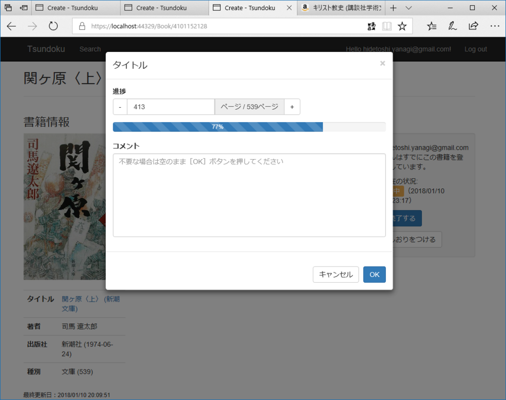

夜中に目を覚ました。「アレクサ、照明をつけて」と闇に呼び掛けた。アレクサが答えた。<i>「インターネットに接続できません。アレクサアプリのヘルプをご確認ください」</i>ここ最近、Amazon Echo Dot と eRemote に頼りっきりで、照明のリモコンなど戸棚の奥にしまってしまっている。せめてメガネがあれば夜目も効くのだが、灯りがないとメガネを探すことすらできない。メガネは灯りを求め、灯りはメガネを求め……その堂々巡りの中、尿意だけが果てしなく高まっていく。インターネットはインフラだな、と実感させられた。

まぁ、それはともかく。

昨日はなぜかルーターの調子が悪く、2.4GHz 帯が使えなかった。パソコンのネットは 5GHz 帯でつなげばいいのでなんら問題ないし、むしろそっちの方が輻輳がなく快適なのだと思うけれど、eRemote――説明し忘れていたが、こいつはネットワークに接続できる学習リモコンのようなもので、Amazon Eco Dot（アレクサ）につないで音声で家電をコントロールできる――が 2.4GHz 帯にしか対応していない関係で、2.4GHz 帯をメインに使っていたのだ。おかげで無線でつないでいたプリンターも応答してくれなくなるし……昼過ぎからはなぜか問題が解消されたけど<a href="#f-8865eafb" name="fn-8865eafb" title="俺の脳みそから強い電波が出ていて干渉したのかもしれんな">*1</a>、いろいろ踏んだり蹴ったりだった。

<a href="http://www.amazon.co.jp/exec/obidos/ASIN/B01MA4W1YD/bestylesnet-22/">LinkJapan eRemote mini IoTリモコン 家でも外からでもいつでもスマホで自宅の家電を操作 【AmazonAlexa対応製品】 MINI</a>
<ul><li>出版社/メーカー: LinkJapan</li><li>メディア: エレクトロニクス</li><li><a href="http://d.hatena.ne.jp/asin/B01MA4W1YD/bestylesnet-22" target="_blank">この商品を含むブログ (1件) を見る</a></li></ul>

でも、このことが逆に Amazon Echo Dot＋eRemote の最強っぷりを改めて証明してくれたと思う。お布団でぬくぬくしたまま<i>「アレクサ、エアコンつけて」</i><i>「アレクサ、10分後に教えて（← 部屋が温まるまで二度寝）」</i><i>「アレクサ、照明つけて」</i>ができるの、ほんまサイコー<a href="#f-66dd4203" name="fn-66dd4203" title="eRemote を使ったアレクサコントロールは今のところ照明にしか対応していないが、エアコンやテレビを“照明”として登録すれば ON/OFF 程度は可能">*2</a>。<i>「スマートスピーカー？　どうせすぐ飽きるだろ」</i>と思っていたのに、この1カ月ですっかり信者になってしまったよ。

eRemote は 5GHz 対応の後継機種が出たら買い足してもいい。仕事部屋だけでなく、リビングにも置いてやる。

ほんとは iPad の修理に出かけたり、サンドイッチ買ったり、温泉や飲みにも出かけたかったけど、軽く雨が降っていたので引きこもり。アプリの開発は、読書の進捗メモ（のユーザーインターフェイスだけ）が実装できた。JavaScript は苦手＆久しぶりでサッパリだったけど、Bootstrap の Modal Dialog を組み込んだり、input の値に応じて Bootstrap の Progress を操作できるようにしてみたり……数値のアップダウンコントロールは Touch Spin というサードパーティ製コンポーネントが使いやすそうで、これも組み込んでみた。

<iframe src="https://hatenablog-parts.com/embed?url=https%3A%2F%2Fwww.virtuosoft.eu%2Fcode%2Fbootstrap-touchspin%2F" title="Bootstrap TouchSpin" class="embed-card embed-webcard" scrolling="no" frameborder="0" style="display: block; width: 100%; height: 155px; max-width: 500px; margin: 10px 0px;"></iframe><cite class="hatena-citation"><a href="https://www.virtuosoft.eu/code/bootstrap-touchspin/">www.virtuosoft.eu</a></cite>

ちなみに、ASP.NET Core MVC/Razor Page でちょっとしたスクリプトを組み込みたい場合は、Scripts セクションに書いてしまえばいいと思う。ここだったら jQuery のロードが終わってるはずなので。というか、他のところに書いてたら jQuery が全然動かなくて……はじめは仕方なくバニラで書いてた。Touch Spin を組み込んだら開発者ツールのコンソールに「jQuery が未定義」みたいなエラーが出てきて、はじめて jQuery がロードされていないことに気づいた。

<pre class="code lang-javascript" data-lang="javascript" data-unlink>@section Scripts {
@{
await Html.RenderPartialAsync(&quot;_ValidationScriptsPartial&quot;);
}

&lt;script src=&quot;~/lib/jquery.bootstrap-touchspin.js&quot;&gt;&lt;/script&gt;
&lt;script&gt;
$(document).ready(function () {
$(&quot;#current-page&quot;).TouchSpin({
min: 0,
max: @Model.Book.NumberOfPages,
stepinterval: 1,
postfix: 'ページ / ' + @Model.Book.NumberOfPages + 'ページ',
});

var updateProgressBar = function () {
var cur = $(this).val();
var all = @Model.Book.NumberOfPages;
var progress = Math.round((cur / all) * 100) + &quot;%&quot;;
$(&quot;#reaging-progress&quot;).css(&quot;width&quot;, progress);
$(&quot;#reaging-progress&quot;).text(progress);
};

$(&quot;#current-page&quot;).keyup(updateProgressBar);
$(&quot;#current-page&quot;).change(updateProgressBar);
});
&lt;/script&gt;
}
</pre>
Razor と混在して書いても問題なかったから、モデルデータもぶち込める。

<a href="#fn-8865eafb" name="f-8865eafb" class="footnote-number">*1</a>:俺の脳みそから強い電波が出ていて干渉したのかもしれんな

<a href="#fn-66dd4203" name="f-66dd4203" class="footnote-number">*2</a>:eRemote を使ったアレクサコントロールは今のところ照明にしか対応していないが、エアコンやテレビを“照明”として登録すれば ON/OFF 程度は可能

