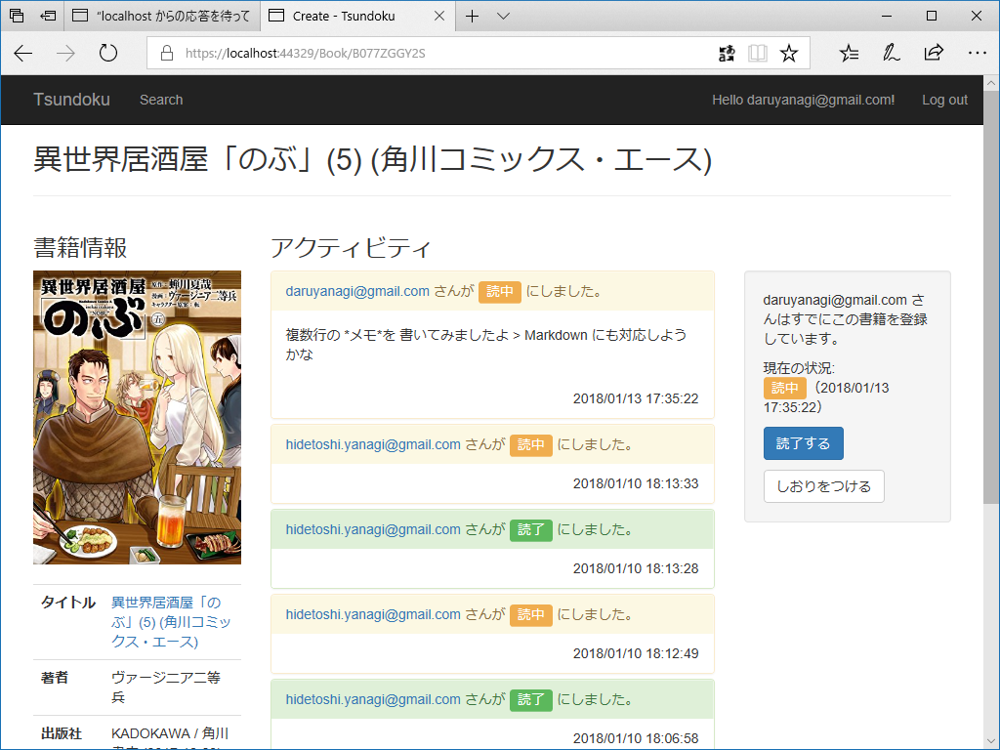

目が覚めたのは明け方だったと思う。今日は何もしないと決めていたので、冷蔵庫からビールを取り出し、ガビガビ飲みながら Civilization 6 で遊んでた……のだけど、そんなに興が乗らない。というわけで、Visual Studio を広げてちょろちょろとコードをいじってた。こっちもあまりやる気がないので、今日はビューコンポーネントの再利用にでも取り組もうかと、TagHelper を作ってみた。

TagHelper については公式のドキュメントもあるし、@miso_soup3 さんの手引きもあるので、それほど難しくないと思う。

<iframe src="https://hatenablog-parts.com/embed?url=http%3A%2F%2Fmiso-soup3.hateblo.jp%2Fentry%2F2015%2F12%2F02%2F231512" title="ASP.NET MVC 6 Tag Helper について - miso_soup3 Blog" class="embed-card embed-blogcard" scrolling="no" frameborder="0" style="display: block; width: 100%; height: 190px; max-width: 500px; margin: 10px 0px;"></iframe><cite class="hatena-citation"><a href="http://miso-soup3.hateblo.jp/entry/2015/12/02/231512">miso-soup3.hateblo.jp</a></cite>

ただ、個人的に２、３ハマってしまったのでメモしておこう。

<h3>@addTagHelper で指定するのはアセンブリ名</h3>

TagHelper をビューで利用するには @addTagHelper でロードしておかなくちゃいけないんだけど（_ViewStart.cshtml に書いておくと複数のビューに一括指定できて便利）、ロードの指定は<b>アセンブリ名</b>で行う。自分はなぜかネームスペースだと勘違いしてしまっていて、ちゃんと書いたはずなのに動かねーなー、クソだなーと悩んでしまった。クソなのは僕の頭でした。申し訳ない。

TagHelper がちゃんとロードされるとインテリセンスの補完を受けることができるが（タグが太字にもなる）、プロジェクトをリビルドしないと反映されないかもしれない。

なお、TagHelper の読み込みは @addTagHelper *, Tsundoku でも @addTagHelper "*, Tsundoku" でもよいみたい。知らんけど。

<h3>HTML タグを SetContent() するとサニタイズされる → SetHtmlContent() を使う</h3>

タグの中身は SetContent() で書き換えるのが基本だけど、HTML タグはエスケープされる。エスケープなしでコンテンツにセットしたい場合は、SetHtmlContent() で「HTML だよ！」と明示すればおっけ。このあたりは string と HtmlString の関係に似ているかもしれない。

<h3>書き換え対象のタグは &lt;hoge /&gt; にしない、Attributes.Clear() は要らないかも</h3>

&lt;hoge /&gt; って書いたタグを TabHelper でいじると、いろいろ謎なことが起こるっぽい。ちゃんと開いて書いといたほうが無難。この前もこれでハマったのにまたやらかすとはな。

あと、Attributes はわざわざクリアしなくてもいいっぽい？　Clear() をコメントアウトしてもへんな属性は出力されなかった。変なタイミングでクリアしちゃうと属性ベースで受け渡しされた情報にアクセスできなくなることがあるみたいなので、要らないことはしない方がいいかもね。

これで無事、アクティブティパネル（読書進捗のタイムラインのアイテム）のデザインを共通化することができてスッキリ。

でも、TagHelper にするとデバッグ時にコードがいじれなくなるのはちょっと面倒だね。ビューなら変更が効くのに……あらかじめビューでいろいろ試して、デザインが固まったら TagHelper にまとめるって感じにした方がいいかも。

<h3>インターネットが切れる</h3>

Visual Studio でちょっと遊んだ後、布団でゴロゴロしているとそのまま爆睡してしまった……たぶん6時間ぐらい、本格的に。再び目を覚ましたのは夕方前だった。クロネコヤマトの配達指定を2時にしていたのに、ビデオを垂れ流しにしていた iPhone の電池が切れていて、アラームが鳴らず……再配達させてしまって、すごく申し訳ないことをした。

それはそうと、布団からのそのそ這い出て Surface Bool 2 の電源を入れると、またインターネットがダウンしていた。今週2回目でいい加減うっとうしいので Wi-Fi Analyzer で電波状況をチェックしてみると……

DIRECT-D*** という SSID がモロかぶりしている。ググってみると Direct Wi-Fi 関連のものらしいのだけど……隣近所で電波ビンビンしてんのかな。

しょうがないので、自分とこの Wi-Fi の設定をいじって、チャンネルを少しずらした。接続の不具合も解消されて、いい気分。スマートネットワークリモコン eRemote mini が 5GHz 対応になってくれたら、混線で悩んだりせずに済むのにな。

ちなみに、今回使った Wi-Fi Analyzer は Windows ストア アプリで、今はほぼ実質死んでいる Windows 10 Mobile でも使える優れもの。アプリ内課金はあるけど、基本無料だしおススメできると思う。

<iframe src="https://hatenablog-parts.com/embed?url=https%3A%2F%2Fforest.watch.impress.co.jp%2Fdocs%2Freview%2F755032.html" title="無線LANの状況をビジュアル表示できる診断ツール「WiFi Analyzer」NOT SUPPORTED" class="embed-card embed-webcard" scrolling="no" frameborder="0" style="display: block; width: 100%; height: 155px; max-width: 500px; margin: 10px 0px;"></iframe><cite class="hatena-citation"><a href="https://forest.watch.impress.co.jp/docs/review/755032.html">forest.watch.impress.co.jp</a></cite> 

<h3>晩御飯</h3>

晩御飯は豚バラ肉に下味をつけて衣をつけて、少し多めの油で炒めて食べた。皿洗いが面倒なのでワンプレートにご飯と一緒に盛り付けてもしゃもしゃ。

それでちょっと思ったんだが、独身ってのはほんとうにダメだな。なにがダメかっていうと、徹頭徹尾自分のためだけに暮らしているという部分がダメ。

所詮、自分のためだけにやることなんかたかが知れている。誰かのためだからこそ、面倒くささを乗り越えて何かをするわけだ。独身のおっさんにはそういうところがないからダメ。結婚して家庭を築いている人は大なり小なり他人の世話を焼いているわけで、その積み重ねが……人格の重みとか、安定感とか……よくわからんけど、そういうものになるんだろう。自分にはそういうものがカケラもないから、うらやましいっちゃ、うらやましい。

とにかく。

独身の耐えられない軽さっていうのを、晩飯のワンプレートで実感させられた。だいたい、日の出前からビール飲んで、ぶっ倒れて二度寝で目が覚めたら夕方ってあり得ないし――今日は日記を書かないつもりだったけど、懺悔の意味も込めてちゃんと書いた。

<h3>追伸</h3>

Amazon で買ったビールがちょっと安くてうれしかった。箱根駅伝記念バージョンみたいだけど、時期を外すと安くなるんだな。東京ローカルな駅伝なんぞに興味はないんだけど、こういう余福があるなら悪くはない。

だるやなぎも時期を外しているので、かなりお安くしておきます。誰か、引き取ってください。

