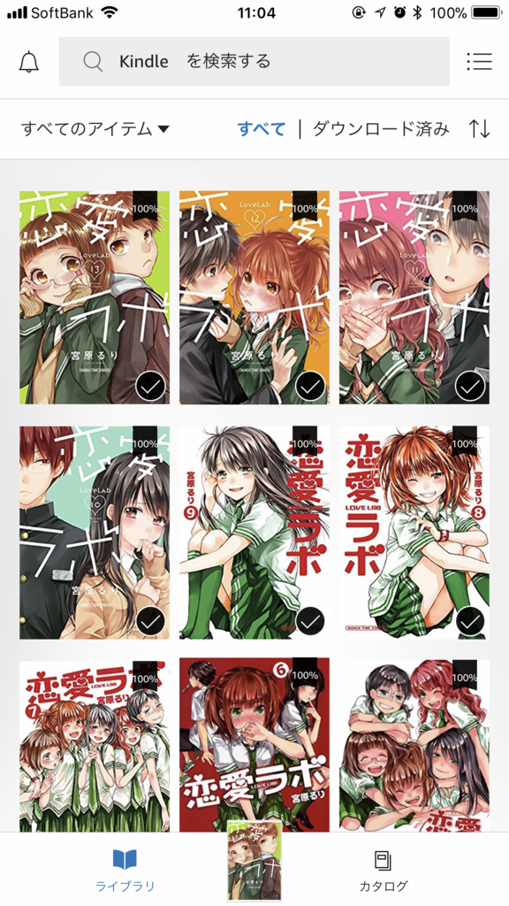
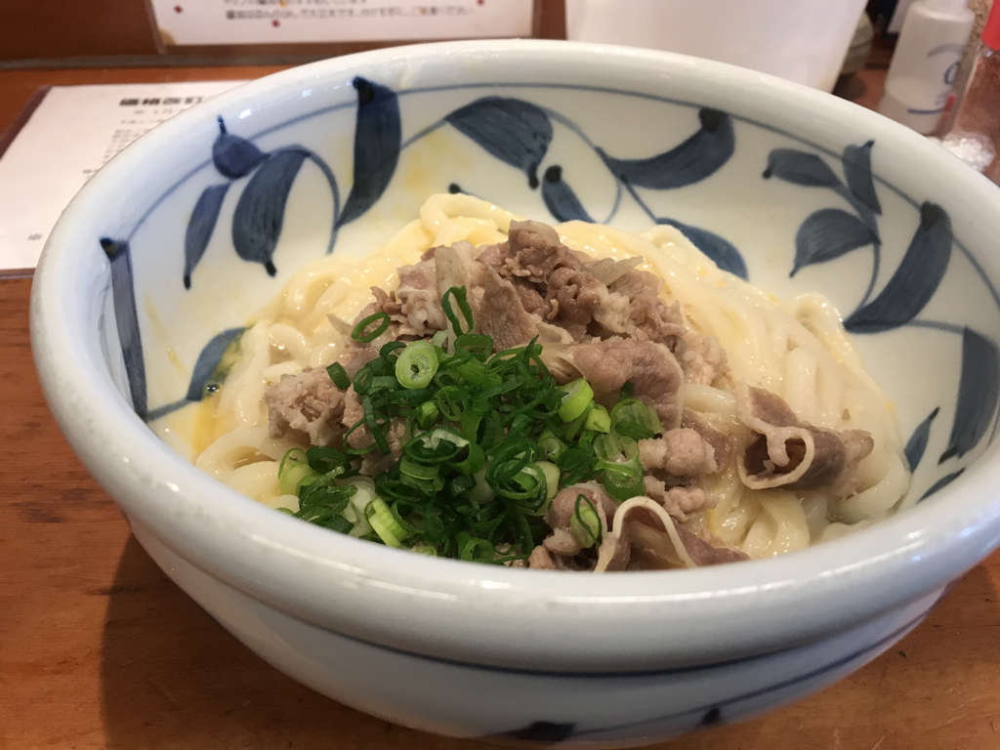
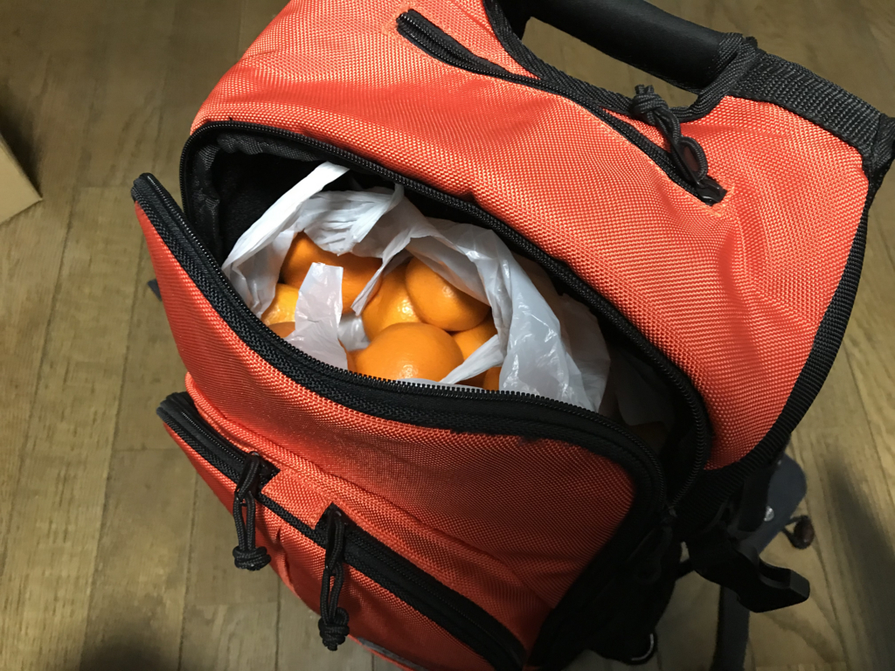
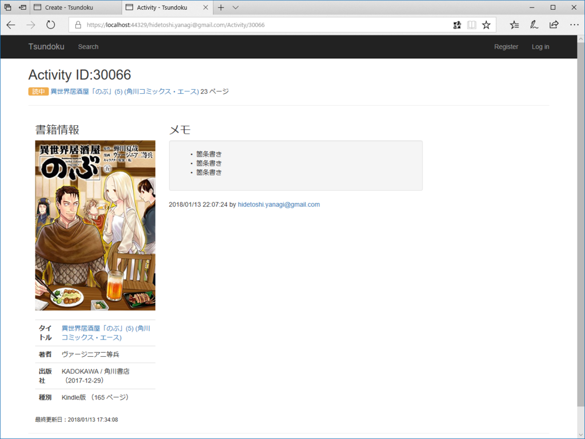

 

昨日の夜は眠れなかったので、ASP.NET Core アプリを作ってるときに戯れに登録した『恋愛ラボ』をまとめ買い（たぶん7,000円）して、朝までずっと読んでた。お正月に『僕らはみんな河合荘』もまとめ買いしたので、今月は15,000円もマンガに使ったことになる。しかも、すべてラブコメに――神よ、この哀れな萌えブタを許したまえ。いつもは今まで買ってたマンガの続巻を買う程度だったのに、最近はなんかやたらまとめ買いをしているような気がする。

でもな。おっさんな、もういろいろしんどくてな、かわいい女の子が仲良くしてるマンガでも読まんかったら、この先一秒たりとも生きていけんのや。

<a href="http://www.amazon.co.jp/exec/obidos/ASIN/B072DX76TX/bestylesnet-22/">僕らはみんな河合荘(9) (ヤングキングコミックス)</a>
<ul><li>作者: 宮原るり</li><li>出版社/メーカー: 少年画報社</li><li>発売日: 2017/04/28</li><li>メディア: Kindle版</li><li><a href="http://d.hatena.ne.jp/asin/B072DX76TX/bestylesnet-22" target="_blank">この商品を含むブログ (3件) を見る</a></li></ul>

ちなみに『僕らはみんな河合荘』は、和風古民家アパート“河合荘”での共同生活を描いたラブコメや。個性的なキャラがドタバタを演じるのがおもろいけど、メインはやっぱり本好きな無表情・不愛想少女とそれを慕う童貞の後輩君との恋物語やな。わいは登場人物の麻弓さんと一緒に「爆発しろ！！」と思いながら読んどるクチやけど、それでいて、こう、不思議と見守りたくなってしまうんやな（そこも麻弓さんと一緒やな）。途中までの話はアニメにもなってて、そっちも……個人的にウサの声があまり好きじゃない（でも、ヘタレ具合っていうか、夢見具合は出てると思う）けど、割とおすすめ。Amazon Prime あたりで観れたんじゃないかな。

お気に入りのキャラクターは元霊感少女・林さん。

<a href="http://www.amazon.co.jp/exec/obidos/ASIN/4832256211/bestylesnet-22/">恋愛ラボ(13) (まんがタイムコミックス)</a>
<ul><li>作者: 宮原るり</li><li>出版社/メーカー: 芳文社</li><li>発売日: 2017/09/07</li><li>メディア: コミック</li><li><a href="http://d.hatena.ne.jp/asin/4832256211/bestylesnet-22" target="_blank">この商品を含むブログ (2件) を見る</a></li></ul>

『恋愛ラボ』は、恋に恋する女子中学生どもを描いた傑作や。生徒会室でガキどもが恋愛妄想して、斜め上の特訓して、いろいろ事件になる……みたいな感じのアレや。ガッチガチに恋愛禁止のお嬢様校のはずやのに、巻を経るにしたがって塾やら他校交流会やら文化祭やらで男女交際がゆるゆるになっていくところが気になるが、それに比例してキュンキュン度もましていくんやで。最新刊ではとうとう色気づきやがって……わいは男子校やったから、羨ましさで血の涙を流しそうや。最初の感はアニメに比べて作画が期待外れだったけど、だんだんうまくなってる感じある。かわいい。

お気に入りのキャラクターは、副会長。

それにしても Activite Pop<a href="#f-8dc3d51d" name="fn-8dc3d51d" title="ヘルスウォッチってやつや。運動や睡眠を記録してくれる。GPS とかスマホ通知とか余計な機能なくて、ボタン電池で半年持つのがいい">*1</a> は優秀やな。マンガ読んでる時間を睡眠時間と誤認してる（5時間15分のヤツがそう）んだけど、一度おしっこで布団を這い出たこともちゃんと記録されている。朝方寝て、少し出かけて、また寝て、合計9時間寝たこともな。これがなかったら、自分のクズっぷりを振り返るチャンスがゼロだったわけで、すごく重宝するわ。なお、振り返ったからといって、生活態度を改めるわけではない模様。

あー、書いてたらだんだんテンションが低まってきたわ。創造主はなぜ俺のような駄作をお造りになったのか。

昼は R さんと約束をしていたので、ちょっと眠いけど頑張って11時に起きた。NHK 将棋をみながら（山ちゃんつえー！）、出かける支度をして、久しぶりにバイクのカバーを取っ払い、エンジンに火を入れた。少し寒めだけど、革ジャンを着ていればそれほどでもない。三津までかっ飛ばして、『踊るうどん』で肉玉ぶっかけうどんを食べて、少し R さんと大将と話をした。

んで、R さんからリュックいっぱいに柑橘類をもらった。S さんからもあずかってるとのことで、すごい大量になった……でも、ありがたい。なんか愛媛の人っぽいイベントを味わった気がする。

――来月で、引っ越してきて4年目を迎えます。

今年はもう振り返り記事は書かないつもり。こっちにいることが普通になったし、あえて書くことも減ってきた。それはそれで大変いいことだと思う。

<h3>開発</h3>

うどん屋さんから帰ってきたあとは、また爆睡して、起きて少しだけアプリ開発もした。今日はあまりやる気がないので、こまごまとしたところだけ。

メモで Markdown 記法を使えるようにしたり……いくつか画面を新設したり。TagHelperSamples っていう NuGet パッケージが緒と便利というか、Tag Helper を便利に使う上での参考になった。

<iframe src="https://hatenablog-parts.com/embed?url=https%3A%2F%2Fgithub.com%2Fdpaquette%2FTagHelperSamples" title="dpaquette/TagHelperSamples" class="embed-card embed-webcard" scrolling="no" frameborder="0" style="display: block; width: 100%; height: 155px; max-width: 500px; margin: 10px 0px;"></iframe><cite class="hatena-citation"><a href="https://github.com/dpaquette/TagHelperSamples">github.com</a></cite>

Bootstrap のごちゃごちゃしたマークアップをスッキリさせるための独自タグを定義したり、&lt;markdown /&gt タグで CommonMark に展開したり……そんな感じ。Tag Helper はだいぶ慣れてきたので、これからもガンガン使いこなしたいと思う。インテリセンスで補完できるのがいいなー。

<a href="#fn-8dc3d51d" name="f-8dc3d51d" class="footnote-number">*1</a>:ヘルスウォッチってやつや。運動や睡眠を記録してくれる。GPS とかスマホ通知とか余計な機能なくて、ボタン電池で半年持つのがいい

