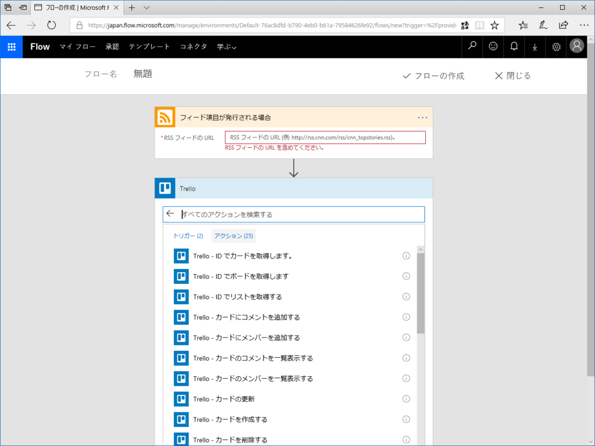
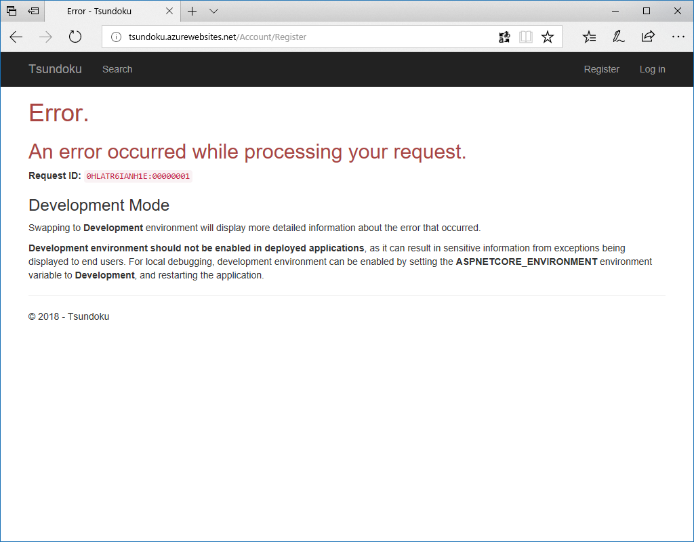
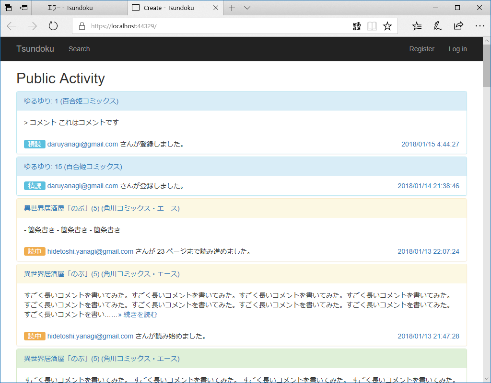
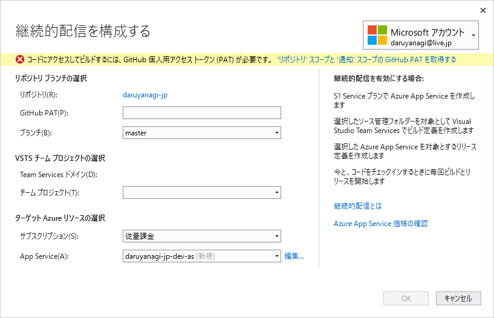
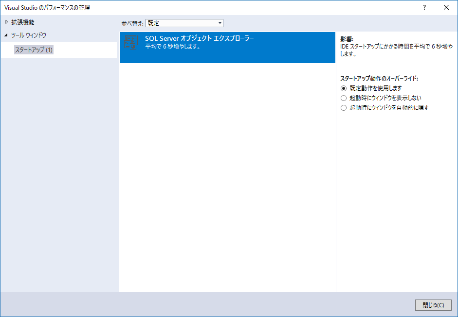
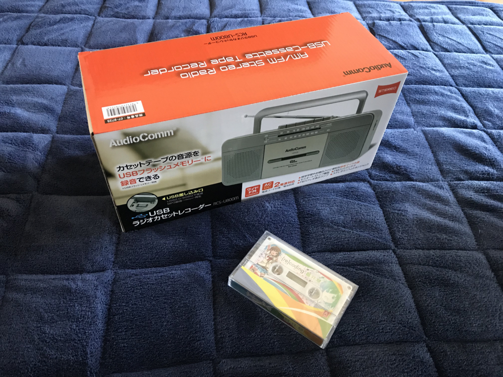

おとんが食いもしない生パスタを大量に購入、冷凍庫にしまったまま出張に出かけて早幾星霜。たいして美味しくないパスタを少しでもおいしく食べる方法はないかと日々悩んでるのですが、この前、Twitter で「キムチ＋ケチャップ＋パスタ」という謎のレシピを見かけたので、適当に作ってみました。とくにレシピをメモったりはしてなかったので、ツイートを目にした時のふわっとしたイメージをベースに作ってみたのですが……まぁ、食えんことはないけど、普通にナポリタン作った方がよかったかもしれない。美味しくないことはないんだけど、味に統一感がないというか、雑多な感じで、B 級としてはなきにしもあらず、な感じでした。ちゃんとレシピ通りに作ったらもう少しカッチリした味になったのかもしれないけど。

<h3>松山～札幌便復活！</h3>

<blockquote cite="http://www.kyt-tv.com/nnn/news8789401.html">

およそ６年半ぶりの運航再開。松山と札幌を結ぶ直行便がアイベックスエアラインズと全日空の共同運航で今年３月から就航することになった。就航が決まったのは松山空港と北海道・新千歳空港を結ぶ直行便で、アイベックスエアラインズが全日空と共同運航する。

<cite><a href="http://www.kyt-tv.com/nnn/news8789401.html">&#xFF13;&#x6708;&#xFF12;&#xFF15;&#x65E5;&#x5C31;&#x822A;&#x958B;&#x59CB; &#x677E;&#x5C71;&#x301C;&#x672D;&#x5E4C;&#x76F4;&#x884C;&#x4FBF;&#x5FA9;&#x6D3B; | NNN&#x30CB;&#x30E5;&#x30FC;&#x30B9;</a></cite>
</blockquote>

2011年11月に運休して以来、およそ6年半ぶりの運航再開なのだそう。今年3月25日から1日1往復が設定されるのだそう。

<ul>
<li>松山発：11:35発、14:30着</li>
<li>千歳発：14:20発、16:45着</li>
</ul>
ちょっと使いにくいかなって思わないでもないですが、一本で行けるのは超便利。札幌で勉強会があるなら、今年は1度ぐらい顔を出してもいいなーって思います。搭乗率75％いかないと、また運休しちゃう＞＜

ちなみに、機材は“ボンバルディア社製の７０人乗りジェット機”。ってことはプレミアクラスとかないんだよな。

<h4>追記</h4>

<blockquote cite="http://www3.nhk.or.jp/matsuyama-news/20180118/0000259.html">

一方、現在、全日空が１日４往復を運航する、松山空港と中部空港を結ぶ路線は、ことし３月２５日から、アイベックスエアラインズとの共同運航を含めて１日３往復に減少することになりました。

<cite><a href="http://www3.nhk.or.jp/matsuyama-news/20180118/0000259.html">&#x677E;&#x5C71;&#x30FC;&#x5343;&#x6B73;&#x7DDA;&#xFF16;&#x5E74;&#x534A;&#x3076;&#x308A;&#x5C31;&#x822A;&#x3078;&#xFF5C;NHK &#x611B;&#x5A9B;&#x306E;&#x30CB;&#x30E5;&#x30FC;&#x30B9;</a></cite>
</blockquote>

<h3>Torello で Flow</h3>

相変わらず睡眠が不規則なので、夜中3時に「Microsoft Flow」で仕事用のワークフローを作ったりしてました。知らなかったんだけど、「Microsoft Flow」って「Torello」が使えるんだね。コネクターを検索しても出てこない（バグ？）から気が付かなかった。

今回やったのは

<ol>
<li>フィードで記事を取得</li>
<li>全文を取得して、謎ロジックで記事をフィルター</li>
<li>新しいフィードを生成（← ここまでを ASP.NET Core で作成）</li>
<li>結果を Torello のカードとして登録して、チームメンバーと共有</li>
</ol>
って感じのことです。Torello の API を調べて自分で実装すれば、すべて ASP.NET Core アプリで完結できるんですけど、正直調べるのが面倒。使えるところだけ「Microsoft Flow」（IFTTT でもいいけど）で使うっていう使い方もありじゃないかな？　って思います。

<h3>GitHub でプライベートリポジトリを作成</h3>

<blockquote class="twitter-tweet" data-lang="ja">
上納することにした <a href="https://t.co/aBshzku5pd">pic.twitter.com/aBshzku5pd</a>
&mdash; 平成という一時代を独身で駆け抜けただるやなぎ (@daruyanagi) <a href="https://twitter.com/daruyanagi/status/953723266081804288?ref_src=twsrc%5Etfw">2018年1月17日</a></blockquote>

API キーを埋め込んだ Web アプリを GitHub で管理すると、どうやってキーの露出を抑えればいいんだろうって悩んじゃいますよね。僕もさんざん悩んだんですが……おカネの力で解決することにしました。

なぜかクレカが通らなかったのだけど、PayPal 経由だと問題なく有償プランにアップデートできました。同じカードなのに、なぜなんだぜ？

これでプライベートレポジトリが作れるようになったので、さっそく daruyanagi.jp のコードと、今開発中の積読管理アプリを GitHub にアップロードしました。

ついでに積読管理アプリを Azure Web サイトにのせてみたのですが――

動かない。ローカルではちゃんと動くのにな。

でも、よく考えたら Update-Database 相当のことを本番環境でやってなかった。データベースもスキーマがないんだから動かないよね。この程度のことに気づかないぐらい頭が回っていなかったので、開発関係のことはこれで手じまいにしました。

できたら、GitHub をつかった継続的配信とかもやってみたい。GitHub PAT ってのは簡単に取得できたけど、Team Services の部分がよくわからんちん。

あと、関係ないけど、起動の足を引っ張ってる原因を Visual Studio が教えてくれるの、すごい賢いなって思いました。そういえば最近起動が遅いっぽい気がするので、お勧めに従っておくことにしましょう。

<h3>ラジカセを買う</h3>

21世紀になってこんなものを買うとは自分でも思わなかったのですが、この前買ったプロ生ちゃん CD の特典であるカセットテープを聞くためだけにラジカセを買いました。

<a href="http://www.amazon.co.jp/exec/obidos/ASIN/B00SAZ58PO/bestylesnet-22/">OHM USBステレオラジカセRCS-U800M</a>
<ul><li>出版社/メーカー: オーム電機</li><li>メディア: エレクトロニクス</li><li><a href="http://d.hatena.ne.jp/asin/B00SAZ58PO/bestylesnet-22" target="_blank">この商品を含むブログを見る</a></li></ul>

3,000円ぐらいだし、家にラジオなかったのでちょうどいいかな。

単2電池×4駆動で、電源コードも付属しています。デザインはいたってベーシックで、アンテナを伸ばしたり、カセットを巻き戻したり、ダイヤルでラジオの周波数合わせたり……こういうの久しぶりでちょっと楽しい。

<blockquote class="twitter-tweet" data-lang="ja">
プロ生ちゃんカセットを聞くためだけにラジカセ買った <a href="https://t.co/q5A1jBddW4">pic.twitter.com/q5A1jBddW4</a>
&mdash; 平成という一時代を独身で駆け抜けただるやなぎ (@daruyanagi) <a href="https://twitter.com/daruyanagi/status/953874981615648768?ref_src=twsrc%5Etfw">2018年1月18日</a></blockquote>

音質はそれなり――でも、BGM として聞くんだったら、変にクリアだったりするより、これぐらいの方がかえっていいかも。久しぶりに聞くラジオは心地よく（※過払い金返還のコマーシャルを除く）、仕事がたいへん捗りました。USB メモリへの録音機能は興味ないからまだ使ってないんだけど、こっちもまた試してみようかと思います。これで3000円か……世の中の進歩はすげえな。

ちなみに、プロ生ちゃんの歌声はとっても上坂すみれさんぽかった！（ぉ　元気でやたら ICT 方面にマニアックな感じはたいへんユニークで、とてもいいんじゃないでしょうか。第2弾にも期待したい。

