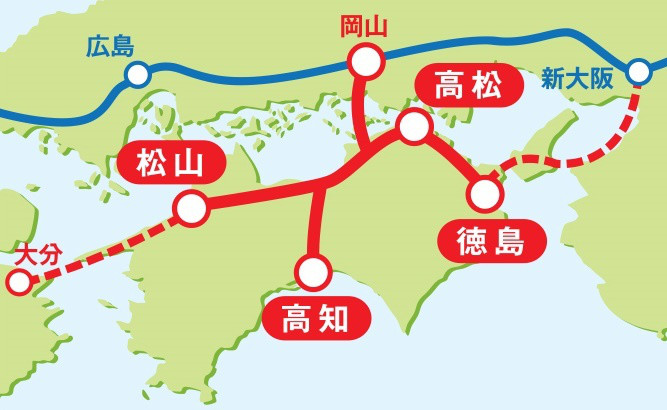
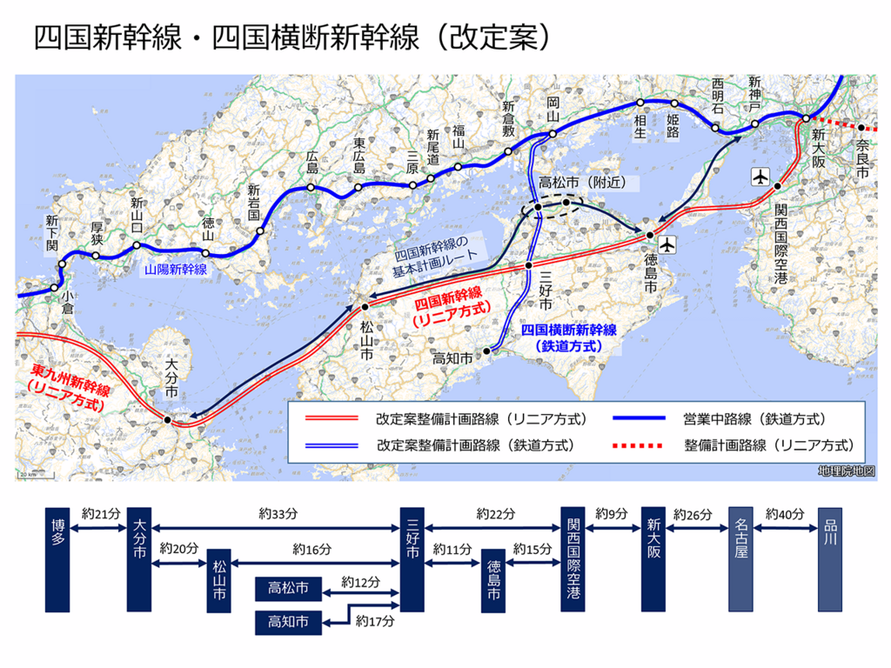
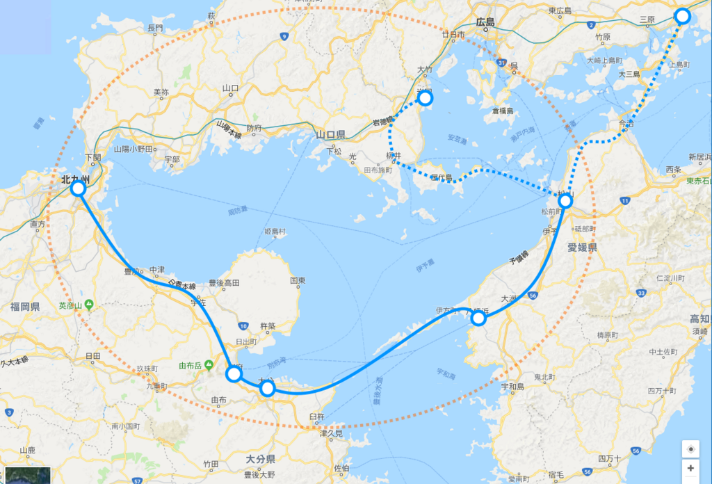

相変わらず夜間不眠で、昼間眠い。今日なんぞは昼の11時から2時まで寝るという大失態をやらかした。まぁ、仕事の量が大した事なさそうという安心感からやってしまったことで、予想通り、それほど忙しくなかったから全然リカバリーできたけど、頭が回らないので英文が読めないというのが一番厳しかった。最近利用している Firefox は翻訳系のアドオンがあまり充実しておらず、ビルトインの機能もない。いつもはそれでも問題なく処理できていたのだけど、こうもしんどいといろいろ辛い。

週末でリズムを取り戻せたらいいんだけど……せめて、めいいっぱい寝ようと思う。

<h3>JR 松山駅がヒドいという話</h3>

<blockquote class="twitter-tweet" data-lang="ja">
ようやく愛媛県が松山駅を変えることの重大さに気づいた模様。 <a href="https://t.co/MqiMb9pvtb">pic.twitter.com/MqiMb9pvtb</a>
&mdash; 宮内 駿尚 (@MTmitka90614) <a href="https://twitter.com/MTmitka90614/status/953548720603242496?ref_src=twsrc%5Etfw">2018年1月17日</a></blockquote>

それな。よその人はあまり実感できないと思うけど、これ見たら割と納得していただけるかと思う。

<blockquote class="twitter-tweet" data-lang="ja">
高松駅 徳島駅 高知駅 松山駅 <a href="https://t.co/Asr4EKfnXQ">pic.twitter.com/Asr4EKfnXQ</a>
&mdash; 人類悪bot (@Izaiza_Chan) <a href="https://twitter.com/Izaiza_Chan/status/953985551555706880?ref_src=twsrc%5Etfw">2018年1月18日</a></blockquote>

松山は私鉄（伊予鉄）の方が元気で、JR はカス（こういうのはちょっと関西っぽいよね）、JR 松山駅なんかよりも伊予鉄・松山市駅の方がよっぽど繁盛しているという点を差し引いても、割とヒドい。松山は空気が緩くて過ごしやすいと思うけれど、緩さがダメな方に出ると締まりのなさとなる。たいそうな絵は描くけど、一向に実現されず、カビたモチのままだ。基本的に首長があまり有能ではないんだろうなと感じるのだけど……困ったもんだと感じる。

たとえば、去年開催された国体は数少ないインフラ整備のチャンスで、確か松山駅も高架にするとかいう話があったはずだけど、いつの間にかなくなってるし……（JR 松山駅にあった計画概要の看板も、いつの間にか撤去されていた）。道路の整備の方に力点が置かれているみたいだけど、そっちすらちゃんと完成はしなかった。そもそもクルマを重視しすぎると街がダラッと広がってしまい、コンパクトな松山のよさを減じてしまう。中心街からは少し外れているとはいえ、JR 松山駅の近辺は十分街の中核部分に数えられるし、こんな立地を操車場のままにして、街を分断させたままにしているのは惜しいと思うべきなのだけど……そこんところが緩いというか。

まぁ、そういうところにお金を突っ込む余裕がないからこそ、できる範囲のことをちょろちょろとやって成果だけ演出しなきゃ……っていうのもわからんくはないけど、それだといいところ現状維持なわけで。とりあえず、観光をやるのか、産業をやる（ほぼないので、実質創出するｗ）のか、どっちかに絞って、長期的に取り組んだ方がいいと思う。

とりあえず、空港と港に電車で行けるようにしろ。

<h3>松山～大分新幹線</h3>

そういえば、大分の新聞で豊予ルートの新幹線の話が出ていたみたい。

 

<blockquote cite="https://www.oita-press.co.jp/1010000000/2018/01/11/JD0056512847">

大分市は１０日、大分、愛媛両県をつなぐ豊予海峡ルートについて、海底トンネルで新幹線を整備する構想の実現可能性を探る２次調査の結果を公表した。大分―松山間を最短３６分で結び、１日に往復３２本の運行が可能とした上で、採算性を確保できると結論付けた。同ルートは四国新幹線（基本計画路線）の西端に当たる。今後は県が推進する東九州新幹線と併せ、事業化の前提となる整備計画路線への格上げを国に要望していく方針だ。

<cite><a href="https://www.oita-press.co.jp/1010000000/2018/01/11/JD0056512847">&#x5927;&#x5206;&#x2015;&#x677E;&#x5C71;&#x6700;&#x77ED;&#xFF13;&#xFF16;&#x5206;&#x3001;&#xFF11;&#x65E5;&#xFF13;&#xFF12;&#x672C; &#x65B0;&#x5E79;&#x7DDA;&#x8C4A;&#x4E88;&#x6D77;&#x5CE1;&#x30EB;&#x30FC;&#x30C8;&#x69CB;&#x60F3; - &#x5927;&#x5206;&#x306E;&#x30CB;&#x30E5;&#x30FC;&#x30B9;&#x306A;&#x3089; &#x5927;&#x5206;&#x5408;&#x540C;&#x65B0;&#x805E;&#x30D7;&#x30EC;&#x30DF;&#x30A2;&#x30E0;&#x30AA;&#x30F3;&#x30E9;&#x30A4;&#x30F3; Gate</a></cite>
</blockquote>

<b>ゴールデン温泉ルート</b>でステキ……だけど、このご時世ではぶっちゃけ難しいよね。まで、でも四国新幹線の話よりはましな気がする。

いつも思うんだけど、高松は現状でも岡山にすぐ出られるわけだし、瀬戸大橋の上は高速走行できないわけで、新幹線なんか通してもあまり意味はない。この案でかろうじて経済的に意味がありそうなのは、豊予海峡と紀淡海峡のルートだけだと思う。

であれば、幸福実現党が書いてる落書きの方がよっぽどいい。

一応、山陽新幹線のサブルートにもなってるから、国土の強靭化にも資する（か？）。そもそも四国四県に一体性なんかないし（四国新幹線の計画見ればうすうすわかるよね、三県それぞれ橋を欲しがったりｗ）、四県足並みそろえて新幹線がほし―とか言っててもしゃあない。いっそのこと抜け駆けして、新しい価値（←うさんくさい）の提言とかしてみれば。

お役人さんとかにウケそうな感じで言えば、「東瀬戸内経済圏」とか。既存の山陽新幹線と接続する形で、環状の高速鉄道網を作る。環状の鉄道網は放射状の鉄道網と違って隣接する地域間の連携を密にすると思うしね。宇和島はじめ、環状線上にない街へのアクセスも満遍なくよくなる。

とはいえ、伊予灘に原油が無尽蔵に沸いてきたりしない限りは何も実現しないだろうとは思う。

