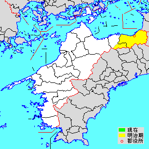
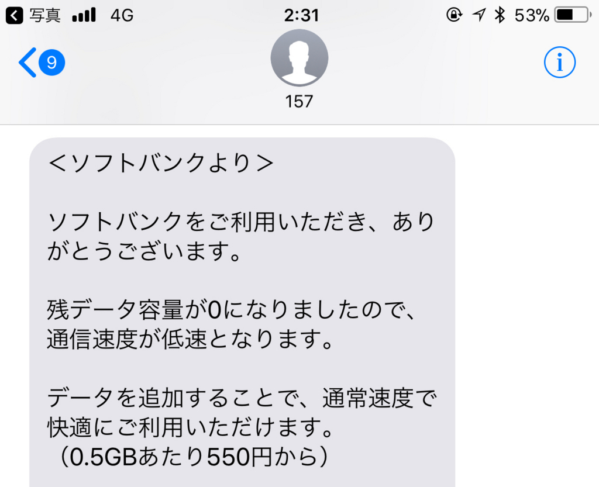

日曜日は Civilization 6 で遊んで、NHK 将棋見て、マンガ読んで、昼寝して過ごした。本当になにもしない一日。しいて言えば、サトイモの煮物を作った。煮物は好きだけど割と面倒なので、自分で作るのはちょっと珍しい。

今回使ったのは「伊予美人」という品種。スーパーで目に付いたので買ってみただけだけど（正月前に！！）、意外においしかった……ありあわせの根菜をぶち込んで適当に煮ただけなのに、ほっくほくでぬめっとおいしい。大振りだけど身のキメはこまかく、皮をむくと真っ白な肌。これは美人ですわ。再買不可避。

<blockquote cite="http://www.ja-uma.or.jp/iyobijin/">

伊予美人は県農業試験場が開発した愛媛県オリジナルの新品種です。

里芋は、350年前から栽培され先代の知恵で水稲→里芋→山の芋の輪作体制が確立され安定生産が図られています。うま地方の風土に合った伝統的な野菜（日本の3大局地風「やまじ風」にたえる地下茎の作物）です。 

<cite><a href="http://www.ja-uma.or.jp/iyobijin/">&#x300C;&#x4F0A;&#x4E88;&#x7F8E;&#x4EBA;&#x300D;&#x306E;&#x3054;&#x7D39;&#x4ECB;&#xFF5C;JA&#x3046;&#x307E;&#xFF3B;&#x3046;&#x307E;&#x8FB2;&#x696D;&#x5354;&#x540C;&#x7D44;&#x5408;&#xFF3D;&#x30DB;&#x30FC;&#x30E0;&#x30DA;&#x30FC;&#x30B8;</a></cite>
</blockquote>

うま地方（宇摩郡）っていうのは、四国中央市の方やね。素敵な古名があるのに、「四国中央」なんて名前にしたのは残念な気がする。

 

<h3>ケータイの回線</h3>

先日の話だけど、Kindle でマンガを同期するのにちょっとだけ iPhone のテザリングを使ったら、一瞬でギガ――こういうのがナウいんだよな？――を使い果たしてしまった。哀しみしかない。

とりあえず、iPhone から SIM（Softbank）を抜き出して Windows 10 Mobile に刺し、iPhone には代わりにデータ SIM（IIJmio）を指して凌ぐ。IIJ は音声×1＋データ×3 をファミリーシェアプランで契約していて10GB使えるのだけど、今月はあまり遠出していないのと、iPad Pro を修理に出していた関係で、ほとんと消費していない（おとんとおかんにも貸しているが、2GB程度しか減ってない）。音声 SIM に電話がかかってくることもほぼないし、月末まではこの体制でいいかなーって感じ。

ちなみに確認してみたところ、手持ちの SIM の利用状況はこんな感じだった。

<ul>
<li>iPhone（メイン端末）: IIJ データ（Surface 3 LTE から移植）</li>
<li>iPad Pro:  IIJ データ</li>
<li>Windows 10 Mobile（NuAns NEO）：Softbank SIM（iPhone から移植）</li>
<li>おかんの iPad:  IIJ データ</li>
<li>おとんの Zenfone: IIJ 音声</li>
</ul>
秋に Softbank の契約が終わったら、MNP で IIJ に転入して、ぜんぶ IIJ で統一するつもり。iPhone を割賦で買ったりっていうのも今後やめようと思う。いろいろ管理が面倒くさい。

