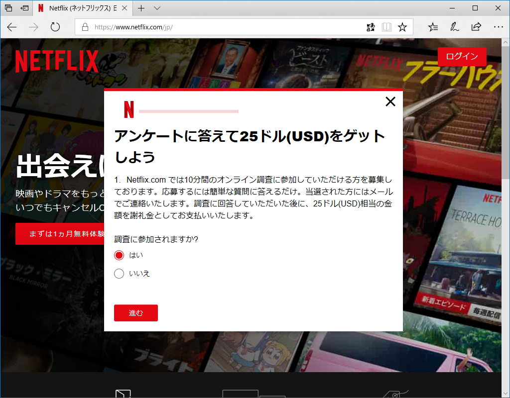
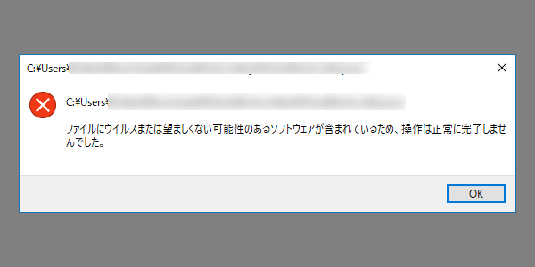

この前悲しい目にあった。アンケートに答えると25ドル呉れると Netflix さまがおっしゃるので、嬉々として参加したんだが、最初の選択肢で「現在、Netflix のユーザーである」みたいなのを選んだら――

「あ、お前は無理」みたいなこと言われた。<i>ねっとふりっくすにたいするちゅうせいしんが 1 さがった。</i>

ついでに、関係あるようでまったくないけど、ちょっと前から Windows 版 Dropbox に共有ファイルの削除警告機能が付いたっぽい。

自分はやらかしたことないけど、まぁ、こういうのはあるといいのかもしれんね。

あと、どうせだからついでに愚痴るけど、最近 Windows Defender がキビしい。なんでもかんでもウイルスと判定するようになった。

「いや、この子は多分悪い子ちゃうで」って報告したいんだけど、どこからやんのかわからんし。

慎重なのは結構だけど、無実の子まで犯罪者扱いするのはいろいろ困る。困るといえば、最近 Explorer のコンテキストメニューが壊れるん。

要らんソフトをバッサバッサとアンインストールしたら、ここ数日発生してないけど……なんだったんだろう。わけのわからんフリーソフトが割と入ってる環境やから、トラブルシューティングめんどくさいなぁ。とりあえず様子見。

<h3>雪が積もるとかどんな田舎って話ですよ</h3>

月曜日は雪で大変だったみたいだけど、うち（愛媛県松山市）は雨だった。みんな楽しそうでちょっとうらやましい。いつもはあまり暖房を付けないけれど、さすがにこの日は寒くて、エアコンに働いていただいた。ナベ洗うときもお湯を使ってしまったし……ちょっと罪悪感ある。まぁ、たまにはいいよね。

<h3>Windows Insider Meetup</h3>

<iframe src="https://hatenablog-parts.com/embed?url=https%3A%2F%2Fblogs.windows.com%2Fjapan%2F2018%2F01%2F17%2Fwindows-insider-meetup-3%2F" title="Windows Insider Meetup 3 開催決定！情シス編も" class="embed-card embed-webcard" scrolling="no" frameborder="0" style="display: block; width: 100%; height: 155px; max-width: 500px; margin: 10px 0px;"></iframe><cite class="hatena-citation"><a href="https://blogs.windows.com/japan/2018/01/17/windows-insider-meetup-3/">blogs.windows.com</a></cite>

おかんが京都連れてけというので宿をとったのだけどキャンセルされた。せっかく関西いく気満々になってたのに梯子を外しおって～（ぐぬぬ……と思ってたら、ちょうど Windows Insider Meetup を大阪・東京でやるらしい。さっそく大阪にエントリーした。

流石に毎回 JR というのはしんどすぎるので（4時間以上かかるんやで……）Peach のダイヤを調べたら、最近の松山＝関空便は昼間飛んでるのな。行きしなは使えなかったから（遅刻するやし）フェリーか JR を使うとして、帰りは関空から飛行機で帰ってこようと思う。6,000円しかかからんし、LCC はすばらしい。もっと便利な時間に飛んでくれ。

