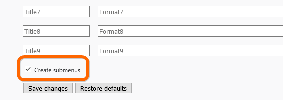
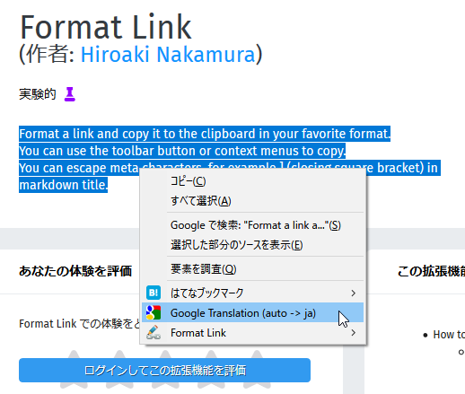
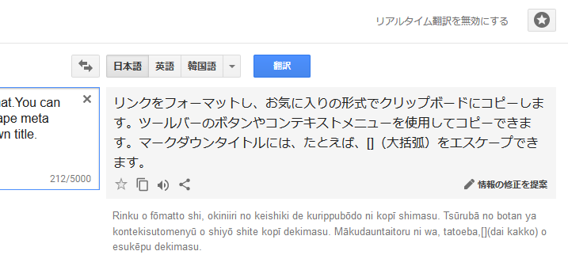

明日あたり Firefox Quantum のアップデートがくるのかな？　ってことは、Google Chrome から乗り換えてちょうどワンサイクル経ったってことか……最近はだいぶ慣れてきて、Chrome を起動することが少なくなってきたかも。これも拡張機能を作ってくれてる方々のおかげやね。

ってことで、感謝を込めて（←ナチュラルにディスってるところもあるけど、マジで感謝してるんだよ！）＆個人的な備忘のために自分が今使ってる拡張機能をさらしてみた。あんまりちゃんと説明する気がないので、詳しくはググってみてください。

<h4><a href="https://addons.mozilla.org/ja/firefox/addon/format-link3/">Format Link &ndash; Firefox &#x5411;&#x3051;&#x30A2;&#x30C9;&#x30AA;&#x30F3;</a></h4>

Google Chrome の Create Link 代替。正直 Create Link の方が使いやすい気がするけど、文句言うなら自分で作れやって感じだし、ありがたく使わせていただいてる。

個人的には、インストール後真っ先にこの↑オプションを有効にするのがお勧め。

<iframe src="https://hatenablog-parts.com/embed?url=https%3A%2F%2Fforest.watch.impress.co.jp%2Fdocs%2Freview%2F1098956.html" title="ブロガー御用達！ リンクや引用がサクサク行えるFirefox拡張機能「Format Link」／好みの書式に整形してタイトルやURLをコピー。「MakeLink」「Create Link」の代わりにも【レビュー】" class="embed-card embed-webcard" scrolling="no" frameborder="0" style="display: block; width: 100%; height: 155px; max-width: 500px; margin: 10px 0px;"></iframe><cite class="hatena-citation"><a href="https://forest.watch.impress.co.jp/docs/review/1098956.html">forest.watch.impress.co.jp</a></cite> 

<h4><a href="https://addons.mozilla.org/ja/firefox/addon/tab-center-redux/">Tab Center Redux &ndash; Firefox &#x5411;&#x3051;&#x30A2;&#x30C9;&#x30AA;&#x30F3;</a></h4>

タブをサイドバーに表示するマン。ただそれだけだけど、自分は気に入ってる。タブバーよりページタイトルが見やすいし、あまり使わんけど、タブ検索とかも地味に便利。

でも、ウィンドウの上にタブバーがあるとついそっちも使っちゃうよな。いっそのこと非表示にできたらいいんだけど……Firefox 本体にはきっとそういう機能はないやろうなぁ（もしかしたら about:config とかに設定あるのかもしれんけど）。

<iframe src="https://hatenablog-parts.com/embed?url=https%3A%2F%2Fforest.watch.impress.co.jp%2Fdocs%2Freview%2F1096294.html" title="「Firefox Quantum」で開いているタブをサイドバーへ垂直表示する「Tab Center Redux」／タブバーよりも情報量豊富で、状況に応じてコンパクト表示へ。フィルタリングも可能【レビュー】" class="embed-card embed-webcard" scrolling="no" frameborder="0" style="display: block; width: 100%; height: 155px; max-width: 500px; margin: 10px 0px;"></iframe><cite class="hatena-citation"><a href="https://forest.watch.impress.co.jp/docs/review/1096294.html">forest.watch.impress.co.jp</a></cite> 

<h4><a href="https://addons.mozilla.org/ja/firefox/addon/twitter%E8%87%AA%E5%8B%95%E7%94%BB%E5%83%8F%E6%8B%A1%E5%A4%A7%E3%83%95%E3%82%A3%E3%83%AB%E3%82%BF%E3%83%BC/">Twitter&#x81EA;&#x52D5;&#x753B;&#x50CF;&#x62E1;&#x5927;&#x30D5;&#x30A3;&#x30EB;&#x30BF; &ndash; Firefox &#x5411;&#x3051;&#x30A2;&#x30C9;&#x30AA;&#x30F3;</a></h4>

Twitter の画像を見やすくしてくれる。この手の拡張機能はいくつかあって、たぶんこれが最良というわけではないと思うけど、なんとなく惰性でつかってる。十分便利だし、これで満足（← 選定基準、割と適当なんだよね

<iframe src="https://hatenablog-parts.com/embed?url=https%3A%2F%2Fforest.watch.impress.co.jp%2Fdocs%2Freview%2F1092757.html" title="縦長の画像を見やすく表示「Twitter画像自動拡大フィルタ」 ～Chrome/Firefox両対応／画像を別タブで開くことも。オリジナル画像を原寸大で表示したい場合に役立つ【レビュー】" class="embed-card embed-webcard" scrolling="no" frameborder="0" style="display: block; width: 100%; height: 155px; max-width: 500px; margin: 10px 0px;"></iframe><cite class="hatena-citation"><a href="https://forest.watch.impress.co.jp/docs/review/1092757.html">forest.watch.impress.co.jp</a></cite> 

<h4><a href="https://addons.mozilla.org/en-US/firefox/addon/google-translation/">Google Translation &ndash; Add-ons for Firefox</a></h4>

翻訳系のアドオンは1つほしいのだけど、どれもイマイチだった（ページ全訳とか要らないし、たまに単語の意味だけ引けたら十分なんだけど）。なんかおすすめがあったら教えてほしいぐらい。

自分はシンプルさ重視で、これを使っている。選択テキストを Google 翻訳に送ってくれるだけだけど、こういうので十分かな。高機能なのはいくらでもあるっぽいけど、どれもなんかしっくりこなかった。

あと、個人的に疑問なんだけど、AI で翻訳が賢くなったっていうの、みんな実感してんのかな。自分は割りとイマイチな印象しかないんだけど……いつもは英文斜め読みしながら、大事そうなところを精読するときの補助にこういうツールを使うが、逆の意味に翻訳することもしばしばだから、正直あんまり信用できん。もっとも、ページ全体の翻訳を多用すれば少しは違うのかもしれんけど。自分はどうしても細切れに使っちゃうから、文脈をうまくくみ取ってくれないのかもな（そういえば、日本語変換も細切れにやってしまうタイプだわ……老害はじまってるねｗ）。

<h4><a href="https://distill.io/">Monitor websites for changes, get SMS alerts and email alerts - Distill</a></h4>

これは普通の人には不要かもしれないけど……ページの更新をチェックしてくれるツール。最近、フィードを配信していないサイト増えてない？　仕方ないのでこういうので更新チェックをしている。

XPath で部分チェックすることもできるし、ブラウザーでレンダリングしてから評価するので、SPA みたいな動的なサイトでも一応使える。ヘッドレスブラウザーでごにょごにょすれば作れるかもしれんけど、自分は途中で飽きた。

ちなみに、自分はこれにお金払ってる（お金使って使ってんの、あとは Feedly ぐらい？）。チェックリストをデバイス間同期できるようになるので……まぁ、そういうのに興味がないならタダでも十分役立つと思う。

<iframe src="https://hatenablog-parts.com/embed?url=https%3A%2F%2Fforest.watch.impress.co.jp%2Fdocs%2Freview%2F1051597.html" title="Webページの特定位置を監視、更新通知や比較ができるブラウザー拡張「Distill Web Monitor」 - 窓の杜" class="embed-card embed-webcard" scrolling="no" frameborder="0" style="display: block; width: 100%; height: 155px; max-width: 500px; margin: 10px 0px;"></iframe><cite class="hatena-citation"><a href="https://forest.watch.impress.co.jp/docs/review/1051597.html">forest.watch.impress.co.jp</a></cite> 

<h4><a href="https://addons.mozilla.org/ja/firefox/addon/hatena-bookmark/">Hatena Bookmark &ndash; Firefox &#x5411;&#x3051;&#x30A2;&#x30C9;&#x30AA;&#x30F3;</a></h4>

Chrome 版をそのまま Firefox で動かせるようにしましたって感じで、質はイマイチだけど、はてブジャンキーだから外せない。はてブやってない人には不要。

<h4><a href="https://addons.mozilla.org/ja/firefox/addon/chrome-store-foxified/">Chrome Store Foxified &ndash; Firefox &#x5411;&#x3051;&#x30A2;&#x30C9;&#x30AA;&#x30F3;</a></h4>

Chrome ウェブストアの拡張機能を Firefox で使えるようにしてくれる……けれど、満足に動いた試しがあまりないかもしれない。今は入れてるだけの状態。まぁ、使い方ぐらいは覚えておくとよいと思う。たまに役立つかもしれんし。

<a href="https://forest.watch.impress.co.jp/docs/serial/yajiuma/758984.html">https://forest.watch.impress.co.jp/docs/serial/yajiuma/758984.html</a><cite class="hatena-citation"><a href="https://forest.watch.impress.co.jp/docs/serial/yajiuma/758984.html">forest.watch.impress.co.jp</a></cite> 

<h3>おまけ</h3>

Firefox Quantum にしてやめたこと

<ul>
<li>Feedly のピン留め：重い！ デスクトップクライアント Nextgen Reader を代わりに使う</li>
<li>Outlook on Web のピン留め：なんかちょくちょくログアウトさせられてめんどい（なんでだ？）。代わりに Windows 10 の「メール」使ってる</li>
</ul>
Firefox Quantum にして気づいたこと

<ul>
<li>Chrome の拡張を全部外したんだけど、フツーに速かった。でも、便利な拡張機能はついつい入れちゃうし……Firefox はちょい不便だけど、トータルでは（アドオンで重武装の）Chrome より速い</li>
<li>たまにタブが暴走してる。Windows のタスクマネージャーから重いプロセスを殺して、Firefox で復元させてる</li>
</ul>
既定のブラウザーは Edge、メインは Firefox、補助で Chrome って感じでこの6週間（だっけ？）使ってきたけど、ぶっちゃけあんまりこだわりがないせいか、それほど不自由なく使えてる。っていうか、Edge 氏、もうちょい頑張ってくれ……

