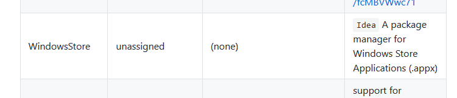
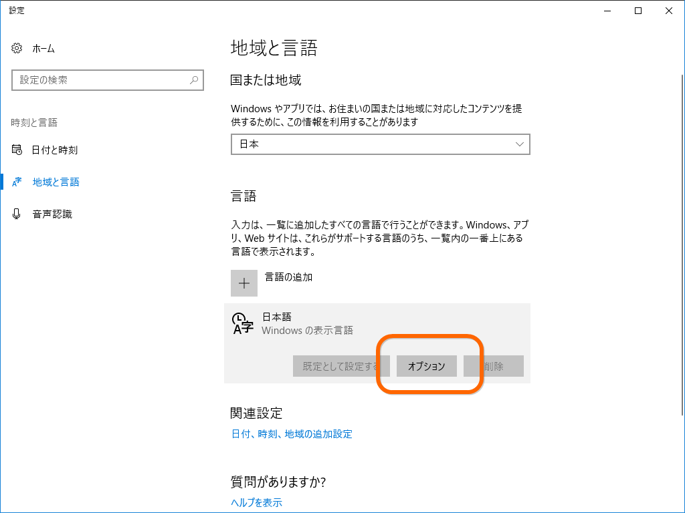
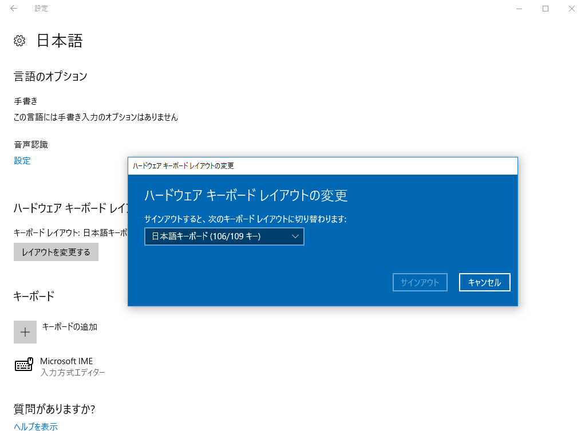
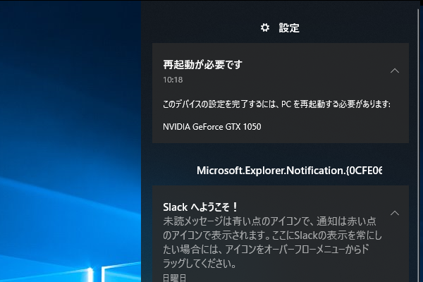
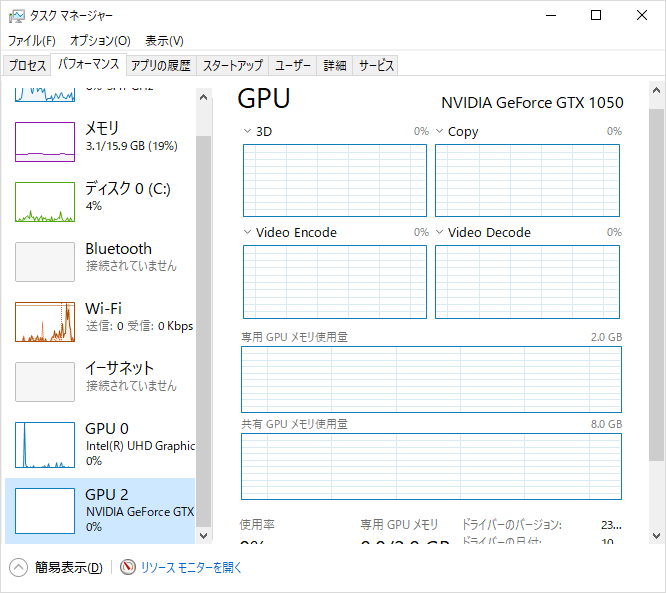

週末は Surface Book 2 をクリーンアップしていた。

というのも、この前発生していたコンテキストメニューが壊れる不具合がどうにも直らない。不要なアプリを削除したり、レジストリをいじったりすると直ったような気になるが、しばらく経つとまた壊れる。グラフィックドライバーがダメだと手の施しようがないが……ともあれ、数か月使って環境も汚れてきたことだし、ここでクリーンアップするのも悪くはないだろう。

むかしは OS のクリーンインストールと環境の復旧は大変めんどくさくて、半日がかりでやっていた気がするけど、最近はデータをクラウドに保存するようになったせいか、それほど手間ではない。PowerShell と Chocolatey で作った初期化スクリプトのおかげもあり、ほぼ全自動で行える。

<iframe src="https://hatenablog-parts.com/embed?url=http%3A%2F%2Fblog.daruyanagi.jp%2Fentry%2F2017%2F05%2F17%2F073339" title="PowerShell：環境構築を（なるべく）自動化する - だるろぐ" class="embed-card embed-blogcard" scrolling="no" frameborder="0" style="display: block; width: 100%; height: 190px; max-width: 500px; margin: 10px 0px;"></iframe><cite class="hatena-citation"><a href="http://blog.daruyanagi.jp/entry/2017/05/17/073339">blog.daruyanagi.jp</a></cite>

今回はインストールアプリの整理もやった

<pre class="code" data-lang="" data-unlink>choco install -y sizer
choco install -y dotnetcore-sdk
choco install -y visualstudiocode
choco install -y dropbox
choco install -y vlc
# choco install -y skype
choco install -y googlechrome
choco install -y unchecky
choco install -y paint.net
choco install -y firefox

# 追加
choco install -y visualstudio2017community
choco install -y steam
choco install -y github-desktop  </pre>
visualstudio2017community パッケージは Installer が追加されただけで、本体のインストールには失敗していた？　どうせワークロードの選択しなきゃいけないから別にいいんだけど。デスクトップ Skype は不要になったので削除した。使いことがあっても今度からは UWP 版で済ませる。

残った手作業の中で面倒なのは、各種サービスのログイン処理だろうか。自分は頭の固い人間だから、パスワードロッカーのようなサービスに手を出せずじまいでいるのだけど、今回は STEAM のパスワードがどうしても思い出せなくて……そろそろ導入すべきかな、などと感じている。使いやすくて、データを流出させたり、脆弱性の修正を隠したりしないところがいいんだけど、どこかいいところはないだろうか。

あと、ソフトウェアのライセンス管理が面倒くさい。うちの場合、

<ul>
<li>EmEditor</li>
<li>WinSnap</li>
</ul>
がそれに該当するのだけど……ストアで配布してくれたら買いなおすわ。あと、ストアアプリのインストールも面倒……OneGet で Windows Store プロバイダーが使えたりしたらいいのになぁ……。

一応リクエストはあるみたいだけど、何も動きはないみたい。

それはともかく、今回のクリーンアップで2、3、軽いトラブルにあったのでメモしておこうかと思う。

<h3>キーボードが英語配列として認識される</h3>

Surface シリーズではもうお馴染みとなったこの不具合……もう嫌になっちゃうよね。でも、最近は GUI で治せるようになったからちょっとましかもしれない。

まず「設定」アプリで［言語と時刻］－［地域と言語］を開き、日本語のオプションへアクセスする。

んで、ハードウェア キーボード レイアウトを“日本語キーボード（106/109 キー）”に変更すれば OK。以前は英語キーボードだったからこうしたトラブルとは無縁だったのだけど、自分の身に降りかかるとクソうっとうしいな。

なお、反映させるには一度サインアウトしなきゃいけない。

<h3>ディスクリート GPU が認識されない</h3>

早速 Civilization 6 で遊んでみるかと思ってゲームを起動すると、どうも遅い。調べてみると Intel の内蔵グラフィックスで動いていた。GeForce GTX 1050 が見当たらない……。

これはベースからトップを外してガチャガチャしてたらいつの間にか直った。

再起動してって言われたのでその通りにすると、外部 GPU が復活した……「タスク マネージャー」で“GPU 1”って表示されてたのが“GPU 2”になっちゃったけど、キニシナイ。

 

<h3>サウンドが死ぬ</h3>

トラブルシューティングアシスタントに従ってドライバーを再インストールしたら直った。さほど手間ではないし、ハマるところもないと思うので割愛。

<h3>ほかにやったこと</h3>

<ul>
<li>ディスクアクセスが遅い気がしたので、Bitlocker は無効化した</li>
<li>要ライセンスアプリの代替品評価 → んー、やっぱり使い慣れたものがいいのでやめた</li>
</ul>

