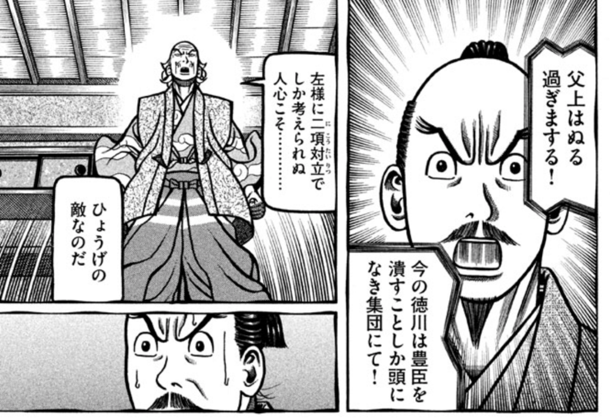

<a href="http://www.amazon.co.jp/exec/obidos/ASIN/B078XT5Y37/bestylesnet-22/">へうげもの（２５） (モーニングコミックス)</a>
<ul><li>作者: 山田芳裕</li><li>出版社/メーカー: 講談社</li><li>発売日: 2018/01/23</li><li>メディア: Kindle版</li><li><a href="http://d.hatena.ne.jp/asin/B078XT5Y37/bestylesnet-22" target="_blank">この商品を含むブログ (3件) を見る</a></li></ul>

続巻が楽しみなマンガはそれほど多くないのだけど、その1つがとうとう完結してしまった。『へうげもの』である。

戦国時代ものといえば、どうしても『センゴク』っぽいモノを思い起こしてしまう。でも『へうげもの』はそういうものとまったく異質で、戦闘シーンはそれほど多くなく、徹頭徹尾アートの方面から政治を見ていて、とても楽しいマンガだった。同じ古田織部を題材にした、司馬遼太郎の短編『割って、城を』なんかもちょっと捻った感じで面白いけど、『へうげもの』はもっと深くえぐって、でも素直に、正面からガンガン行く感じ。

<blockquote>

それでも僕はやってない。幕府転覆、家康・秀忠謀殺容疑により拘束中の古田織部。俺たち現代人のライフスタイルを決めちゃった大先輩が、「日本人」のあるべき姿を語る感動の完結巻。作者・山田芳裕の死生観、国民論をどうか受け止めてくだされ！

</blockquote>

こういうアオリは「はぁ～ん？」って感じでまったく響いてこないけど（笑）、信長・秀吉・家康の死に際の描き方がそれぞれ秀逸なのは確か。個性の輝きが寂しさを埋めてる。よい思い出も、後ろめたい過去も、笑いでかき混ぜて発酵させちゃう感じは、嫌いではない。

顔芸は『ゴールデンカムイ』以上だしな。きっとアニメにもドラマにもできない、唯一無二の作品だと思う。

んで、まったく方向は変わるけど、Kindle の一迅社フェアもクリティカルヒットだった。

<iframe src="https://hatenablog-parts.com/embed?url=https%3A%2F%2Fwww.amazon.co.jp%2Fb%2Fref%3Ds9_acss_bw_hsb_x_s1_s_w%3F_encoding%3DUTF8%26ie%3DUTF8%26node%3D5443713051%26ref%3DIchijinsha_0126_pchero%26pf_rd_m%3DAN1VRQENFRJN5%26pf_rd_s%3Dmerchandised-search-2%26pf_rd_r%3D3GXBZ3NMNJXD2FDYYYCD%26pf_rd_t%3D101%26pf_rd_p%3D3ddab596-4cd6-43ab-bbf2-e25de977d69f%26pf_rd_i%3D2275256051" title="Amazon.co.jp: 『50%ポイント還元』一迅社フェア: Kindleストア" class="embed-card embed-webcard" scrolling="no" frameborder="0" style="display: block; width: 100%; height: 155px; max-width: 500px; margin: 10px 0px;"></iframe><cite class="hatena-citation"><a href="https://www.amazon.co.jp/b/ref=s9_acss_bw_hsb_x_s1_s_w?_encoding=UTF8&ie=UTF8&node=5443713051&ref=Ichijinsha_0126_pchero&pf_rd_m=AN1VRQENFRJN5&pf_rd_s=merchandised-search-2&pf_rd_r=3GXBZ3NMNJXD2FDYYYCD&pf_rd_t=101&pf_rd_p=3ddab596-4cd6-43ab-bbf2-e25de977d69f&pf_rd_i=2275256051">www.amazon.co.jp</a></cite>

最近、精神的な疲れからか、かわいい女の子がただなかよくするだけのマンガをカラダが欲してやまないのだけど、そこにポイント50％還元ですよ。ファーーー！

でも、『ゆるゆり』みたいに継続購入しているものは紀伊国屋 Kinoppy で買っていたので、今回の Kindle セールはあまり自分には関係なかった<a href="#f-bfd0e405" name="fn-bfd0e405" title="紀伊国屋でもポイントが増えるキャンペーンやってたから、割とお得だったけど">*1</a>。とりあえず今回は、『政宗君のリベンジ』をまとめて買って、当面の消費欲を満たしておいた（← 安いと買いたくなるタイプ）。どれを買っていいかわからんのが幸いして、致命傷で済んだ。

『ゆるゆり』といえば、昨日あたり、最新刊が配信されてきたな。布団でゴロゴロしながら読んだのだけど、あいかわらずな感じで安心と癒しで溢れとるわ。しいて言えば向日葵ちゃんの出番を2倍ぐらいにしてほしい。

<a href="http://www.amazon.co.jp/exec/obidos/ASIN/B0799FC5D5/bestylesnet-22/">ゆるゆり: 16 (百合姫コミックス)</a>
<ul><li>作者: なもり</li><li>出版社/メーカー: 一迅社</li><li>発売日: 2018/01/30</li><li>メディア: Kindle版</li><li><a href="http://d.hatena.ne.jp/asin/B0799FC5D5/bestylesnet-22" target="_blank">この商品を含むブログを見る</a></li></ul>

そんなわけで『大室家』の続巻（こっちの方が出番多いんだよ！　櫻子さまのおかげで）にも期待してるんだけど……もう新しいのでないのかな。月刊誌・週刊誌読むほどマンガ漬けではないので、あんまり動向を知らない。

<a href="http://www.amazon.co.jp/exec/obidos/ASIN/B00E7OFE7O/bestylesnet-22/">大室家: 1 (百合姫コミックス)</a>
<ul><li>作者: なもり</li><li>出版社/メーカー: 一迅社</li><li>発売日: 2013/08/02</li><li>メディア: Kindle版</li><li><a href="http://d.hatena.ne.jp/asin/B00E7OFE7O/bestylesnet-22" target="_blank">この商品を含むブログを見る</a></li></ul>

<h3>追伸</h3>

<iframe src="https://hatenablog-parts.com/embed?url=https%3A%2F%2Fnatalie.mu%2Fcomic%2Fnews%2F267179" title="なもりキャラ原案によるオリジナルアニメ「RELEASE THE SPYCE」が制作決定 - コミックナタリー" class="embed-card embed-webcard" scrolling="no" frameborder="0" style="display: block; width: 100%; height: 155px; max-width: 500px; margin: 10px 0px;"></iframe><cite class="hatena-citation"><a href="https://natalie.mu/comic/news/267179">natalie.mu</a></cite>

クッソ楽しみ。富山の方角に向かって三跪九叩頭の礼をささげねば。

<a href="#fn-bfd0e405" name="f-bfd0e405" class="footnote-number">*1</a>:紀伊国屋でもポイントが増えるキャンペーンやってたから、割とお得だったけど

