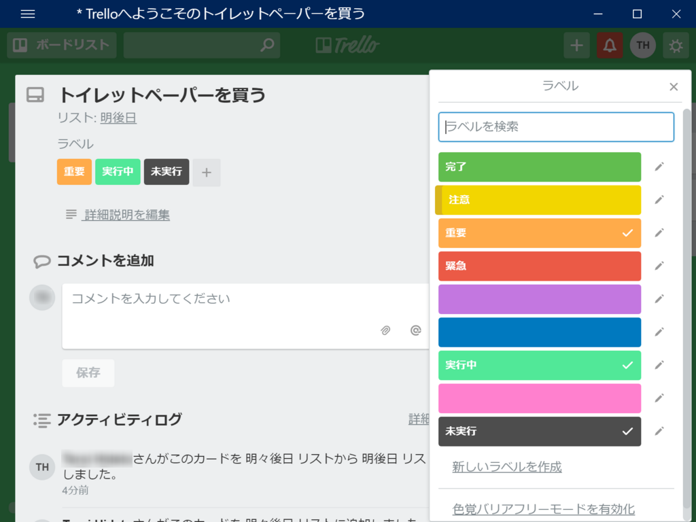

Trello は柔軟性に富むので、たとえば 未実行 → 実行 → 完了 という単純なフローであっても、いくつかの方法で表せる。

<ul>
<li><b>リスト</b>：［未実行］［実行］［完了］というリストを作って、状況に応じてカードを移動させる（［未実行］と［実行］、［実行］と［完了］は隣り合わせにして、横へ横へカードを動かしていくようにするといい感じ）</li>
<li><b>ラベル</b>：［未実行］［実行］［完了］というラベルを作って、状況に応じてラベルを足していく。（黄色）→（橙色）→（赤色）みたいにラベルが積まれていくことで進捗を確認できると結構見やすい（色の選択にちょっと工夫しなきゃだけど）</li>
<li><b>チェックリスト</b>：［未実行］［実行］［完了］というチェックリストを作って、状況に応じてチェックをつけていく（進捗状況が％表示されるけど、カードの詳細画面じゃないとみにくいのが難点。あとボードからだと現在の状況（全体の何分の何ぼ）はわかっても、チェックポイント（未実行？実行中？）がわからん）</li>
</ul>
これはタスクの<b>“状況（ステータス）”</b>にフォーカスした例だが、タスクの<b>担当者</b>だってリストまたラベル、メンバーで管理できるし、タスクの<b>期限</b>だってリストまたは期限で管理できる。タスクの<b>“属性”</b>（緊急・注意など）はリストとラベルで管理できる。

つまり、リストは一番汎用的で割となんにでも使える。その次に柔軟性があるのはラベル。チェックリスト・メンバー・期限などの機能は特定の用途に特化していて便利だが、ほかに応用するのは難しい。

また、機能が 汎用 → 特化 になるにしたがって、ボードからは少し把握しづらくなっていくという特性もある。リストで管理するのがパッと見、一番わかりやすい。

理屈はともかく、手っ取り早くタスク管理を始めたければ、とりあえずリストだけを使っとけばいい。だんだん慣れてきたり、作業フローが固まってきたら、専用の機能を使い始める。そうすれば、無理なくタスク管理をステップアップさせていくことができる。Trello がとっつきやすいのも、そうした“ステップアップ”を許容する懐の深さがあるからではないだろうか。いきなり高機能・多機能なタスク管理ツールを与えられても定着しないのは、要するにそういうところだと思う――機能が「シンプル」過ぎてもすぐ物足りなくなるから、バランスはとても難しい。

さて、以上は余談――。

うちのチームでは、当初、タスクの状況をリストで管理していた。しかし、リストはあまりに汎用的で、あまりにも便利。使い続けるうちに、状況だけでなく、属性の管理にも使うようになった。一方、属性はラベルで管理しているものもある。

例がうまくないのは承知の上だが、このサンプルボードでは、ラベルで2つの属性を管理している。1つは<b>重要性</b>という属性（注意・重要・緊急）、もう一つは<b>進行状況</b>という属性（未実行・実行中・完了――“状況”は広く見れば“属性”の一種だ）。リストは<b>期限</b>という属性の管理に使ってしまっている。リストとラベルの柔軟性に甘えてしまったがゆえの、割とありがちな「混乱」じゃないだろうか。最悪の場合、リストでも複数の”属性”が入り乱れていることがある。

とりあえずやばいのはラベルに2つの役割を持たせてしまっていることなので、そのどちらかの管理をより専門的な機能に任せるべきだろう。今回の場合、重要性を専門に管理する機能は Trello にないので、進行状況をチェックリスト機能に移行させるべきだろう。

というわけで、ガチャガチャといじりながら使い方を考えてみたんだけど、割とあっさりいけるっぽい。

まず、適当なカードを作って、チェックリストを作成する。

チェックリストの項目はドラッグ＆ドロップで入れ替えられる。チェックリストが完成したら、なんでもいいんだけど、「ひながた」というリストに退避させておく。

次に、なんでもいいからタスクのカードを開き……

チェックリストを追加する。そのとき「次のリストからコピー」というドロップダウンリストを利用すると、さっき作ったチェックリストをコピーできる（これでさっきのひな型は用済みになった。消してしまってもいいし、残しておいてもいいだろう）。

これでチェックリストをつかった進行状況の管理が可能になったので、ラベルの方は用済み。編集して消してしまおう。

……みたいな感じで、メンバーの習熟度に応じて、汎用的な機能で実現していたことをより専門的な機能へ移行し、混乱した運用を見直していけたらいいな？　一方で（Trello に習熟していない）新規参入メンバーにとっては、学ぶことが多くなっちゃうけど――これはまた別の課題。とりあえずは、「困ってないなら汎用的な機能で済ます、専門機能の使い方を学ばなくていいようにする」って感じにしておけばいいようにも思う。<b>1つの機能で複数の属性を扱い始めたら要注意</b>、切り分けて、専門機能が使えるならそっちに移行しよう。

